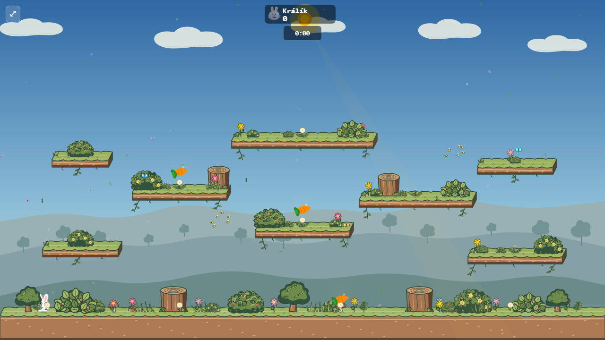
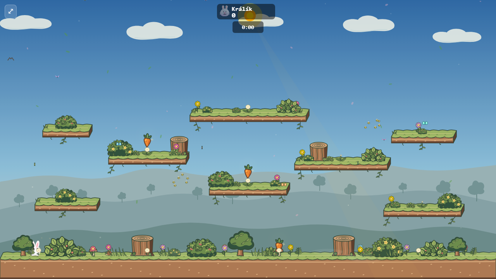
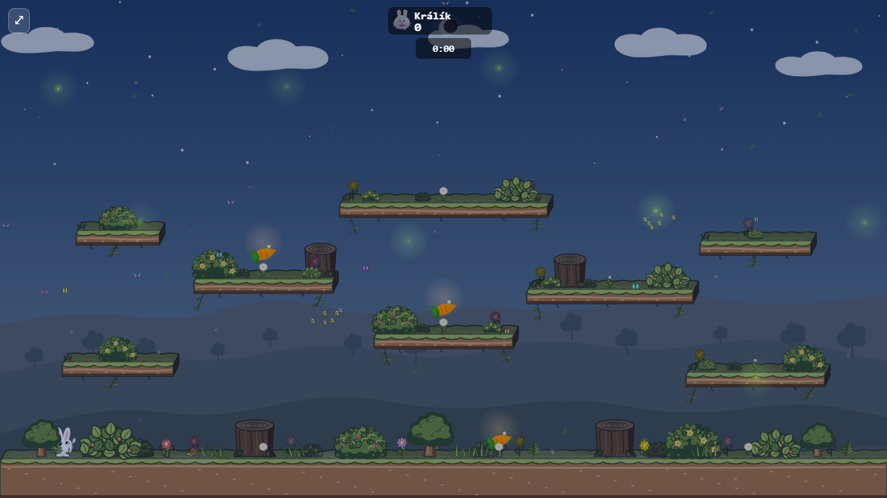
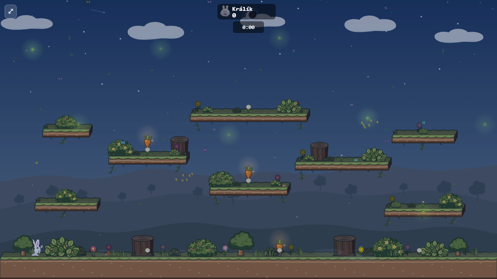
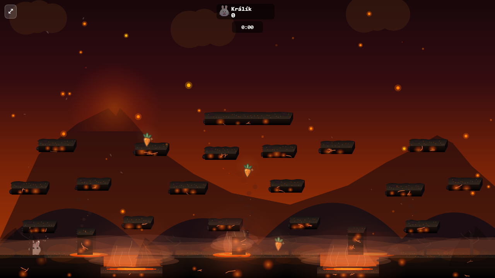

# Storybook carrot pickup

The shared carrot pickup now reads as a small rooted vegetable instead of a sideways orange oval. Its broader shoulders taper to a slightly uneven tip. Three connected leaves, a dark ink edge, two warm color planes, and sparse root creases follow the Meadow prop language. The bob, brief spawn ring, and single glint still distinguish it from static foliage.

| Current pickup | Storybook redesign |
| --- | --- |
|  |  |
|  |  |

These are captures from running matches with three carrots placed at fixed coordinates and the Meadow day phase set to noon or midnight. Both versions use the same arena art and camera; wildlife and other match details may vary between captures. Inspect the whole scene at normal size: the pickup must remain recognizable near flowers, bushes, and platform edges. Foreground cover still draws over it.



Volcano supplies a second palette check: the warm root still has a separate dark silhouette against lava-colored scenery. This arena does not use Meadow's day/night cycle.

`CARROT_SIZE` and the pickup collision box are unchanged. The art uses a handful of solid Canvas paths; it adds no bitmap download, blur, or per-frame gradient. The new drawing is shared across arenas, so other arena palettes remain follow-up visual checks during play.

To recapture either version from a running Vite server:

```bash
node docs/mockups/carrot-pickup/capture.mjs http://127.0.0.1:4196/bunnybrawl/ docs/mockups/carrot-pickup/after
```

The capture uses `?simWorker=off` so it can place carrots through the diagnostic match state, then saves day and night PNGs. Use the version of the code being compared for each capture.
Pass an arena ID as a third argument to inspect another setting.
