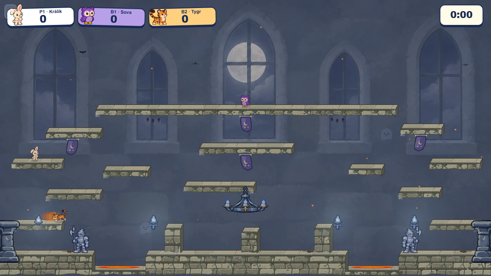
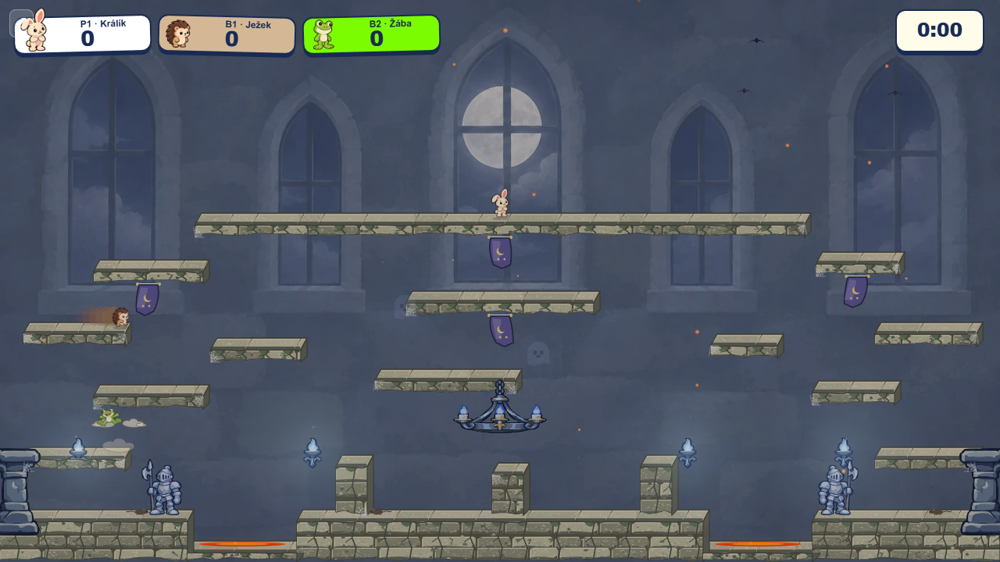

# Castle cartoon props

The approved Moonlit props use simplified storybook silhouettes and broad light/shadow planes. The guard, sconce, chandelier, and edge column were traced to editable [SVG masters](svg/) and rendered as transparent WebP files for the game. A browser probe found that `createImageBitmap` could not decode the SVG Blob in Edge, while the WebP files loaded in both canvas-owning worker modes. Run `node docs/mockups/castle-cartoon-props/rasterize.mjs` with `CASTLE_PROPS_BROWSER` set to a local Chromium or Edge binary to regenerate the runtime files from the SVGs.

The four WebP files total 40,972 bytes. The small sconce is inlined by Vite; the other three are fetched with the arena backdrop. All four must decode before the new prop set renders. A missing image falls back to the old complete Canvas scene. Guards and sconces sit behind players; the chandelier and edge columns are foreground. The five warm wall torches are replaced by four cool sconces, and sparse Moonlit banners retain their reactive sway. Gameplay geometry and hazard collision are unchanged.

| Default simulation worker | `simWorker=off` |
| --- | --- |
|  |  |

Both captures are from the production preview after countdown. Focused tests, the production build, and direct-entry and Meadow-to-Castle switching in both worker modes passed. The deterministic initial-bundle budget passed at 158,350 / 163,840 gzip bytes. The optional constrained-browser loading probe could not launch because the bundled Playwright Chromium is absent on this machine; live captures used installed Edge.
