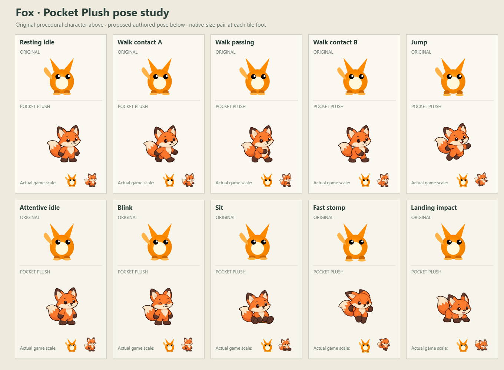
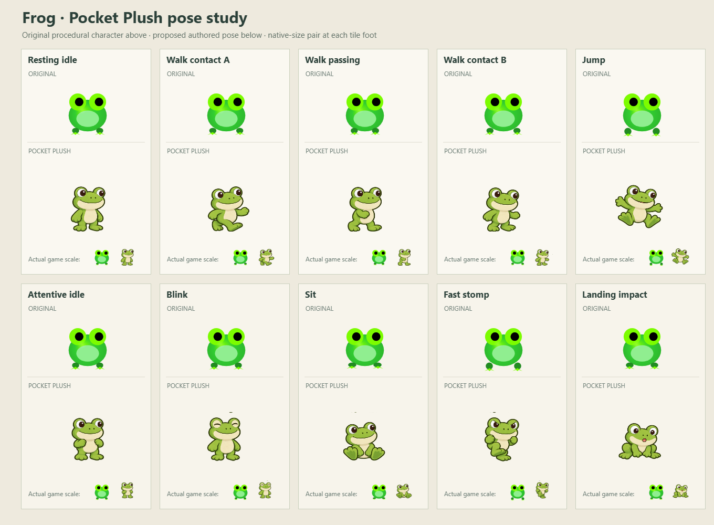
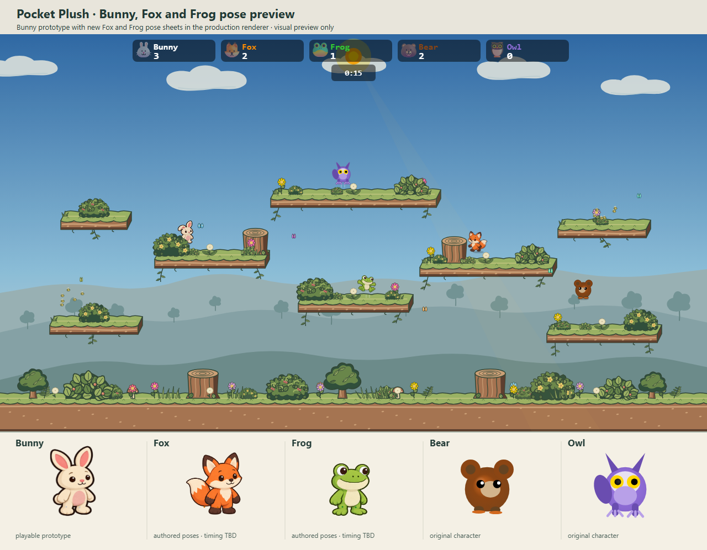
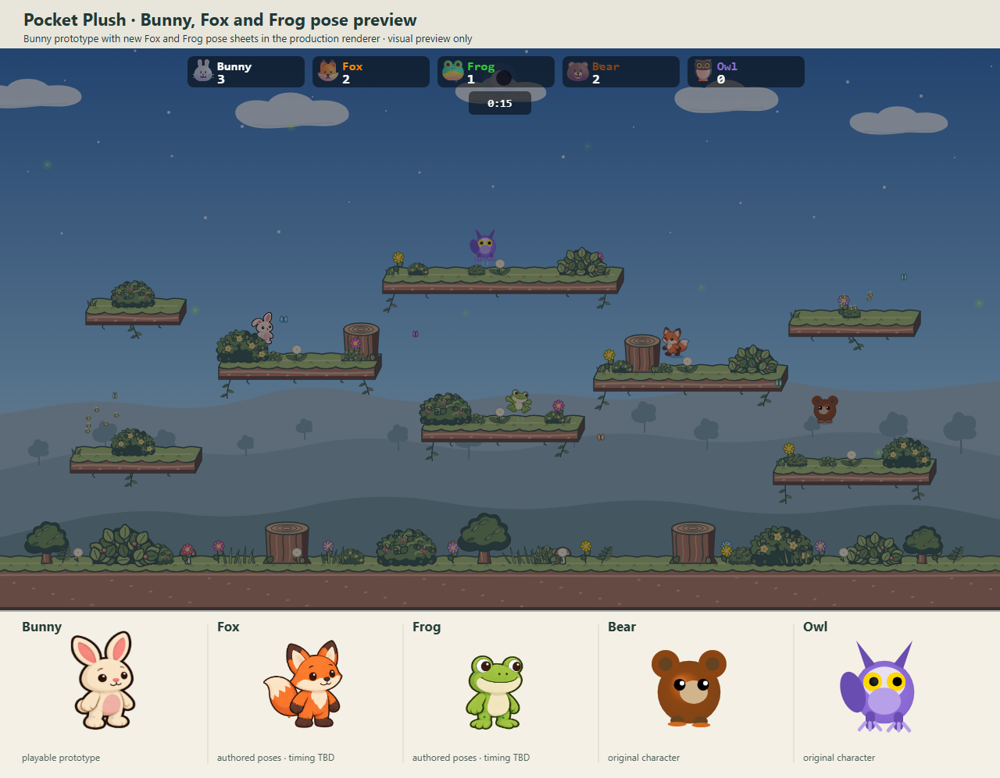

# Character roster redesign · batch 1

The established Pocket Plush Bunny is the style and motion reference. This first batch studies **Fox** and **Frog**, which test two different silhouettes: a large directional tail and pointed ears versus high-set eyes, a wide mouth, and webbed feet. Both sheets use complete authored bodies for each action. They retain the warm toy volume, connected limbs, and smooth dark ink of Bunny while giving each species its own acting.

## Original beside proposed states

Each board compares ten beats: resting idle, three walk phases, jump, attentive idle, blink, seated, angry fast stomp, and landing impact. The original row uses the current procedural pack in the closest matching state. Some original beats share the same base drawing; the live renderer adds motion transforms and effects that the board does not reproduce. The proposed row uses the new source pose. The small pair at the foot of each tile is at game scale, while the larger drawings expose details for review.

| Fox | Frog |
| --- | --- |
|  |  |

Fox's walk alternates visible paws and swings the tail without detaching it. The attack sweeps its ears back and gathers the feet; the landing puts its weight back on bent legs. Frog uses webbed foot positions and arm reach for its gait and jump. Its fast stomp carries intent through the eye shape and gathered limbs rather than simply stretching the idle body.

## Meadow context

These are real production-renderer snapshots with the existing arena, lighting, and character placement. Bunny uses the playable Pocket Plush prototype, Fox and Frog use the new pose sources, and Bear and Owl remain original. Foreground bushes keep their opaque gameplay cover. The scene is a visual preview; Fox and Frog have not yet been wired into the live match or packed into runtime atlases.

| Original roster · day | Batch 1 preview · day |
| --- | --- |
|  |  |

| Original roster · night | Batch 1 preview · night |
| --- | --- |
|  |  |

The full-size editable studies are [Fox](fox-poses-source.png) and [Frog](frog-poses-source.png). The [comparison renderer](render.ts), [preview packs](previewPacks.ts), and [capture script](capture.mjs) reproduce the boards and Meadow snapshots from a running Vite server. For example:

```text
node docs/mockups/character-roster-batch-1/capture.mjs <running-vite-base-url>
```

The base URL includes `/bunnybrawl/` and a trailing slash. The capture waits for the renderer and fails on browser errors.

## Roster batches

| Batch | Characters | Reason for grouping |
| --- | --- | --- |
| Reference | Bunny | Playable prototype and style baseline. |
| **1** | **Fox, Frog** | Test tail-driven and broad-eyed motion before repeating the method. |
| 2 | Bear, Owl, Cat | Round weight, wings, and feline agility. |
| 3 | Wolf, Panda, Pig | Different snouts and body mass. |
| 4 | Cow, Goat, Horse, Sheep | Hooves, horns, long face, and wool. |
| 5 | Monkey, Tiger, Rhino | Long arms or tail, stripes, and heavy horn. |
| 6 | Hedgehog, Chick, Axolotl | Spines, tiny wings, and external gills. |

For each batch, review the original and proposed states at game scale and in day/night scenes, then refine shapes before packing and testing animation in a live match. Keep the 32 × 32 gameplay collision and the existing foreground cover behavior. Do not reuse one animal's pose drawings with only a color swap.
