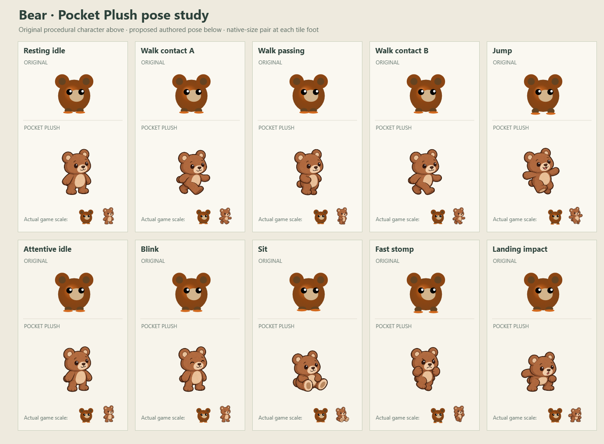
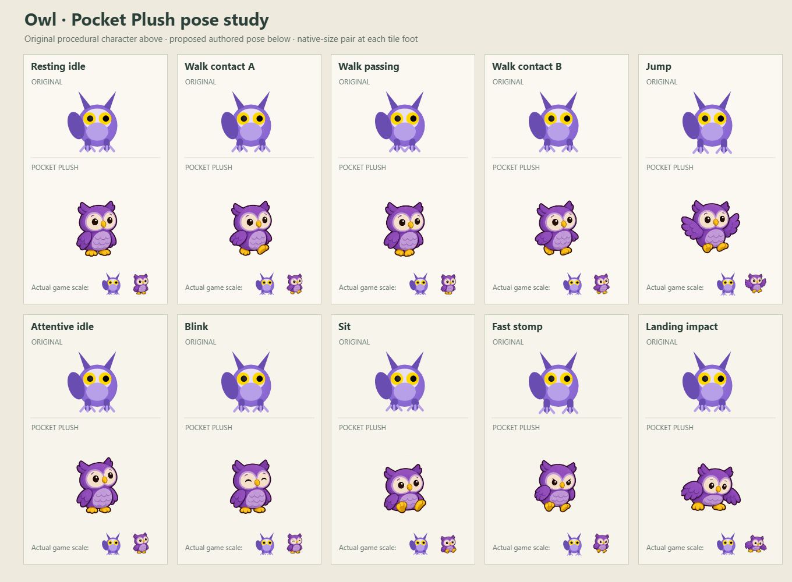
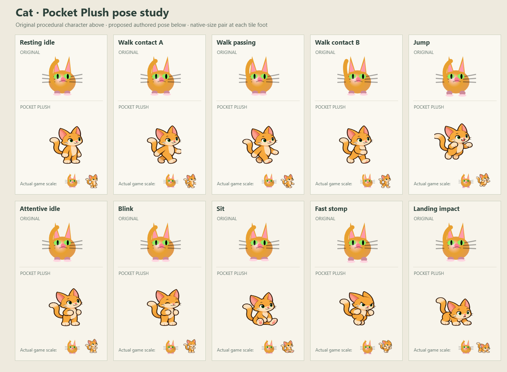
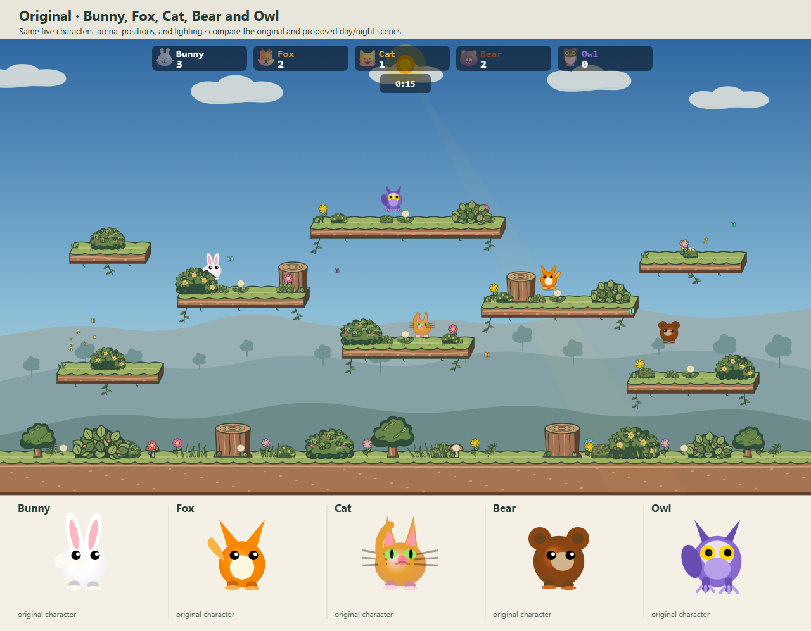
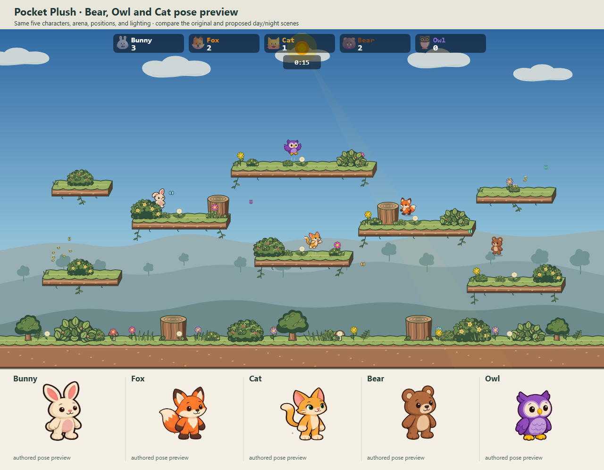
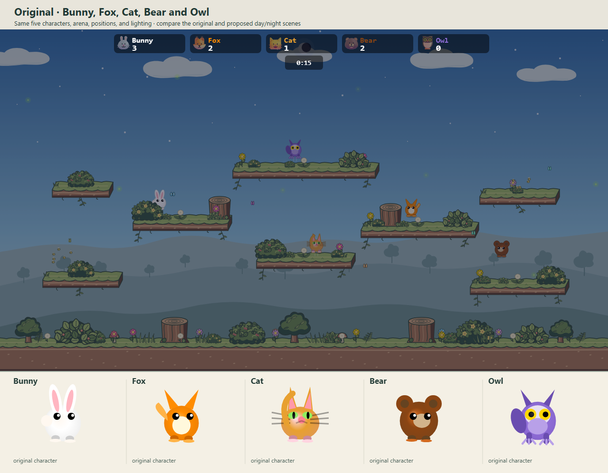
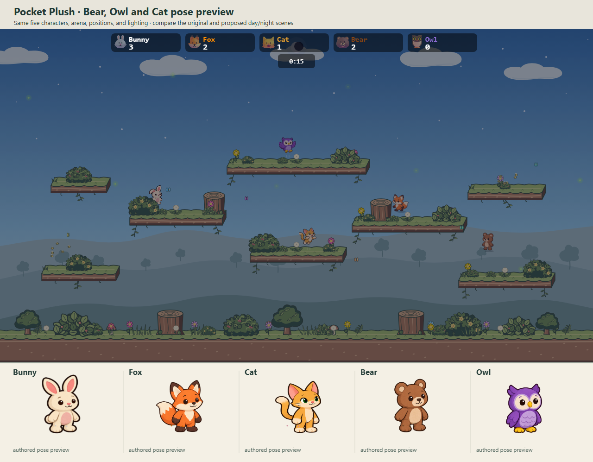

# Character roster redesign · batch 2

This batch explores **Bear, Owl, and Cat** in the Pocket Plush direction established by Bunny and the [Fox/Frog studies](../character-roster-batch-1/README.md). It tests round body weight, wing-led motion, and a slimmer tailed animal without turning them into the same toy with different head details.

## Original beside proposed states

Each board compares resting idle, three walk phases, jump, attentive idle, blink, sit, angry fast stomp, and landing impact. The original row is drawn by the current procedural pack in the closest state. Its live motion transforms and effects are not reproduced in the board; several original beats share the same base drawing. The small pair at each tile's foot shows actual game scale.

### Bear



Bear has the strongest body weight in this batch: paws alternate through the walk, the jump opens its arms, and landing gathers its mass without flattening it. Its seated pose keeps both soles visible.

### Owl



Owl moves with wings and talons rather than mammal arms. The open-wing jump differs from its tucked, focused stomp; the pale mask, beak, and yellow feet remain readable at match scale.

### Cat



Cat stays leaner than Bunny or Bear, with a curved tail, green eyes, and light paws. An initial sheet put Cat on all fours and made sit too similar to idle. The retained revision uses the roster's upright posture, an explicit seated silhouette, and gathered paws for the stomp. This preserves the existing game's movement language while letting the tail and ears give Cat its own acting.

## Meadow context

Both columns use the production Meadow renderer with the **same five characters, positions, and lighting**. The preview combines the Bunny prototype, batch 1 Fox, and this batch's Cat, Bear, and Owl. The original column uses their current procedural packs. Foreground bushes still hide players as intended.

| Original · day | Pocket Plush preview · day |
| --- | --- |
|  |  |

| Original · night | Pocket Plush preview · night |
| --- | --- |
|  |  |

The full-size source studies are [Bear](bear-poses-source.png), [Owl](owl-poses-source.png), and [Cat](cat-poses-source.png). The [comparison renderer](render.ts), [preview packs](previewPacks.ts), and [capture script](capture.mjs) reproduce the boards and Meadow snapshots from a running Vite server:

```text
node docs/mockups/character-roster-batch-2/capture.mjs <running-vite-base-url>
```

The base URL includes `/bunnybrawl/` and a trailing slash. The capture waits for the renderer and fails on browser errors. The preview trims each source-sheet cell slightly so adjacent drawings cannot leak into a different pose.

These are review images. The new Bear, Owl, and Cat are not wired into live gameplay or packed as runtime atlases. After visual feedback, the selected pose art needs motion timing, transition checks, two facing directions, lobby rendering, and a performance pass. Gameplay hitboxes and the Meadow arena remain unchanged.
