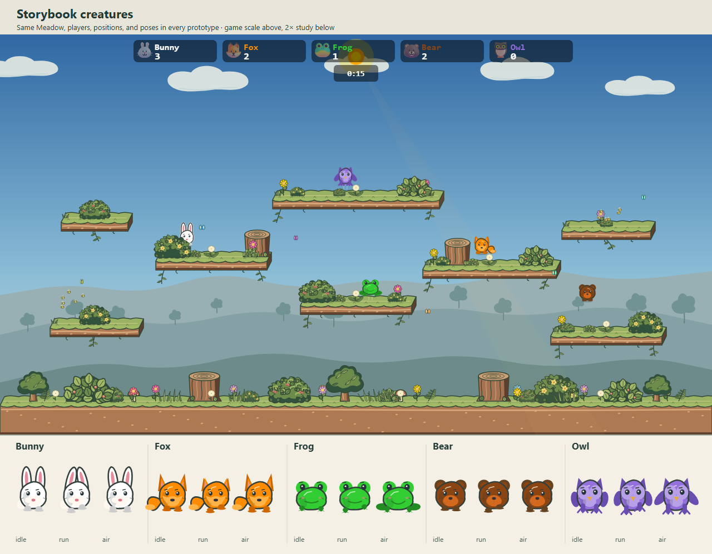
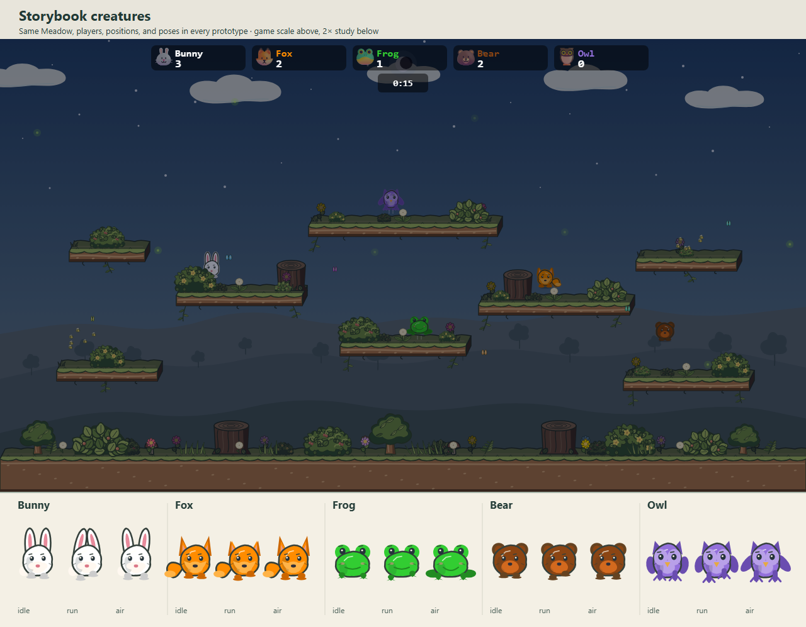
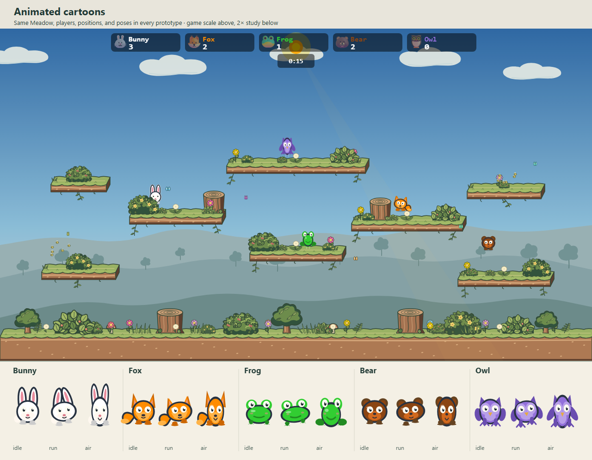
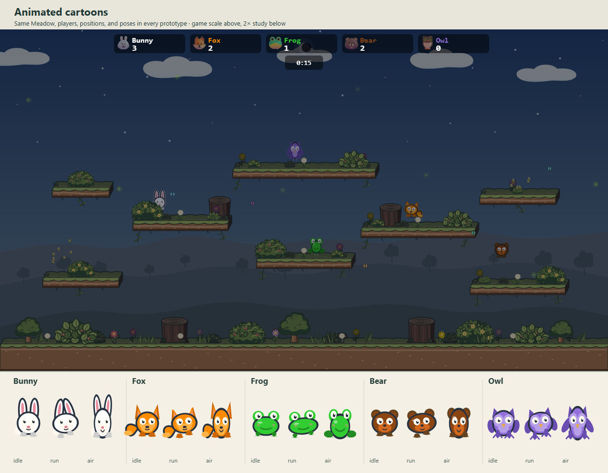

# Character style prototypes

These are **isolated visual prototypes**, not changes to the playable character packs. They replace the five study characters only inside this mockup page. The upper scene uses the production Meadow arena and renderer at 1280 × 720; the lower strip draws each character's shared rendering core at 2× in idle, run, and airborne poses. Player positions and poses are identical across styles. Frog sits on the middle platform so all five can be compared outside intentional foreground cover.

| Style | Day | Night | What it tests |
| --- | --- | --- | --- |
| **Current** |  |  | Baseline silhouettes, eyes, and color. |
| **Storybook creatures** |  |  | Uneven inked bodies, layered color, quieter eyes, and small expression marks that rhyme with Meadow's props. |
| **Soft toys** |  |  | Fabric patches, belly seams, button-like eyes, and gentler silhouettes. |
| **Animated cartoons** |  |  | Bold eyes and outlines, stronger running lean, and elongated airborne poses. These frames demonstrate pose shapes, not animation timing. |

## First review

- **Storybook** feels most at home with Meadow's outlined platforms and foliage. Bunny separates well from the sky. Some face marks, particularly at night, may be too small to matter at match scale.
- **Soft toys** have the warmest close-up character. The fabric details are subtle at match scale, so this direction would need stronger mass and appendage changes before a roster-wide rollout.
- **Cartoon** makes airborne poses and faces easy to spot. Its larger eyes and narrow stretched bodies are the most conspicuous departure from the arena's storybook style; motion would need careful timing to keep stomp targets clear.
- **Night** darkens all candidates substantially. The comparison is useful for silhouette, but no prototype here solves general night contrast by itself.

None of these images changes hitboxes, cover, actual match character packs, or animation timing. The `prototypePacks.ts` module is deliberately private to this page. A chosen direction should be refined with side-by-side screenshots at reduced display size, then tested in live movement before altering the full 19-character roster.

## Reproduce

From the repository root, run `npx vite --host 127.0.0.1 --port 4193`, then `node docs/mockups/character-styles/capture.mjs`. The capture script fixes the viewport, character positions, random seed, and lighting phase, and fails on browser page errors. The generated PNGs are committed so the comparison remains accessible without a running server.
