# Character style prototypes — plush directions

The first Storybook and Cartoon studies were rejected. This set keeps the original **Soft toys** prototype and explores three stronger plush directions. Pocket Plush Bunny can now be played in a local match through an opt-in URL flag. The default Bunny, hitboxes, and foreground cover remain unchanged.

The later roster studies are in [Fox and Frog](../character-roster-batch-1/README.md), [Bear, Owl, and Cat](../character-roster-batch-2/README.md), and the [remaining 13 animals](../character-roster-completion/README.md). Together they cover visual pose comparisons for all 19 built-in animals. Only Bunny is playable in the opt-in prototype.
The [expressive second pass](../character-roster-expressive/README.md) pushes all 19 farther apart in body shape, physical traits, personality, and action silhouettes.

The upper half of each capture is the production Meadow renderer at 1280 × 720. The lower strip enlarges the same five study characters: Bunny, Fox, Frog, Bear, and Owl. Positions, lighting phase, and random seed are fixed. Frog stands on the middle platform to keep all five visible outside deliberate bush cover. The source concept sheets are transparent and appear below the comparisons.

| Direction | Day at match scale | Night at match scale | Design question |
| --- | --- | --- | --- |
| **Current** | 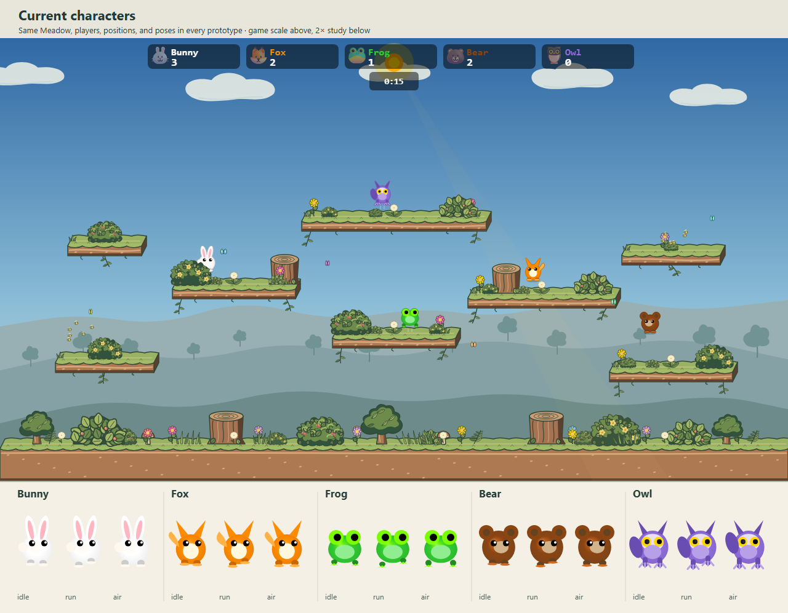 | 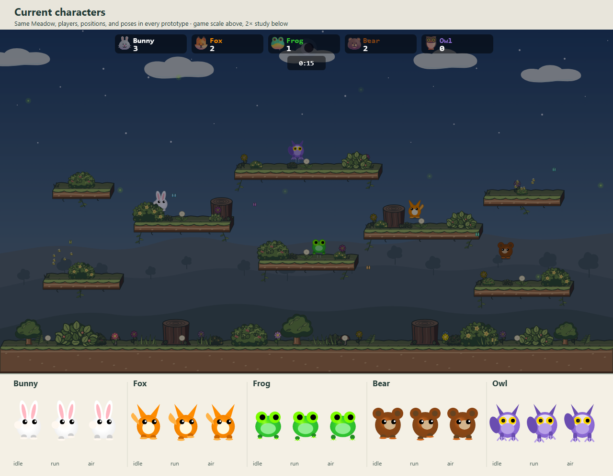 | Baseline for silhouette and lighting. |
| **Original Soft toys** | 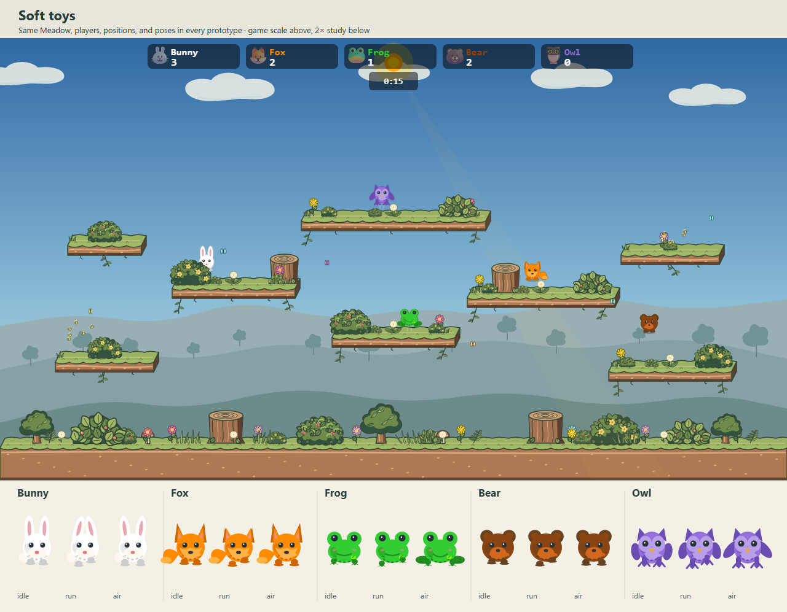 | 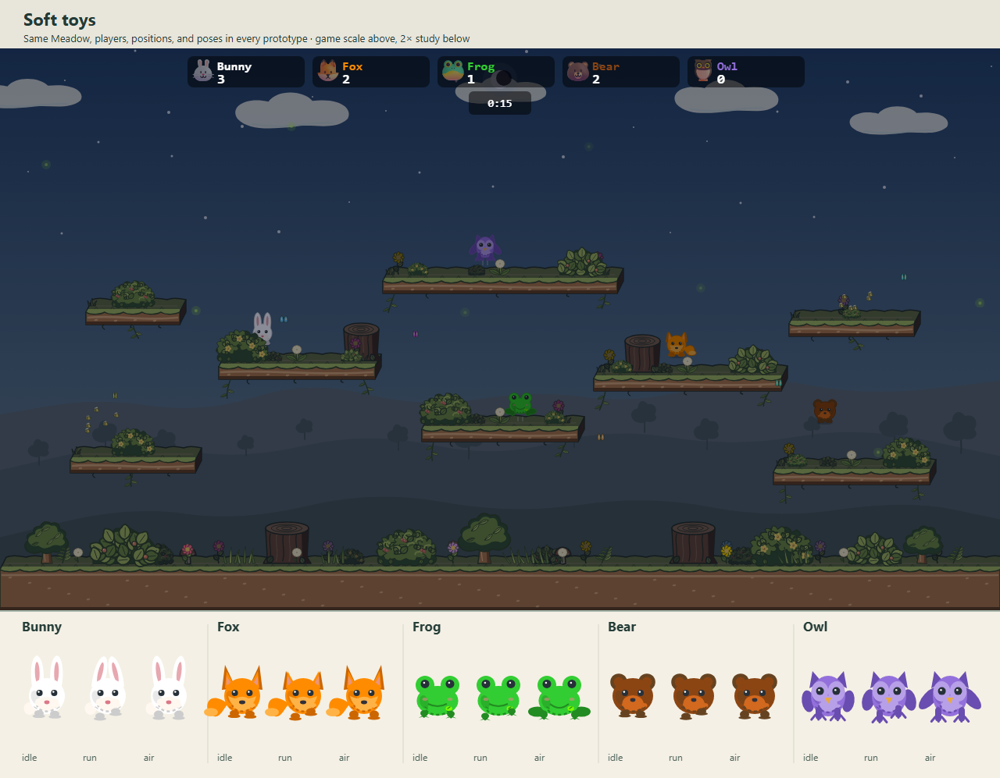 | The retained Canvas prototype: small fabric patches, seams, and button-like eyes. |
| **Pocket plush** | 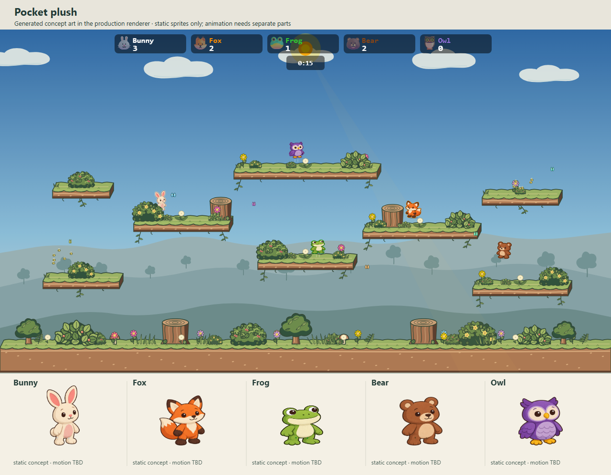 | 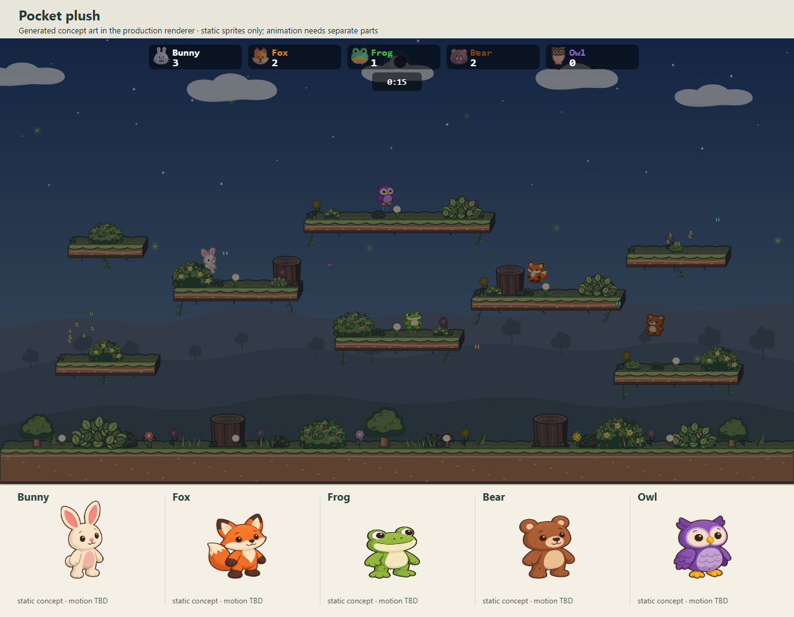 | Compact padded heads, clear face panels, and distinct tails and wings. |
| **Floppy beanbags** | 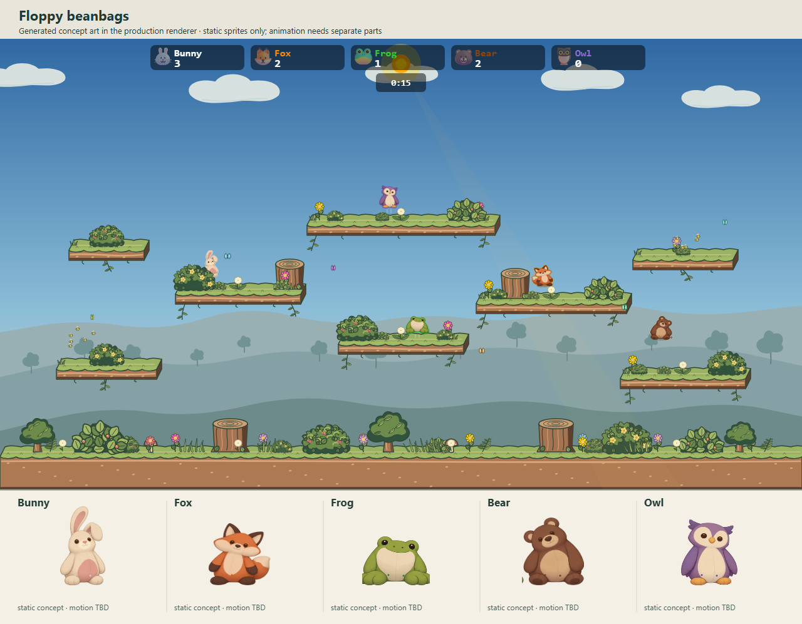 | 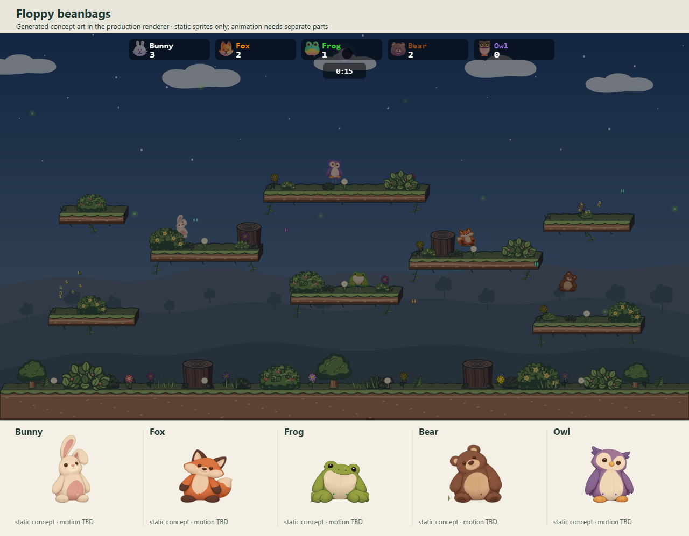 | Relaxed, bottom-heavy masses and asymmetrical appendages. |
| **Layered felt** | 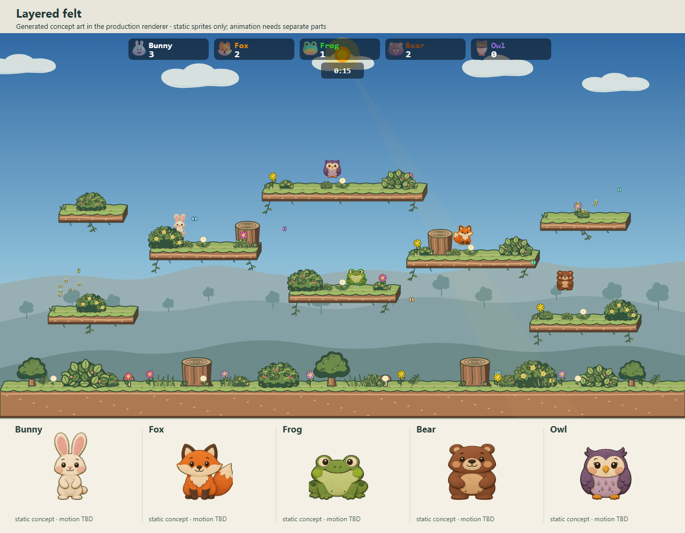 | 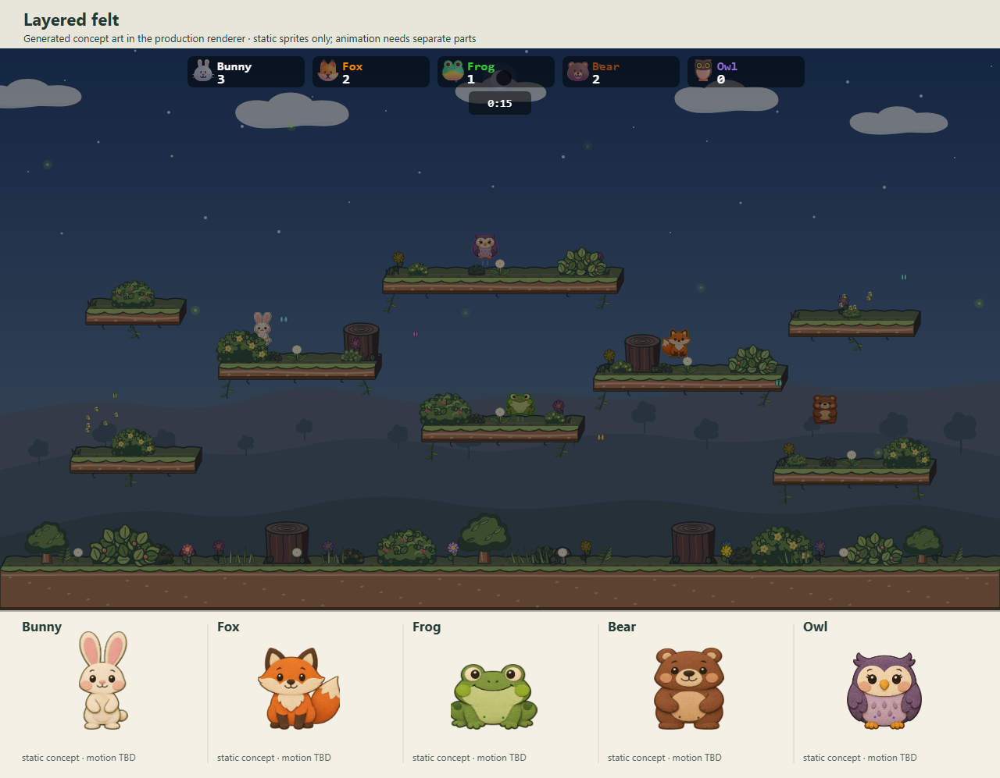 | Broader flat shapes and overlapping felt pieces closer to Meadow's drawn props. |

## Pocket Plush Bunny motion test

### Play it in the game

Start the dev server with `npx vite --host 127.0.0.1 --port 4193`, then open [Meadow with Pocket Plush Bunny](http://127.0.0.1:4193/bunnybrawl/?arena=meadow&bots=1&pocketBunny=1). P1 controls are **A/D** to move, **W** to jump, and **S** to fall quickly. The URL starts a real match with one bot. Remove `pocketBunny=1` to return to the original Bunny. The alternate renderer worker mode is available by adding `&simWorker=off`.

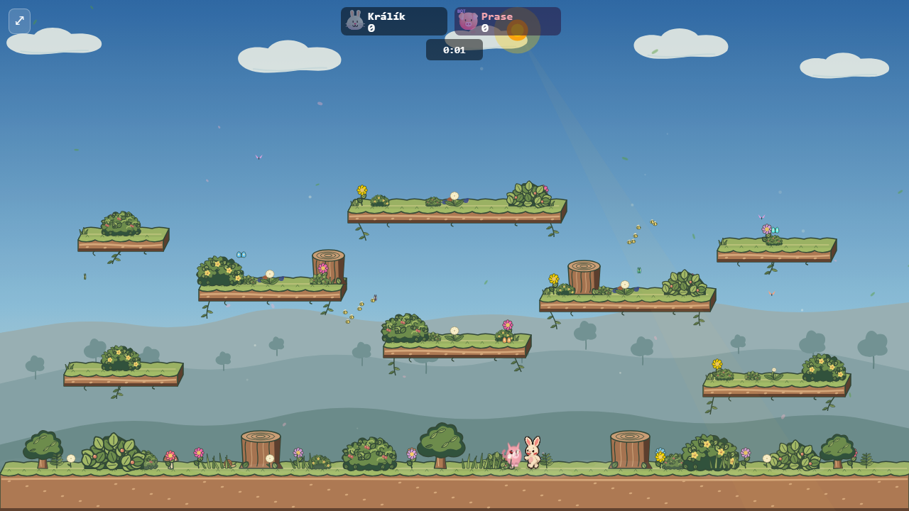

The image above was captured from a running match. Browser tests verify that P1 moves in both worker modes. The authored Bunny pose atlas loads only with the opt-in flag. The packed game atlas is 357 KB; the larger source paintings remain in this study folder.

### Motion study

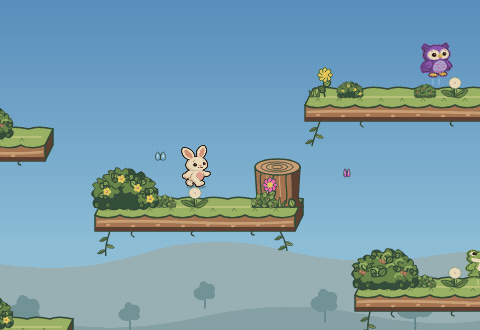

| Day, with idle, sit, walk, jump, fast stomp, and impact poses | Night, same renderer and lighting |
| --- | --- |
| 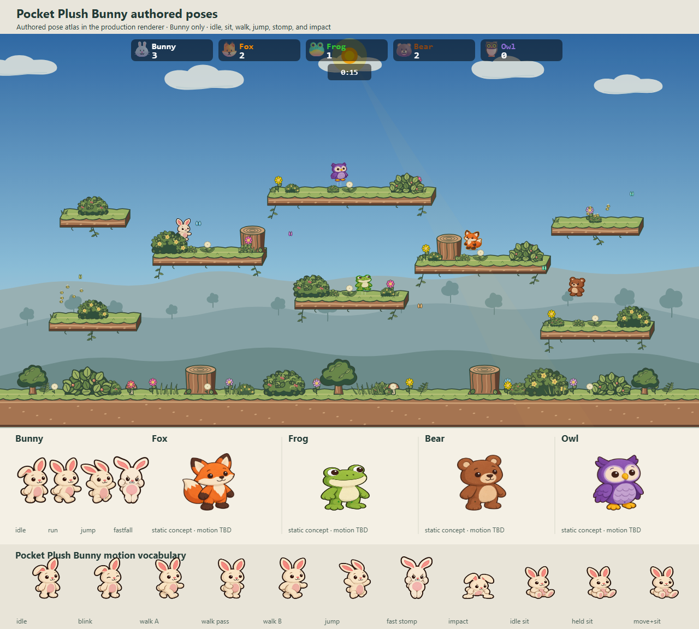 | 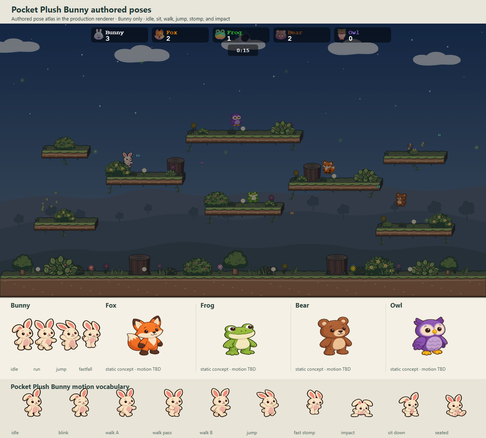 |

This revision uses [10 authored poses in a compact atlas](v4/pocket-bunny-game-atlas.png): original idle, attentive idle, blink, three walk shapes, jump, fast stomp, landing impact, and seated. The four-frame walk cycle repeats the passing shape. The awkward half-sit drawing was removed. Both the random idle sit and the player-controlled grounded crouch use the same seated pose. Moving while holding crouch gives it a small foot-anchored sway; interrupting an idle sit with movement gives it a 0.24-second seated sway before the walk frames. The original source art is retained in [v4](v4/); `packPocketBunnyAtlas.mjs` crops and packs the runtime sheet with a dark edge built at 4× game resolution. The generic outline, lean, run bounce, fast-fall stretch, landing squash, and shared transform-based idle actions are disabled for this Bunny only. Sprite caching, facing flip, gameplay physics, and foreground bush cover remain. Other animals retain their static Pocket Plush concepts for comparison. The GIF's path is manually keyed; it does not show live physics or input.

The fast stomp uses a [round-bodied angry pose source](v5/angry-fast-stomp-chubby-source.png) with swept ears, clenched fists, narrowed eyes, and a gritted mouth. It replaces pose 8 in the packed atlas; [the earlier slimmer drawing](v5/angry-fast-stomp-source.png) is retained for comparison. The first round-bodied export was too wide at 36 game pixels. It is now packed at 32 pixels, matching the jump pose's width while keeping the same height. Compare the [oversized game crop](v5/chubby-stomp-live.png) with the [corrected game crop](v5/matched-stomp-live.png). The generic red angry-eyebrow overlay is suppressed for this authored Bunny because its fixed coordinates drift across the different poses; the stomp expression is painted into its sprite. [Post-stomp brow crop](v5/brow-fix-live.png) shows the result. Meadow's ground art now overscans both viewport edges without changing its collision box. The live foreground is tinted at night with the same ambient color as the background night variant, preserving transparent areas and opaque bush cover. [Night match capture](v5/night-match-after.png) shows the props and ground edge after these changes.

### Performance and audio check

Headless Chromium on this development machine, three fresh browser contexts per variant, production preview, Meadow with one bot:

| Mode | Original Bunny: median arena ready | Pocket Bunny: median arena ready | Frame median and p95 |
| --- | ---: | ---: | --- |
| Default simulation worker | 1503 ms | 1500 ms | 16.66 / 16.67 ms for both |
| `simWorker=off` | 1052 ms | 1163 ms | 16.66 / 16.67 ms for both |

Cold entry varied across these three-trial local samples; the prototype was roughly equal in the default worker mode and about **111 ms slower** with `simWorker=off`. Neither variant missed the browser's 60 fps cadence during the two-second frame sample. A separate warmed full-renderer probe measured **0.395 ms** for the current procedural roster, **0.327 ms** for static Pocket Plush, and **0.312 ms** for the authored Bunny with the other four Pocket Plush concepts. The full-renderer styles change other characters too, so that probe is indicative only. These short local runs do not establish performance on slower devices or explain every aspect of perceived movement speed. The current packed atlas transfers 356,842 bytes instead of the old 1.50 MB source sheet. Reproduce with `benchmarkPocketBunny.mjs` against a production preview and `captureBunnyMotion.mjs` against a dev server.

Direct arena entry can finish loading without browser user activation. If autoplay rejects the arena MP3, the first gameplay key, pointer, or touch now retries playback; pause/unpause is no longer required. A browser test forces that rejection and checks that the retry does not create a second track.

## Full-size concept art

| Pocket plush | Floppy beanbags | Layered felt |
| --- | --- | --- |
| 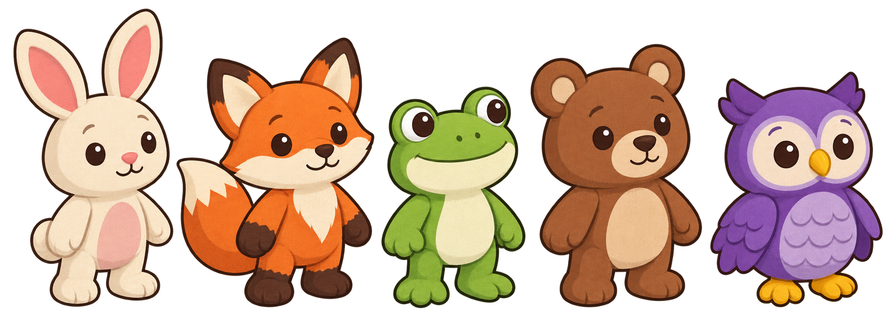 | 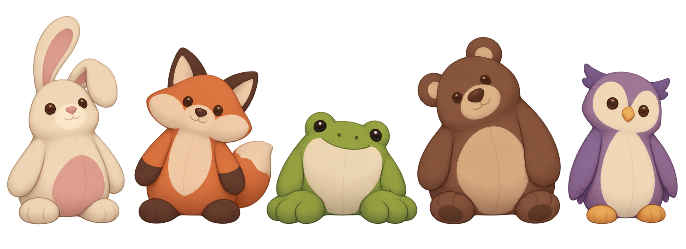 | 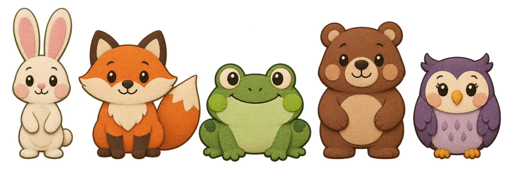 |

These high-resolution concepts were generated from art briefs. The match-scale previews crop and draw them as static raster sprites through the production renderer. The original Soft toys prototype remains procedural Canvas art. At match scale the three new directions gain recognizable silhouettes; fine felt and fabric texture largely disappears. Night still dims Bear and Owl considerably, so their pale face and chest areas need further tuning if either direction is selected.

## Animation and rendering feasibility

- The static previews prove that the designs can be placed and sprite-cached in the current renderer. The 10-pose Bunny atlas runs in a real match in both worker modes; slower devices remain unmeasured.
- The original flattened concept could not produce clean joints: moving cutouts exposed missing art and scarred the forehead. Authored whole-body poses solve that for Bunny. Other characters still need their own pose art if selected.
- Keep large source sheets out of the runtime bundle. Pack at game scale and benchmark both arena entry and live frame pacing.
- Keep opaque foreground bushes over players. Any character outline, face highlight, or moving appendage must remain inside the player layer so cover still hides it.

The next implementation decision is a longer hands-on gameplay review of pose timing, occlusion, and input feel before turning the later visual studies into playable character packs.

## Reproduce

Run `npx vite --host 127.0.0.1 --port 4193` from the repository root, then `node docs/mockups/character-styles/capture.mjs` for the style gallery and `node docs/mockups/character-styles/captureBunnyMotion.mjs` for the Bunny captures, GIF, and warmed-frame timing. Captures use a fixed viewport and fail on browser page errors. The PNGs and GIF are committed so no local server is needed for review.
