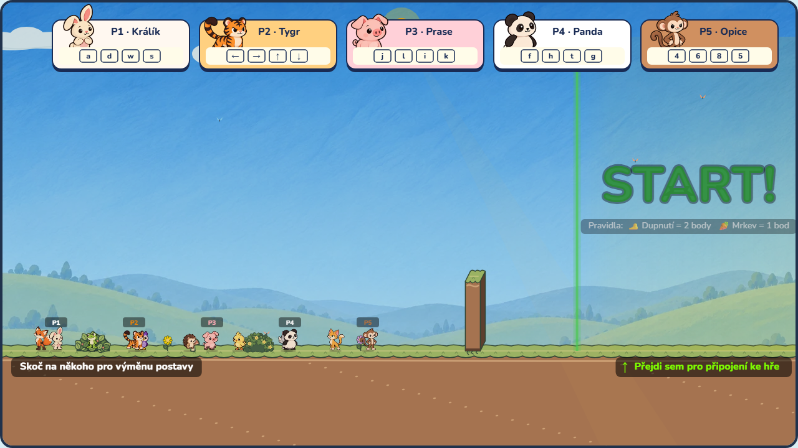
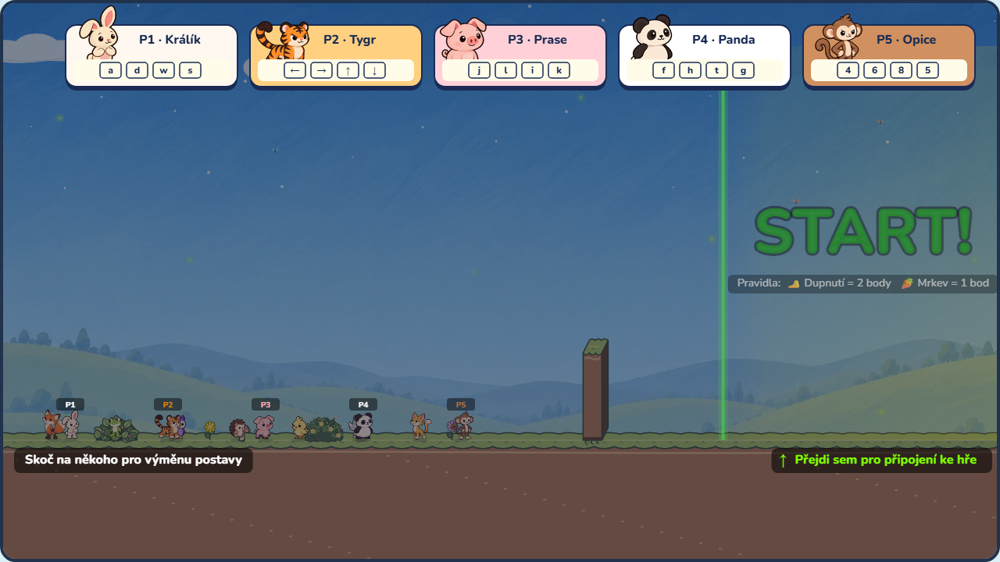
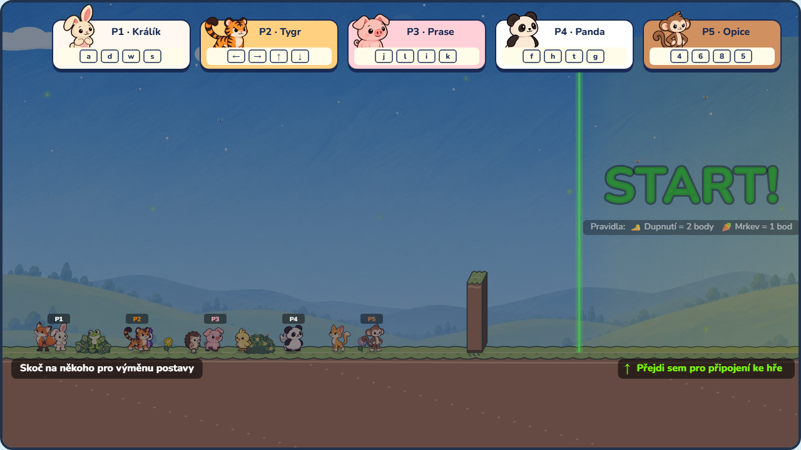
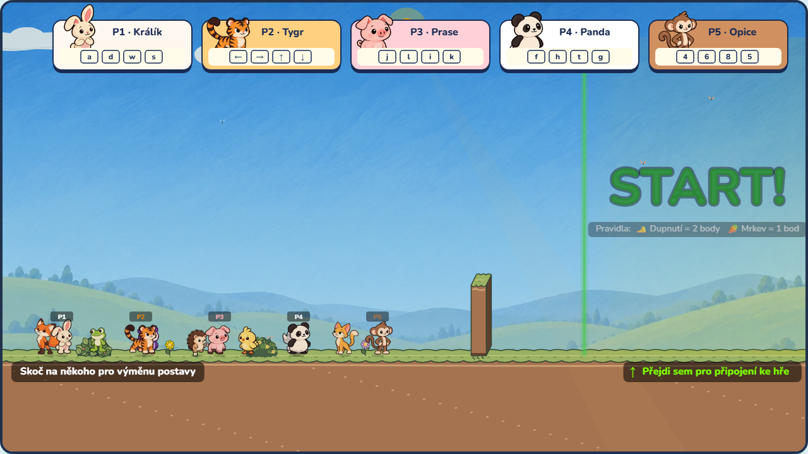
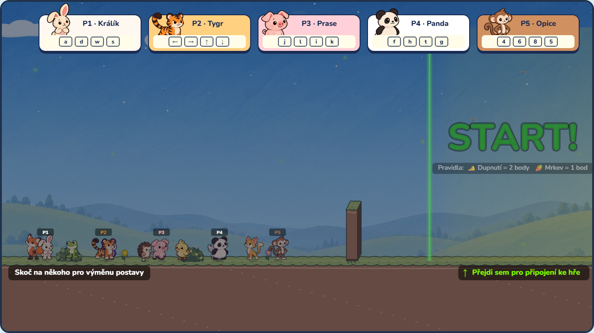
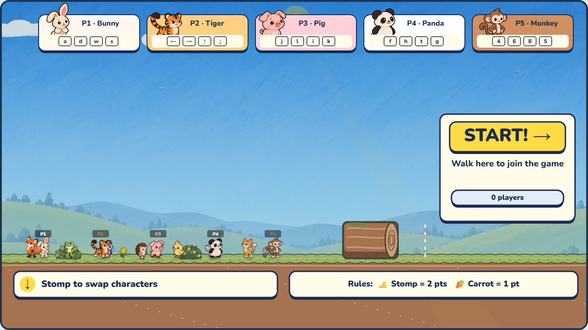
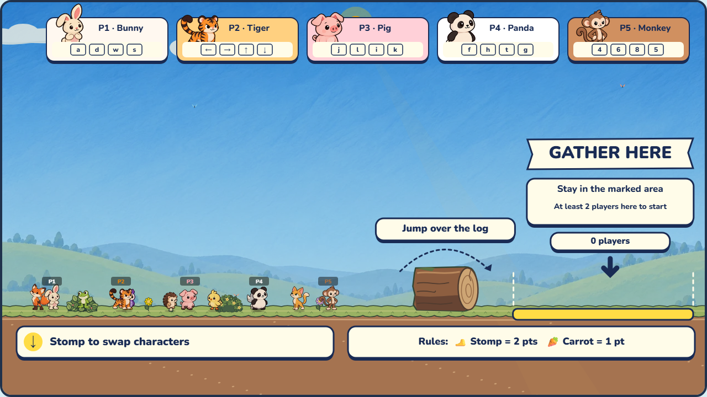
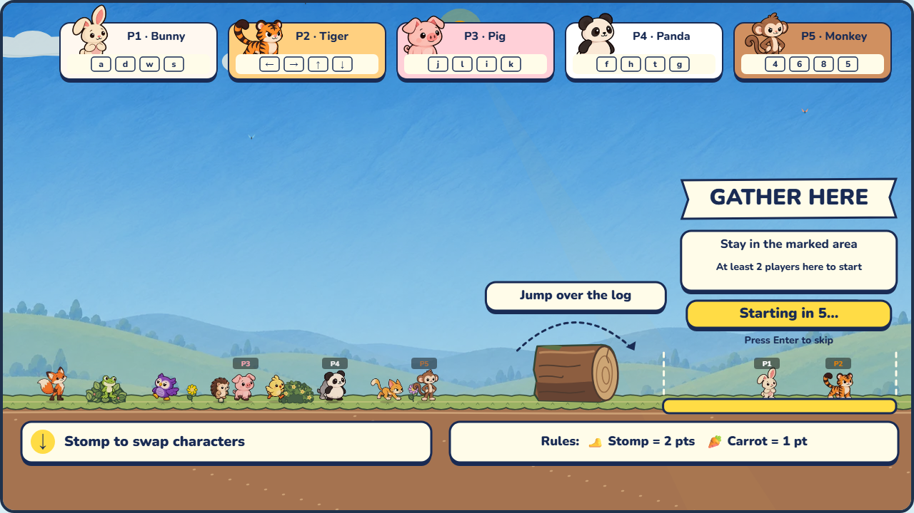

# Painted lobby and gameplay size study

Open [the playable comparison](index.html) through the local Vite server. It uses the production LobbyGame, Renderer, character atlases, and UI overlay. Choose 1×, 1.25× or 1.5×; use WASD or arrows to walk, jump and stomp. The production lobby always uses the approved 1.5× size. The match link launches the study's selected scale in a Meadow match.

The lobby now reuses Meadow's selected low painted valley (65% blend), clouds, leafy bushes, flowers, mushroom and storybook earth/platform skin. The floor remains at y=560 and the jump obstacle is a 120×80 fallen log. Bushes sit separately at x=145 and x=410; the tutorial approach and ready area remain open.

| Scale | Body | Lobby speed | Lobby jump height | Airtime |
|---|---|---|---|---|
| 1× | 32×32 | 200 px/s | 133 px | 1.33 s |
| 1.25× | 40×40 | 250 px/s | 167 px | 1.33 s |
| 1.5× | 48×48 | 300 px/s | 200 px | 1.33 s |

The jump heights are continuous-physics estimates; fixed-step simulation differs slightly. Dimensions, speed, acceleration, braking, gravity, jump velocity, fast-fall, push, stomp bounce and spring launch scale together. Timers and animation timing stay unchanged. `MatchSettings.characterScale` carries the setting through local matches, workers, arena changes and host settings sync. Default match size remains 1×; the lobby uses 1.5× independently. URL experiments use `?characterScale=1.25` or `?arena=meadow&bots=2&characterScale=1.5`. The first supported comparison range is 1–1.5×.

Character artwork keeps its foot anchor. Authored plush poses scale with body height; sprite caches reject bitmaps baked for a different body size and scale their silhouette padding. Existing Giant Players size and carrot power-up effects remain separate modifiers. Larger-size bot navigation rebuilds and caches the arena graph; existing 1× navigation stays unchanged. Route estimates retain the existing approximate geyser and zero-G models; larger scale has not been tuned across every arena.

## Matched production-art captures

These use seeded characters and fixed initial positions (`?still&scale=…`) with the actual production renderer. Night changes lighting only.

| Scale | Day | Night |
|---|---|---|
| 1× |  |  |
| 1.25× |  |  |
| 1.5× |  |  |

The study keeps players in the lobby for practice; the real game starts a match after sufficient players enter the ready zone.

## Refined lobby UI and fallen log

The lobby now uses cream instruction cards under the ground and a yellow Start sign with localized walk-to-join text, ready counts and countdown. The top player tickets stay as approved. The tutorial obstacle is now a fallen log: its collision body intentionally changed from a 24×120 post to a 120×80 log so the artwork and blocking surface agree. The floor and ready-zone boundary remain unchanged. Movement tests cover walk-blocking and jumping at 1×, 1.25× and 1.5×. Legacy wall tests now use layout constants instead of stale literal dimensions.

Language captures: [Czech](lobby-refined-cs.png), [Hindi](lobby-refined-hi.png), [Filipino](lobby-refined-fil.png). The sign wraps localized text rather than clipping it, and instruction labels fit their available width.

## Gathering area revision

The start section is now a gathering pennant with explicit stay-in-area and two-player instructions, a downward arrow, and a bounded ground marker. A localized jump-over-the-log card and dashed jump arc explain the tutorial obstacle. The log has an irregular bark silhouette, a sawn end, and restrained moss. Collision geometry and scaled movement remain unchanged from the fallen-log revision.

Validation: TypeScript build, scoped ESLint, and 84 Vitest lobby tests passed. Production-renderer screenshots were checked in English, Czech, Hindi and Filipino, plus countdown and night states; the capture reported no page errors.
