# Meadow background studies

These are **mockups**, not changes to the game. They use the production Meadow arena, platforms, props, characters, renderer, sky gradient, sun, and day/night treatment at 1280 × 720. The five players have the same fixed positions in every capture. Only the distant landscape or cloud shapes vary.

The current day capture matches the [approved production scene](../meadow-mixed-props/all-assets-day.png) pixel for pixel. Night captures use the same lighting but can differ in ambient particle placement.

| Direction | Day | Night | What it tests |
| --- | --- | --- | --- |
| **Current** |  | 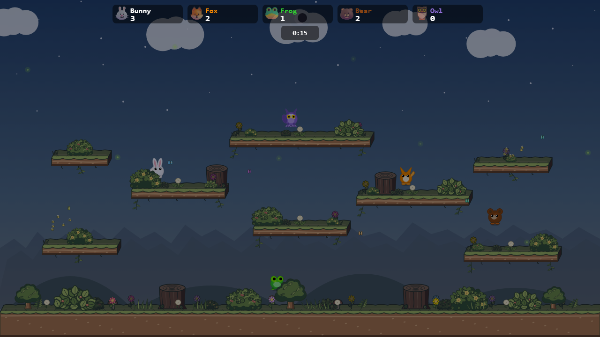 | Existing round hills, sharp distant treeline, and round cloud clusters. |
| **Wooded valley** | 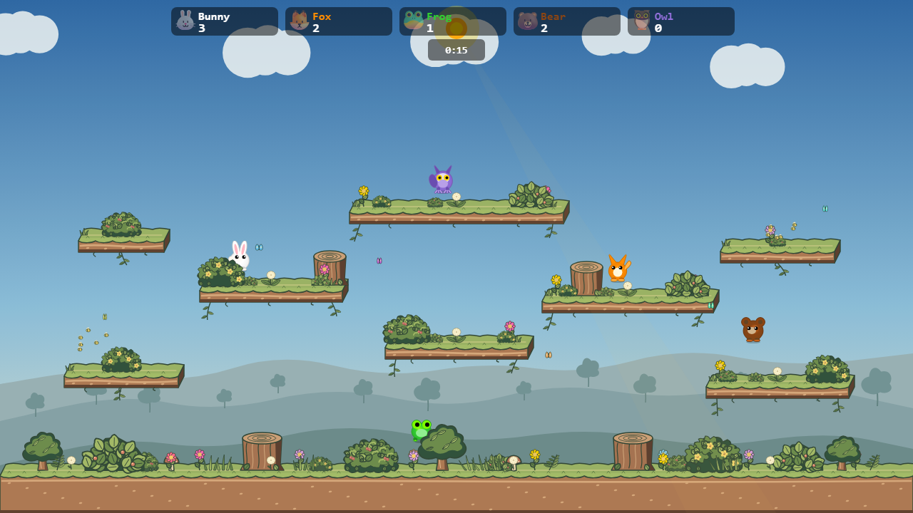 | 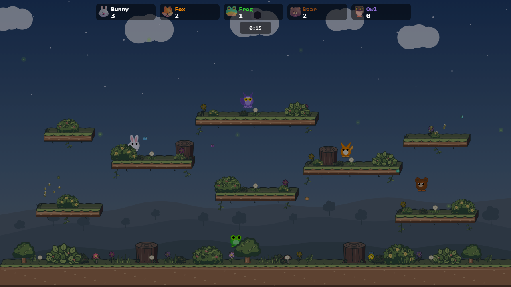 | Broad rolling hills and small, quiet distant trees instead of the zigzag treeline. |
| **Countryside** | 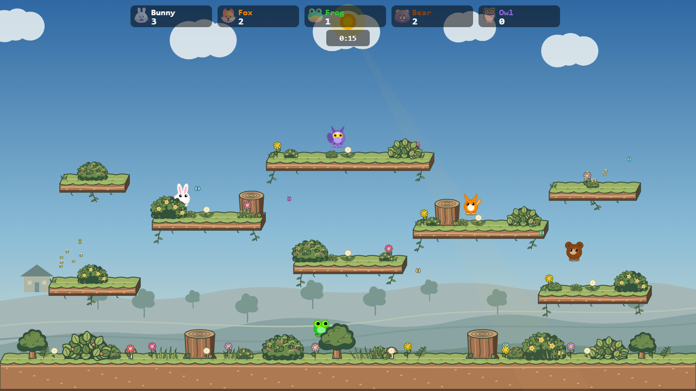 | 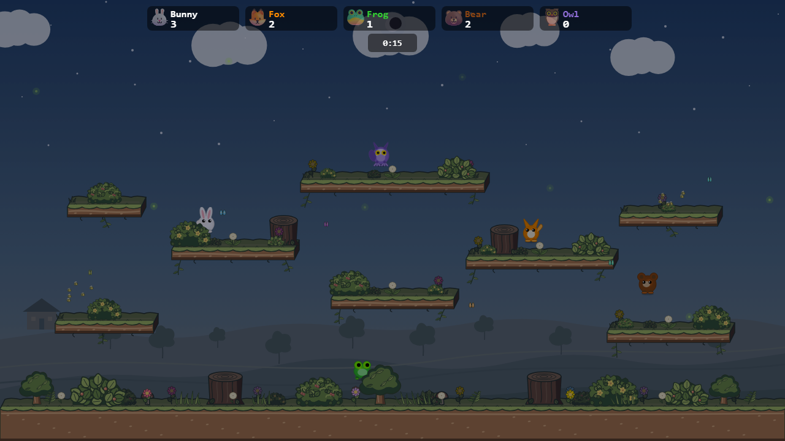 | Field contours, a sparse orchard, and one small cottage as a distant landmark. |
| **Storybook clouds** | 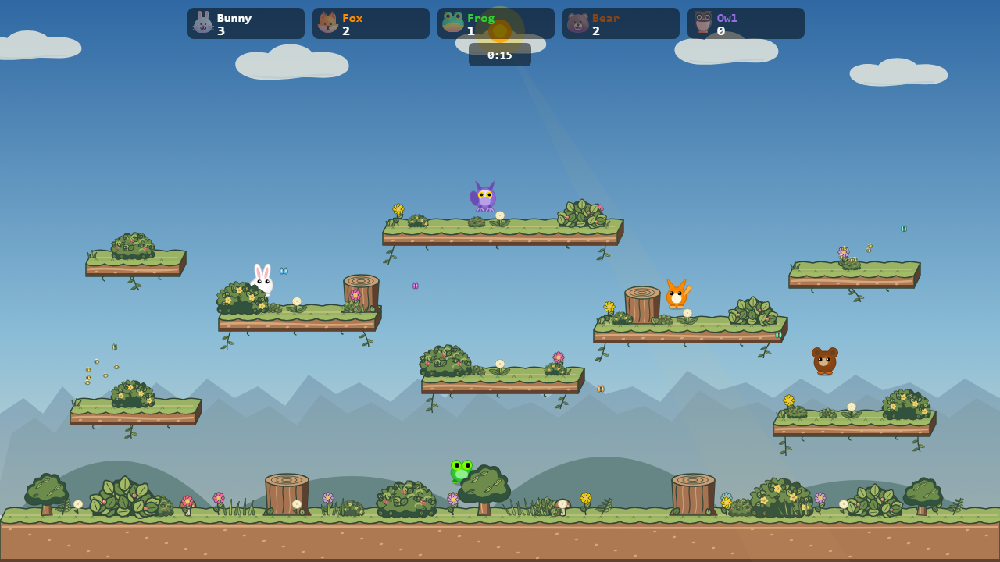 | 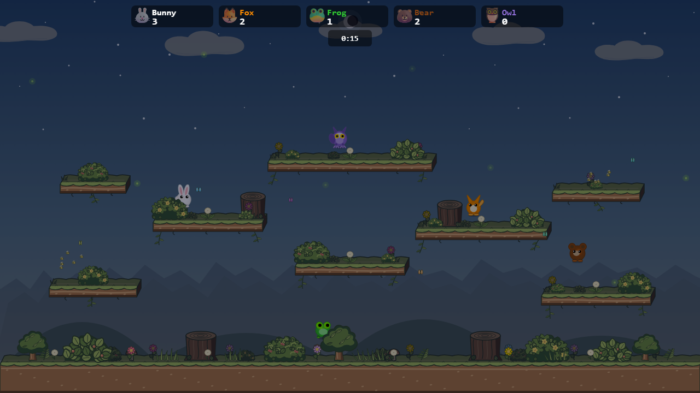 | Longer, irregular cloud silhouettes with a subdued underside. The landscape stays current. |
| **Valley + clouds** | 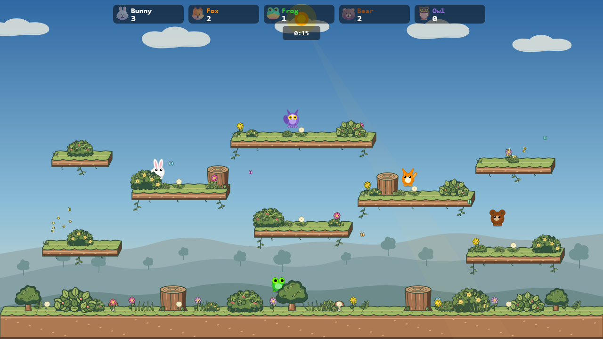 | 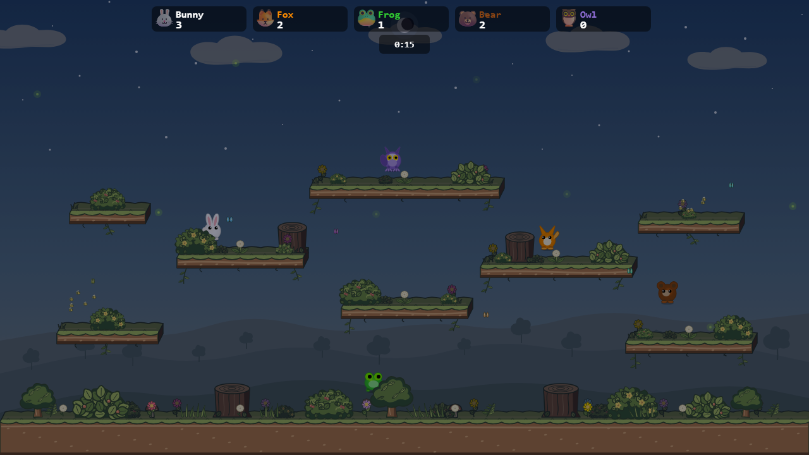 | The calmer landscape and clouds together. |

## Higher hill studies

The valley and storybook clouds were selected for another pass. These two studies raise the far ridge, with smaller changes to the middle and near slopes. Tree positions follow the hills. The original valley + clouds images above remain available for direct comparison.

| Hill profile | Day | Night | Difference from the first valley |
| --- | --- | --- | --- |
| **Raised hills** | 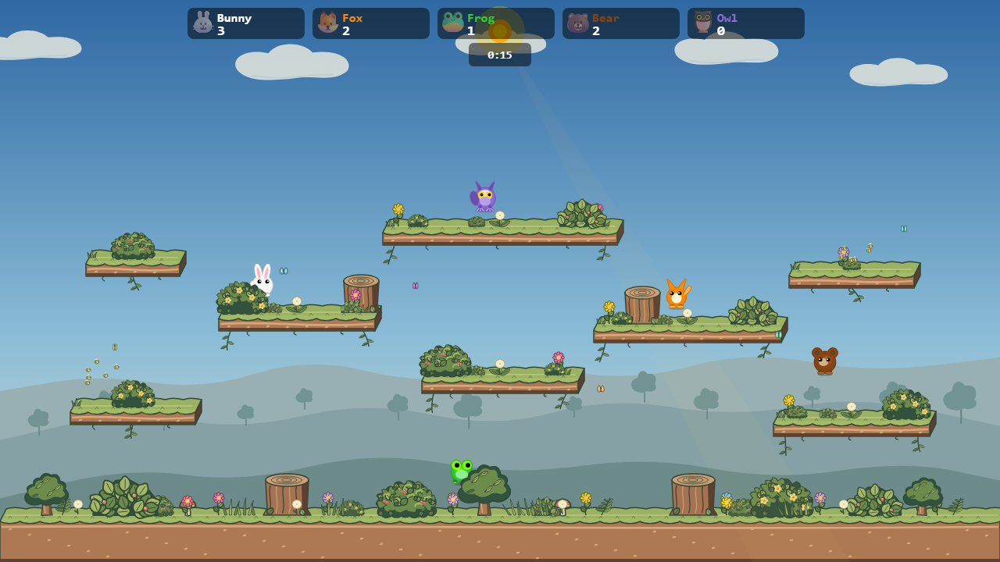 | 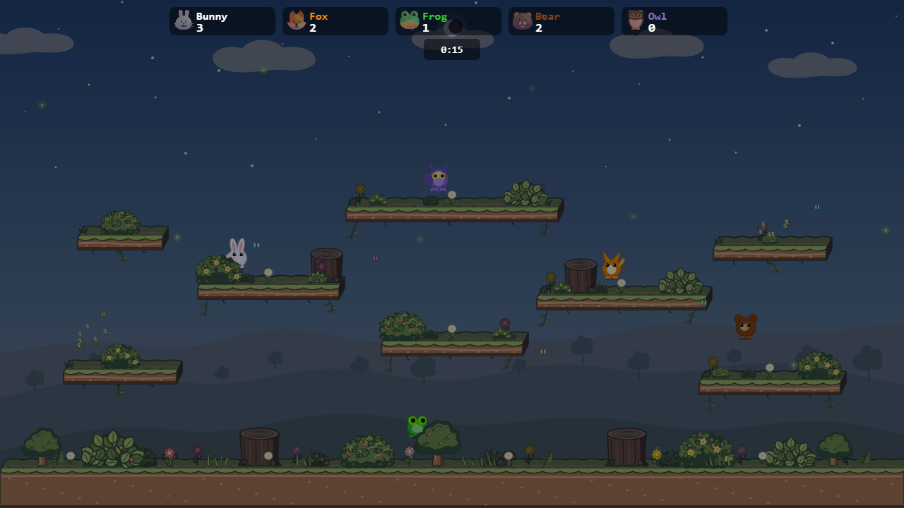 | Far ridge raised about 38 px; middle slopes about 27 px. |
| **Tall hills** | 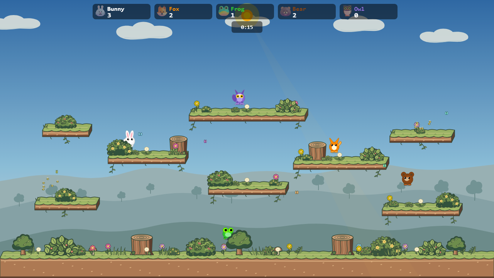 | 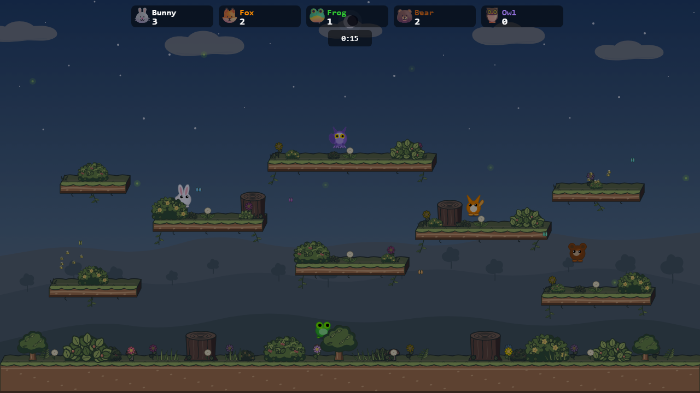 | Far ridge raised about 70 px; middle slopes about 50 px. |

The tall profile gives the valley a stronger presence without reaching the highest platforms. The raised profile keeps more open sky behind the middle of the arena. Both retain the existing night tint and foreground hiding behavior.

The wooded valley leaves the clearest open space around jumping characters. Countryside has more sense of place but also more visual information near the lower lanes. The cloud treatment can be combined with either landscape. The woodland frame experiment was dropped after inspection because its side canopies crowded the outer platforms.

To reproduce the images, run Vite on port 4192 from the repo root with `npx vite --host 127.0.0.1 --port 4192`, then run `node docs/mockups/meadow-backgrounds/capture.mjs`. The [fixture](render.ts) swaps background drawing only. It freezes cloud positions for fair comparisons; if a cloud direction is chosen, its production implementation would need to preserve the game's cloud animation.
