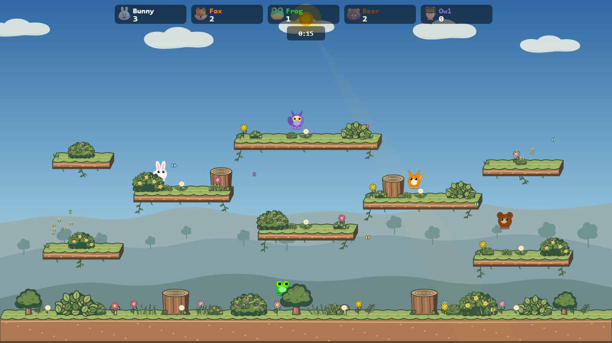
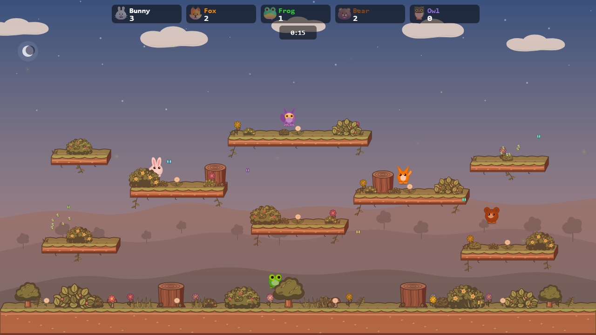
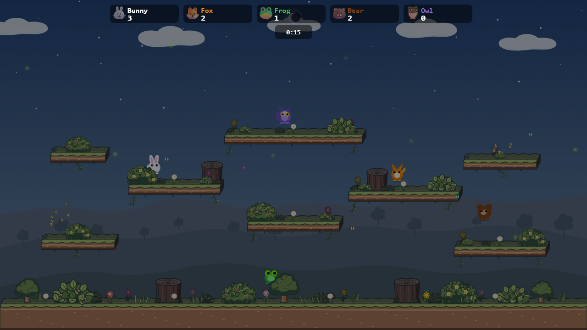

# Meadow background studies

This gallery records the background studies and the selected production result. All captures use the Meadow arena, platforms, props, characters, renderer, sky gradient, sun, and day/night treatment at 1280 × 720. The five players have the same fixed positions in every capture. Only the distant landscape or cloud shapes vary.

The **previous Meadow** day capture matches the [earlier approved production scene](../meadow-mixed-props/all-assets-day.png) pixel for pixel. Both selected tall-hill mockups match the new production captures pixel for pixel at their frozen frame.

| Direction | Day | Night | What it tests |
| --- | --- | --- | --- |
| **Previous Meadow** |  |  | Earlier round hills, sharp distant treeline, and round cloud clusters. |
| **Wooded valley** |  |  | Broad rolling hills and small, quiet distant trees instead of the zigzag treeline. |
| **Countryside** |  |  | Field contours, a sparse orchard, and one small cottage as a distant landmark. |
| **Storybook clouds** |  |  | Longer, irregular cloud silhouettes with a subdued underside. The landscape stays current. |
| **Valley + clouds** |  |  | The calmer landscape and clouds together. |

## Higher hill studies

The valley and storybook clouds were selected for another pass. These two studies raise the far ridge, with smaller changes to the middle and near slopes. Tree positions follow the hills. The original valley + clouds images above remain available for direct comparison.

| Hill profile | Day | Night | Difference from the first valley |
| --- | --- | --- | --- |
| **Raised hills** |  |  | Far ridge raised about 38 px; middle slopes about 27 px. |
| **Tall hills** |  |  | Far ridge raised about 70 px; middle slopes about 50 px. |

The tall profile gives the valley a stronger presence without reaching the highest platforms. The raised profile keeps more open sky behind the middle of the arena. Both retain the existing night tint and foreground hiding behavior.

## Production result

| Day | Sunset | Night |
| --- | --- | --- |
|  |  |  |

The selected tall valley now draws from [`meadowBackdrop.ts`](../../../src/engine/arenas/packs/meadowBackdrop.ts). Meadow's storybook cloud shapes use the renderer's existing movement and wrapping, with fixed starting positions to preserve the chosen composition. The sky gradient, lighting, platforms, props, characters, and foreground cover are unchanged.

Live match captures in the [default simulation-worker mode](live-default.png) and [simWorker=off mode](live-simWorker-off.png) show the backdrop behind moving characters after the countdown. Neither mode reported browser page errors.

The wooded valley leaves the clearest open space around jumping characters. Countryside has more sense of place but also more visual information near the lower lanes. The cloud treatment can be combined with either landscape. The woodland frame experiment was dropped after inspection because its side canopies crowded the outer platforms.

To reproduce the images, run Vite on port 4192 from the repo root with `npx vite --host 127.0.0.1 --port 4192`, then run `node docs/mockups/meadow-backgrounds/capture.mjs`. The [fixture](render.ts) keeps the previous scene and study variants available while its `production` option uses the unmodified Meadow pack. Captures freeze the first frame for a fair comparison; live clouds continue to move.
