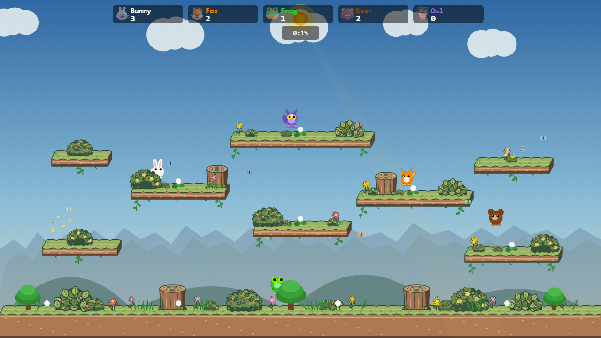
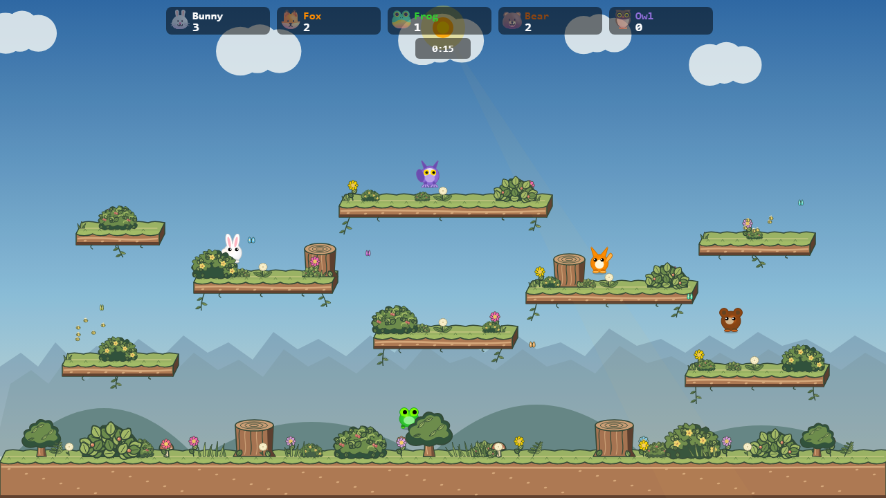
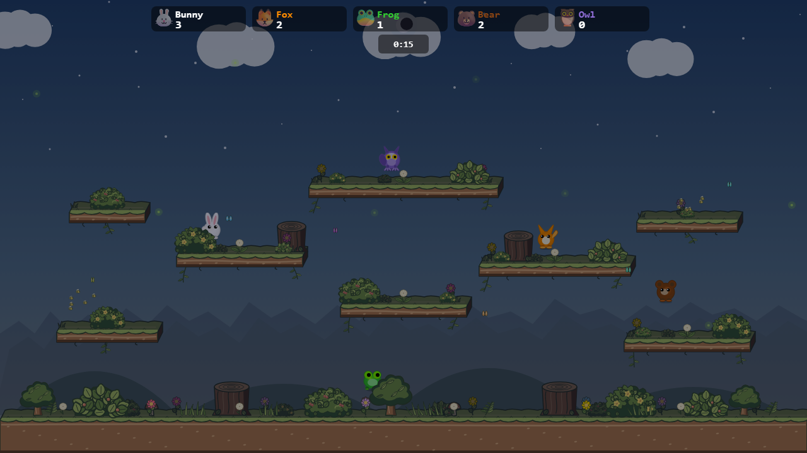

# Mixed Meadow, in game

These captures use the production Meadow arena and renderer at 1280 × 720. The scene combines the Leafy, Hedge, and Flower thicket bushes from the [prop study](https://github.com/VilemProchazka-KangoGift/bunnybrawl/pull/55). Flower thicket is the former Berry bush with pale yellow flowers in place of its berries.

| Day | Night |
| --- | --- |
|  |  |

The terrain, flowers, and mushrooms use Leafy Storybook styling. Foreground bushes remain opaque and draw over characters, preserving their hiding role. Platform front faces still cover characters moving behind them.

The day capture matches the selected mixed mockup pixel for pixel. Night captures can differ in ambient particle positions.

## All Meadow props

The following pass carries the same storybook style into the remaining Meadow props: trees, grass tufts and clusters, ferns, hanging vines, dandelions, butterflies, bees, snails, and foreground leaf clusters. The platforms and stumps retain their fake 3D top and front faces from the selected mixed version. The sky, hills, distant treeline, clouds, and character art are unchanged.

| Time | Selected mixed version | All Meadow props |
| --- | --- | --- |
| Day |  |  |
| Night |  |  |

These are fixed-position production-renderer comparisons. Live match captures in the [default simulation-worker mode](live-default.png) and [simWorker=off mode](live-simWorker-off.png) show the same art with the HUD, animated props, and characters in motion. Foreground bushes still hide players; platform front faces still draw over players who move behind them.

The reusable design rules, including background contrast with characters, are in the [visual style skill](../../../.claude/skills/visual-style/SKILL.md).
