# Meadow illustrated-background experiment

This applies the same cartoon-versus-procedural experiment as the Winter Lake study to the **existing Meadow** arena. The matched captures below use the real renderer, platform geometry, props, opaque hiding bushes, five character sprites, HUD, clouds, and day/night treatment. Only the distant background plate changes. The frozen state, camera, and 1280 × 720 output are identical. The selected low painted valley was subsequently integrated into the playable Meadow pack; the gallery retains its earlier vector baseline.

| Background | Day | Night | Reading at game size |
| --- | --- | --- | --- |
| **Current production** | 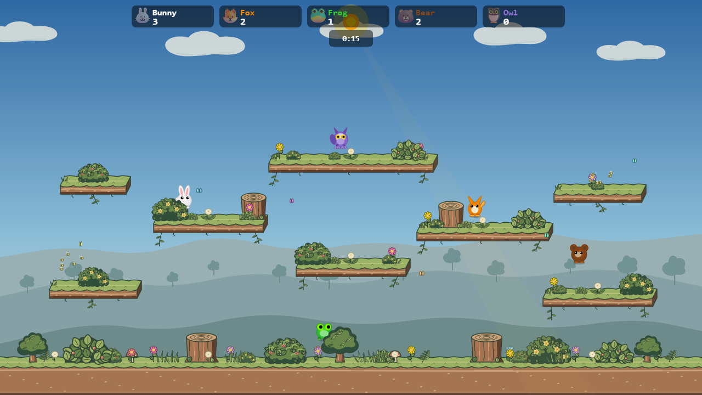 | 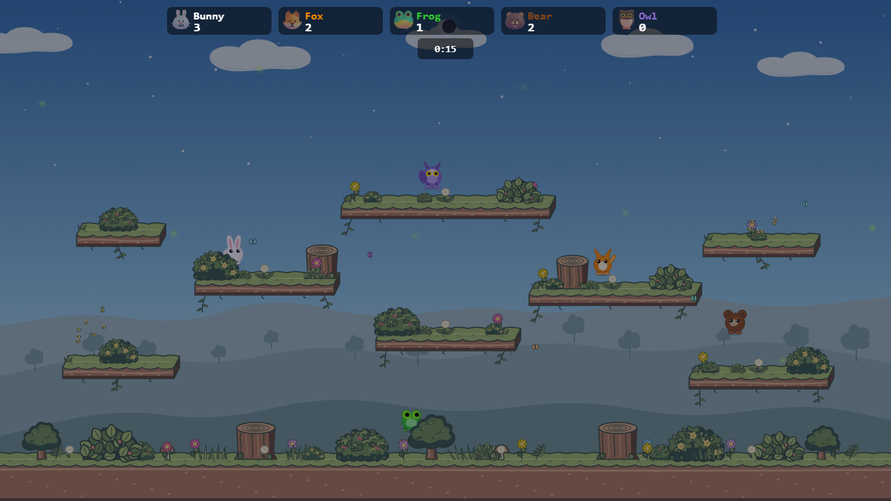 | Clearest play space; restrained hills and texture. |
| **Painted valley** | 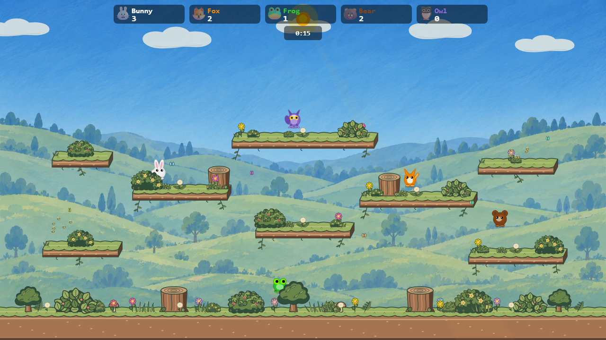 | 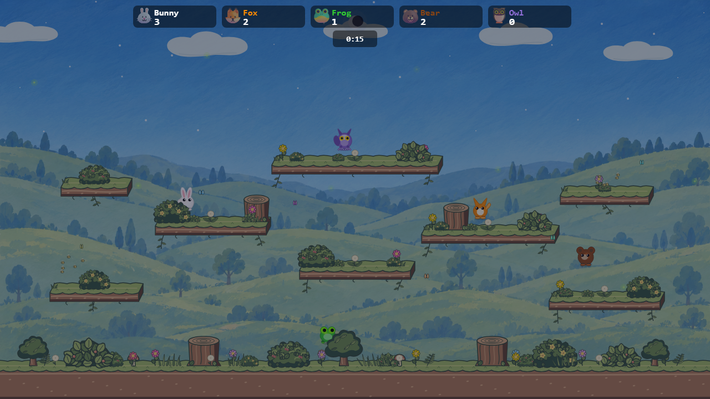 | Strong storybook setting, but hills climb behind too many platforms and the tree/detail density competes with gameplay. |
| **Low painted valley — selected** | 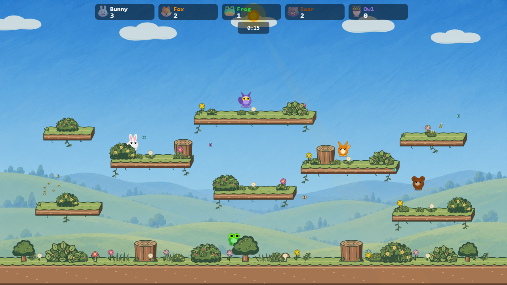 | 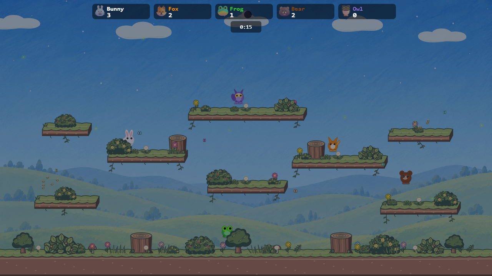 | Keeps open blue sky behind upper play lanes while adding pale layered hills and a hand-painted texture below. |

The low valley is the selected direction. Keep it **subtle and pale** so the platforms, props, hiding bushes, and characters stay dominant. This revision blends the plate at 65% opacity over the production sky. The playable version retains a more visible blue-sky texture than the old gradient, and its painted marks differ from the unchanged foreground props. Those are the next polish points, not reasons to move gameplay art into the bitmap.

### Resolution and loading experiment

| Plate | Encoded size | Approximate decoded RGBA memory | Day | Night |
| --- | ---: | ---: | --- | --- |
| Generated PNG, 1672 × 936 | 1,876,861 B | 5.97 MiB | source plate | source plate |
| WebP quality 90, 1280 × 720 | 73,422 B | 3.52 MiB |  |  |
| WebP quality 90, 960 × 540 | 44,066 B | 1.98 MiB | 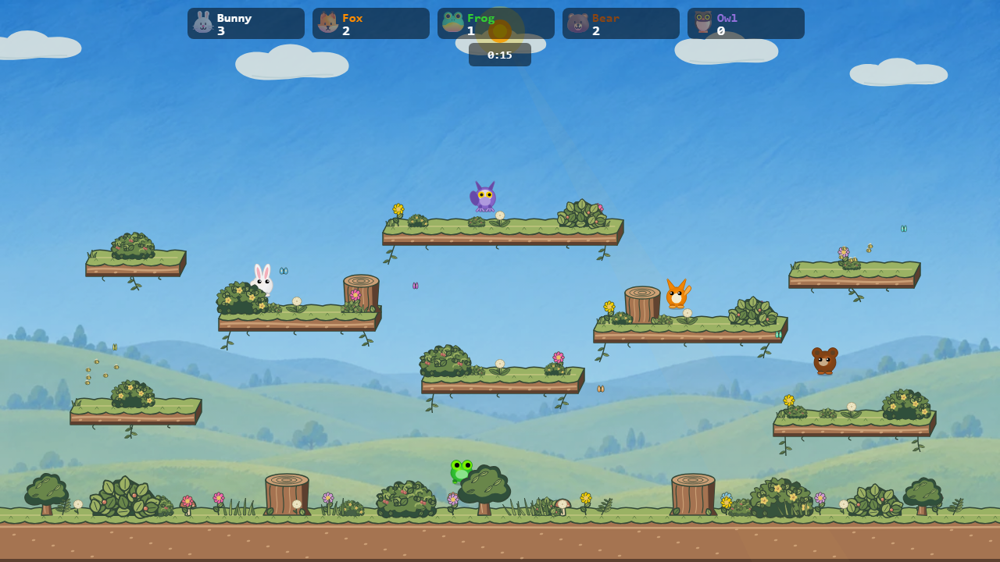 | 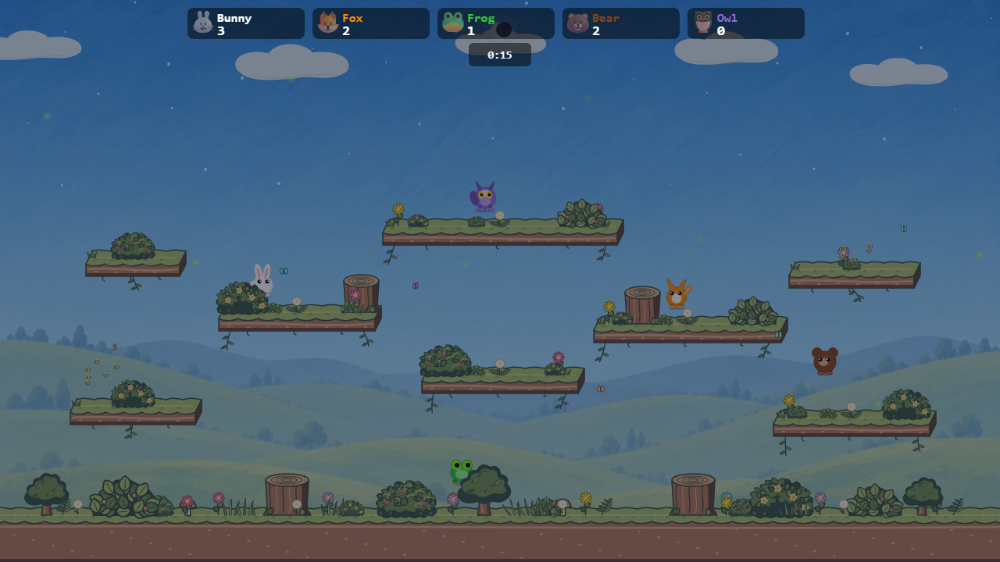 |

Both WebP plates were resized from [the same generated source](low-valley-plate.png) with Pillow Lanczos resampling, then encoded at quality 90. The 960 version is slightly softer when expanded to 1280 × 720; that softness suits a distant background. A 640 × 360 / 20,796 B trial looked conspicuously blurred at the reference size and was dropped. The source PNG is retained in this study for editing, but a production game would load only the selected optimized WebP, never the full-scene concept images or the source PNG.

In twelve fresh Chromium fixture navigations per variant, with HTTP cache disabled and 4× CPU slowdown, median time to the fixture's first rendered frame was **979 ms** for production, **1341 ms** for the 1280 WebP, and **1403 ms** for the 960 WebP. Median image fetch-plus-decode was **55 ms** and **44 ms**, respectively; the full static background render was **98 ms**, **161 ms**, and **137 ms**. These are local Vite development-server measurements with wide run-to-run ranges, so they are **not production load-time estimates** or proof that 960 is slower. Reproduce with [`measure-local.mjs`](measure-local.mjs). The plate is baked into Meadow's static background canvas when the arena loads; it adds no image draw to the normal per-frame character/particle loop. Preloading and decoding after menu paint or during lobby selection would hide most of the match-entry wait.

Production uses a single 1280 × 720 WebP (73 KB) unless mobile profiling shows a real memory or load problem. A two-size choice would save only about 29 KB of transfer and 1.54 MiB of decoded image memory for the smaller option. If used, select by the effective rendered canvas size, not by a device label, and keep both behind the arena's lazy load. There is no demonstrated need for a 2× plate for this deliberately soft landscape.

## Production adoption

The game loads [`meadow-low-valley.webp`](../../../src/engine/arenas/assets/meadow-low-valley.webp) and blends it at 65% in [`meadowBackdrop.ts`](../../../src/engine/arenas/packs/meadowBackdrop.ts). Animated clouds, all playable objects, and foreground hiding bushes remain procedural. When the image is unavailable, the previous vector valley still draws. The menu begins fetching the encoded image **after its first paint** when Meadow is selected; opening Online cancels that speculative request. The lobby also fetches it if the selection changes to Meadow. Match setup decodes it in the canvas-owning thread before the first Meadow background paint, including direct arena links and mid-match switches. It is baked into the static background canvas rather than drawn each frame.

| Live production build, default simulation worker | Live production build, renderer-only worker |
| --- | --- |
| 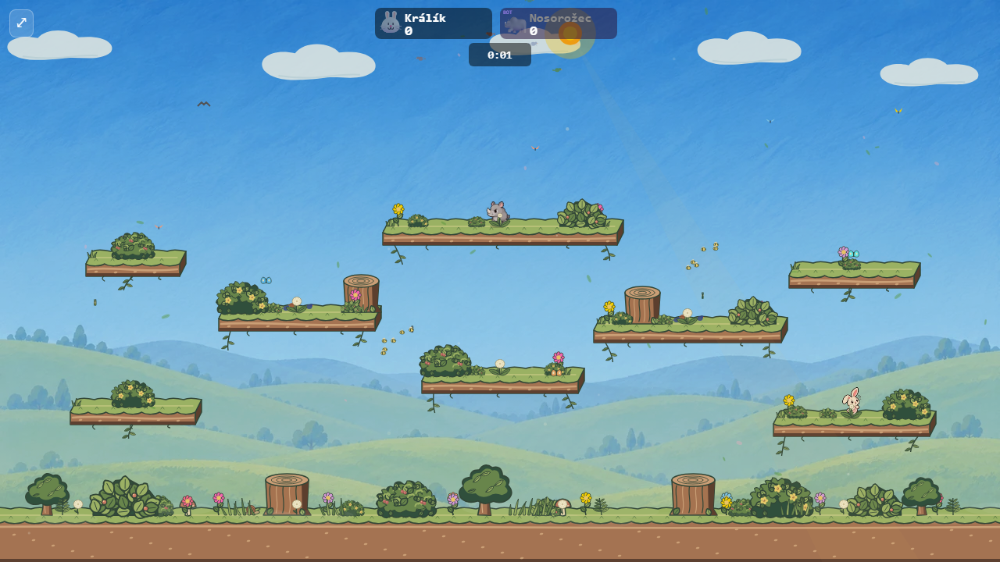 | 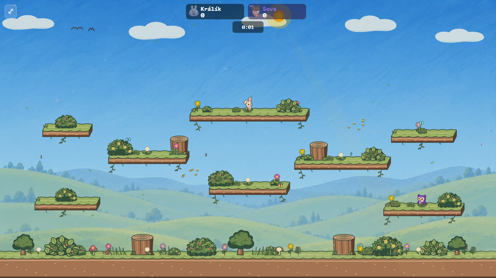 |

The live captures have moving characters and are not pixel-matched to the frozen table above. The production build passed the full Vitest suite (3,049 tests), nine smoke E2E cases, five Meadow backdrop E2E cases covering menu preload, direct entry and arena switches in both worker modes, and the constrained loading-budget gate. The budget kept arena pack code out of the initial menu bundle. Use `npm run build`, start `npx vite preview --host 127.0.0.1 --port 4224`, then run [`capture-live.mjs`](capture-live.mjs) to reproduce the live captures.

## Full-scene style concepts

These image-generation paintovers explored art direction before extracting the clean plate. **They are not matched gameplay captures**: the generator repainted characters, bushes, flowers, platforms, and HUD, changing their shapes and details. They must not be used as arena art or as evidence that gameplay cover is preserved.

| Gouache storybook | Inked cartoon storybook |
| --- | --- |
| 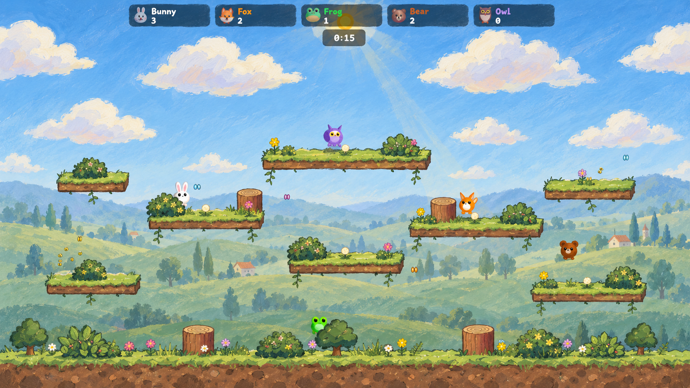 | 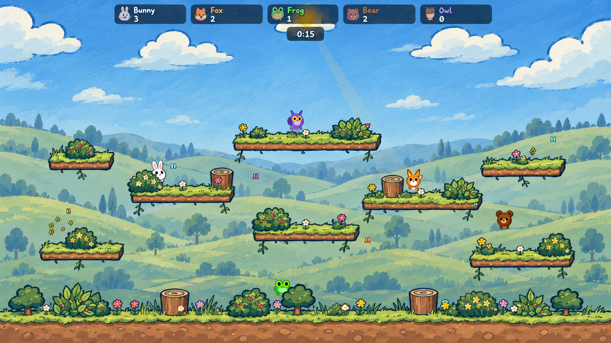 |

The gouache version gives the meadow a warm illustrated finish, but its soft edges stray from the current outlined props. The inked version relates more closely to the stage's existing silhouettes. The two clean background sources are [painted valley](landscape-plate.png) and [low valley](low-valley-plate.png).

## Reproduction and source

All four generated images were made with the built-in image generator. The gouache and inked concepts each used the [production Meadow day capture](../meadow-backgrounds/production-day.png) as an image reference. The first prompt requested painted storybook texture, rounded layered hills, a morning-blue sky, and readable character lanes. The second requested expressive uneven ink contours and simpler cel-shaded hills. The painted valley plate was edited from the inked concept with all platforms, ground, characters, props, bushes, HUD, clouds and sun removed. The low valley plate was edited from that clean plate, moving the ridge lower and reducing trees and detail. The generated source images are saved in this folder; [the fixture override](../meadow-backgrounds/render.ts) draws the first plate at 76% opacity and the selected low valley at 65% over the game's sky gradient, before real platforms and game objects. The real day/night overlay remains in charge of lighting.

To reproduce the matched captures, start Vite from the repository root with `npx vite --host 127.0.0.1 --port 4223`, then run `node docs/mockups/meadow-painted/capture.mjs`. The script fails on browser page errors. Direct fixture URLs can be used for live inspection: `?variant=production`, `?variant=painted-landscape`, `?variant=painted-low-valley`, or `?variant=painted-low-valley-small`, each with `&time=day` or `&time=night` at `/bunnybrawl/docs/mockups/meadow-backgrounds/render.html`.
