# Meadow prop art studies

Five experimental redraws of Meadow's decorative objects, compared with the current Morning blue arena. These are renderer-backed stills, not a game art change. They use the production arena layout, characters, background, HUD, and night treatment. Only bushes, flowers, mushrooms, platforms, and stumps are redrawn.

## Second round: outlined leaves and dimensional platforms

This round responds to feedback that the earlier platforms lost their fake 3D form and the woodcut bushes resembled rocks. Every new platform has a wavy top plane with depth, a visible soil front, and a dark right face. Bushes use individual leaf clusters and branching instead of a rounded mound.

| Current | Botanical ink | Leafy storybook | Bold animation |
| --- | --- | --- | --- |
| 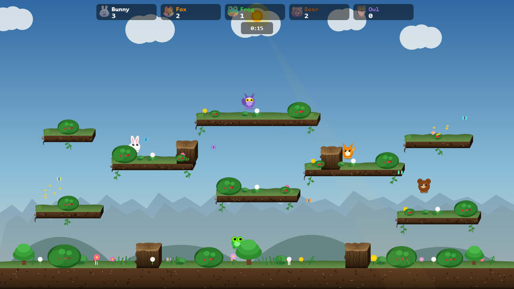 | 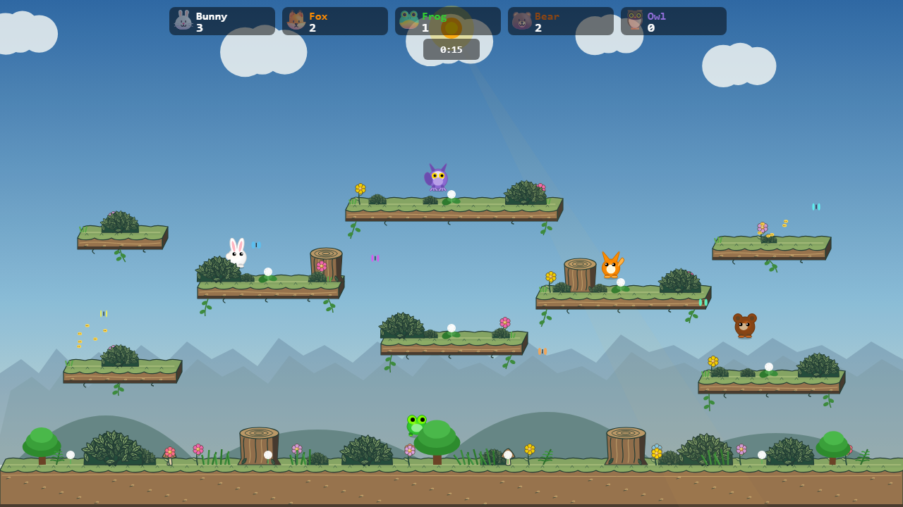 | 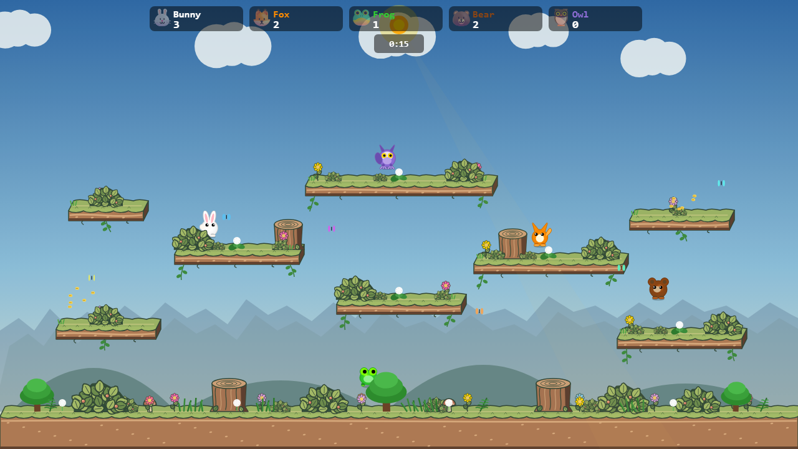 | 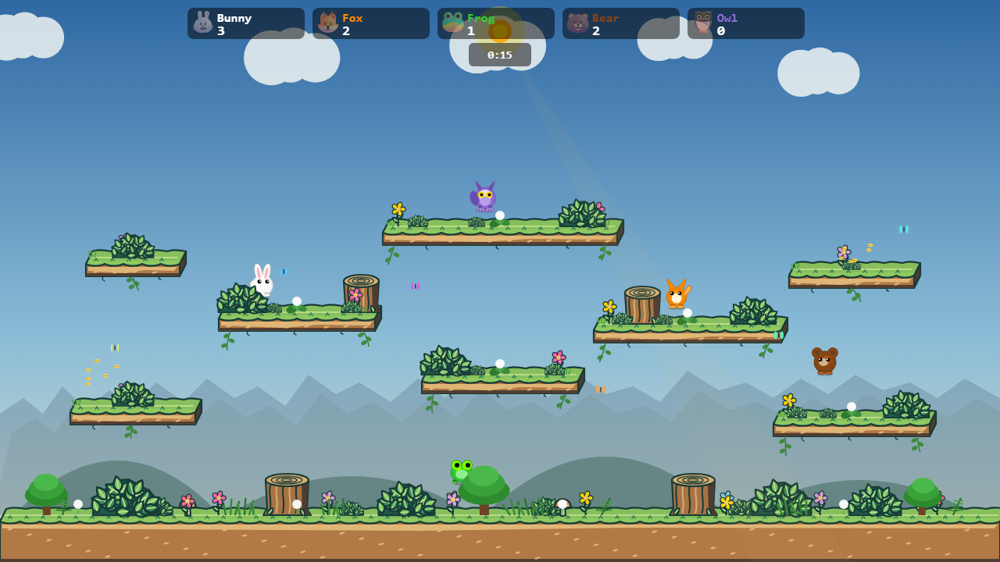 |
| 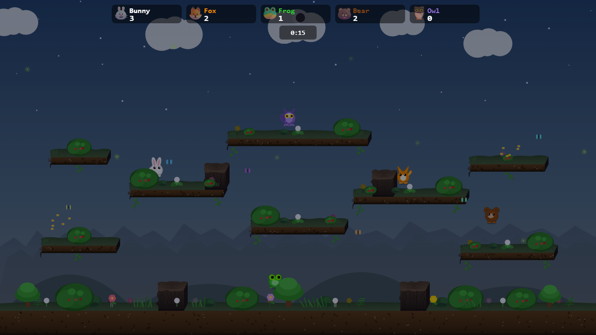 | 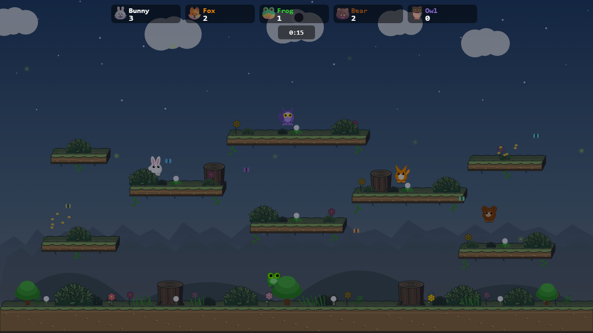 | 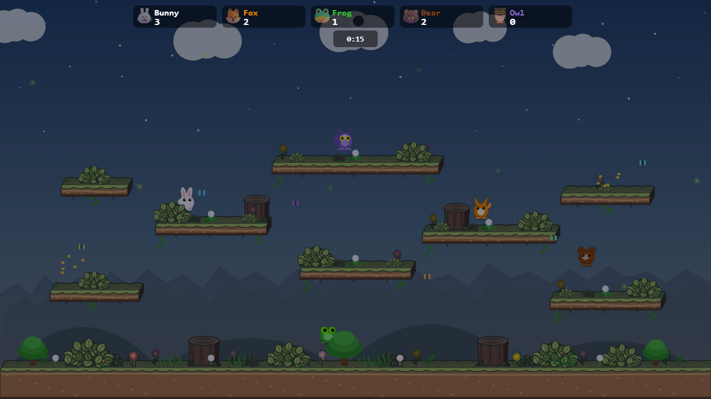 | 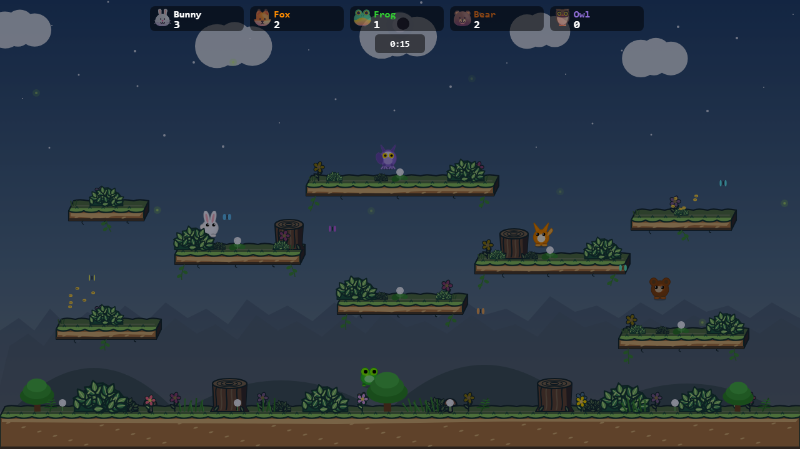 |

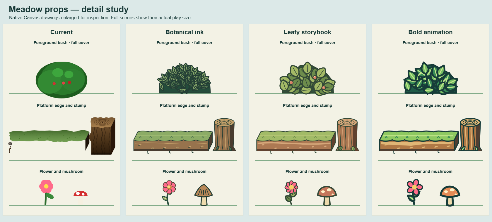

**Botanical ink:** fine veins and dense pointed foliage. It has a natural silhouette, but becomes visually dense at gameplay size, especially at night.

**Leafy storybook:** larger rounded leaves, moderate outlines, coral berries and terracotta soil. This currently reads most clearly at gameplay size while keeping the desired drawn character.

**Bold animation:** thick outlines, bright leaves, prominent flowers and strong platform edges. This is the most graphic direction; its contrast could compete with characters during active play.

## First round

| Current | Garden storybook | Field-guide woodcut |
| --- | --- | --- |
|  | 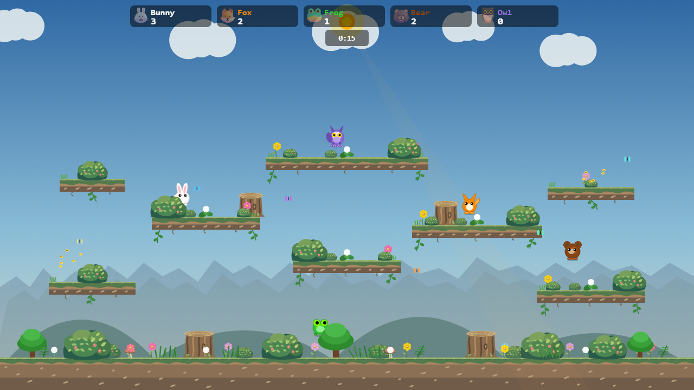 | 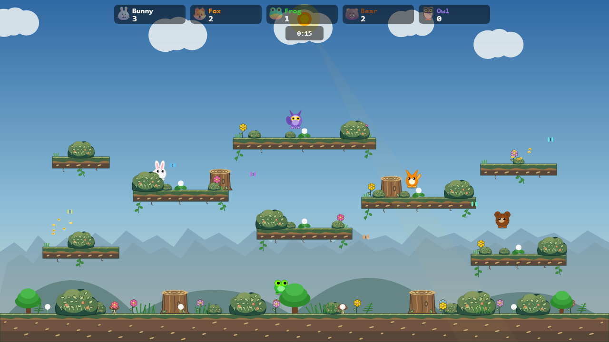 |
|  | 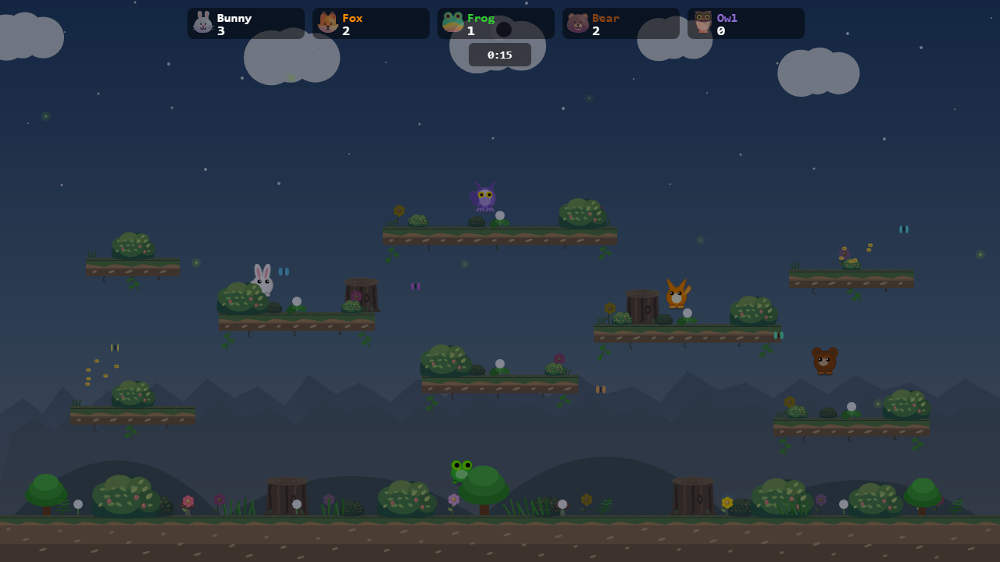 | 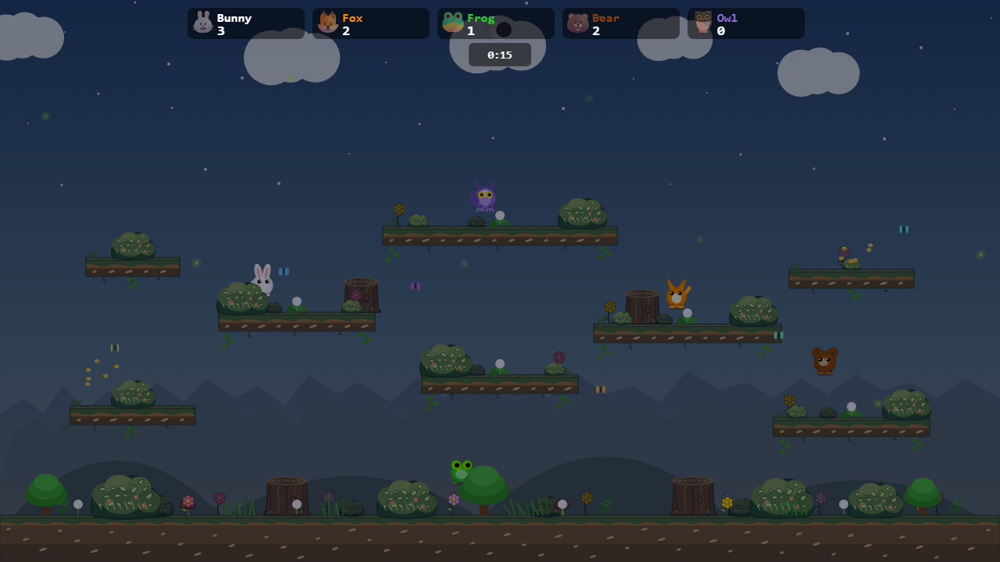 |

The foreground bushes remain opaque and cover the rabbit in the same scene position. Their placement and stacking role are preserved. Platform landing height and arena geometry also stay fixed. Night images check how each style behaves under the existing tint.

**Garden storybook:** broader leaf clusters, sage greens, coral berries, warmer soil and softer stump grain. This was the clearest of the first-round shapes at gameplay size.

**Field-guide woodcut:** olive and ochre colors with carved leaf veins, dark outlines and visible platform strata. Its fine marks read well up close but become busier at native play size.

These images are a static art direction test. They do not evaluate motion, gameplay readability during a match, rendering cost, or concealment from every possible character position. Before adopting any style, implement it as a separate change and verify both worker modes in browser play.

## Reproduce

From the repository root, start `npm run dev -- --host 127.0.0.1 --port 4190`, then run `node docs/mockups/meadow-props/capture.mjs`. The fixture is at `/bunnybrawl/docs/mockups/meadow-props/render.html` with `variant=current|storybook|woodcut|botanical|leafy|animation` and `time=day|night` query parameters. The capture script writes the twelve scene PNGs and detail sheet in this directory. It uses seeded randomness and fixed player positions for comparable scenes.
