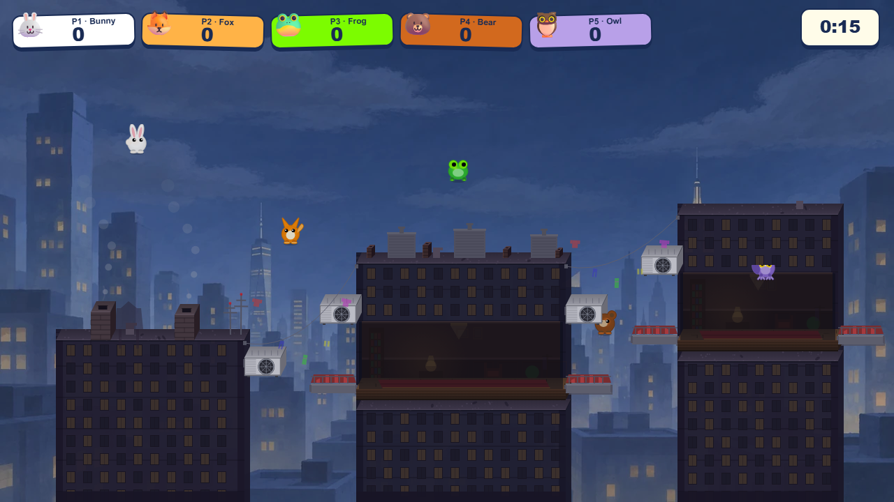
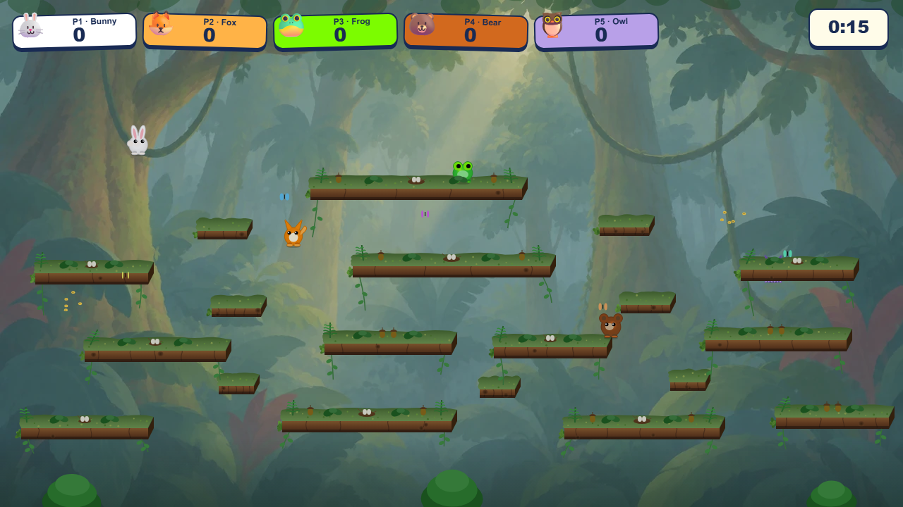
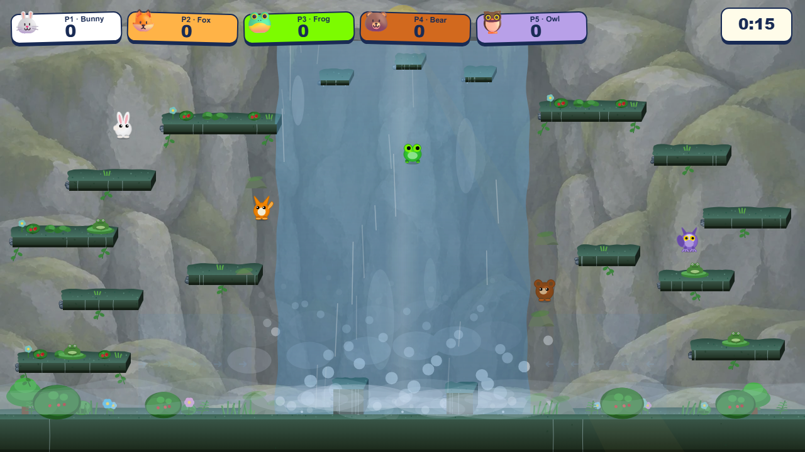
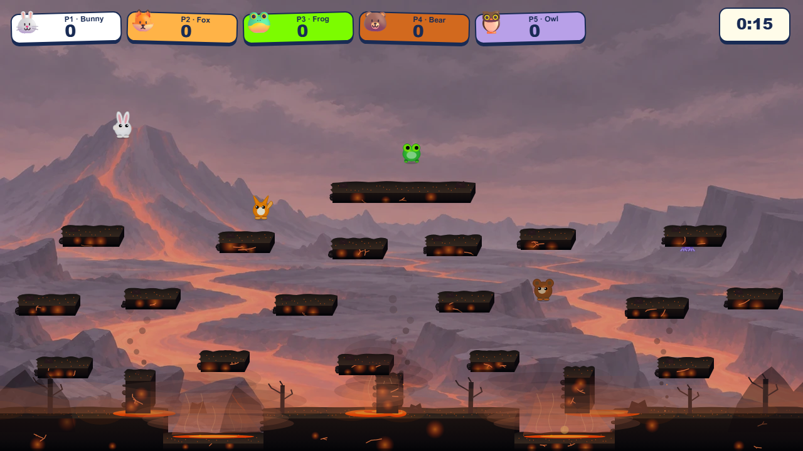
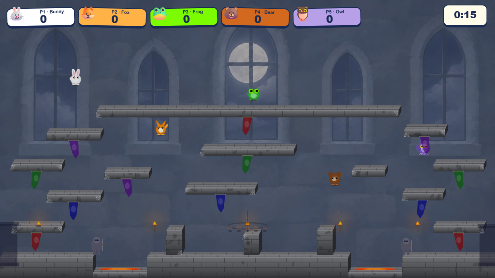
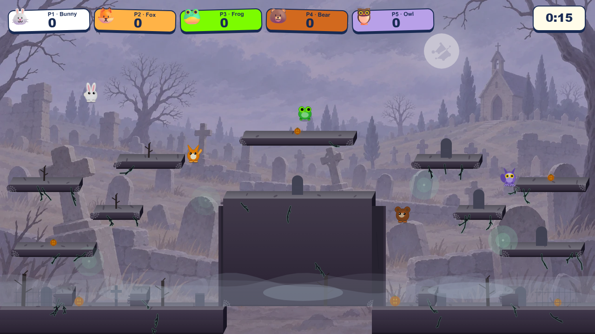
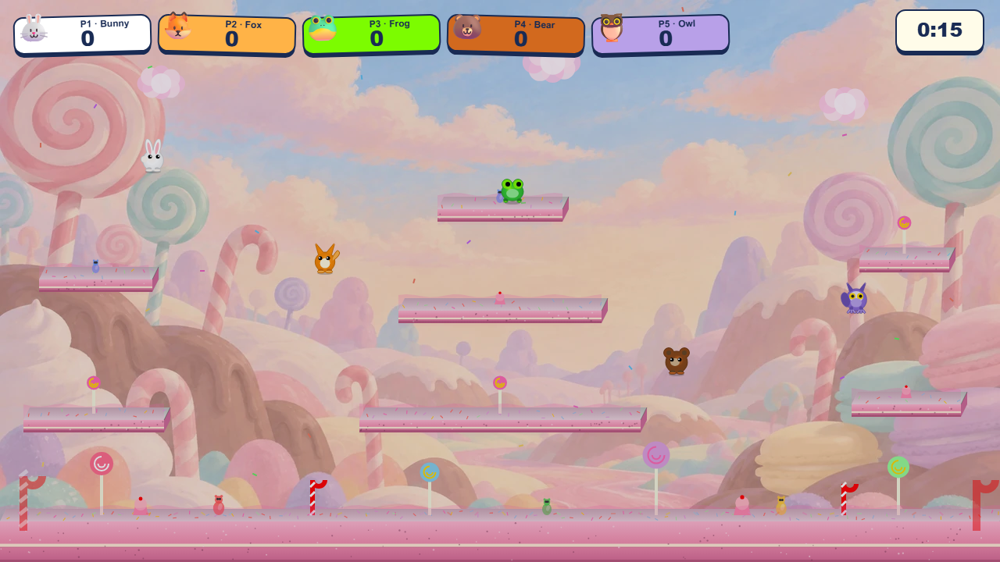
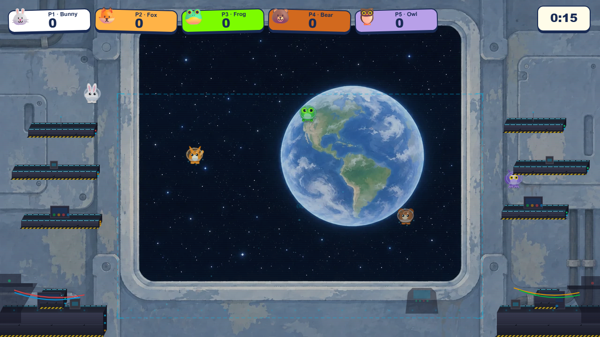
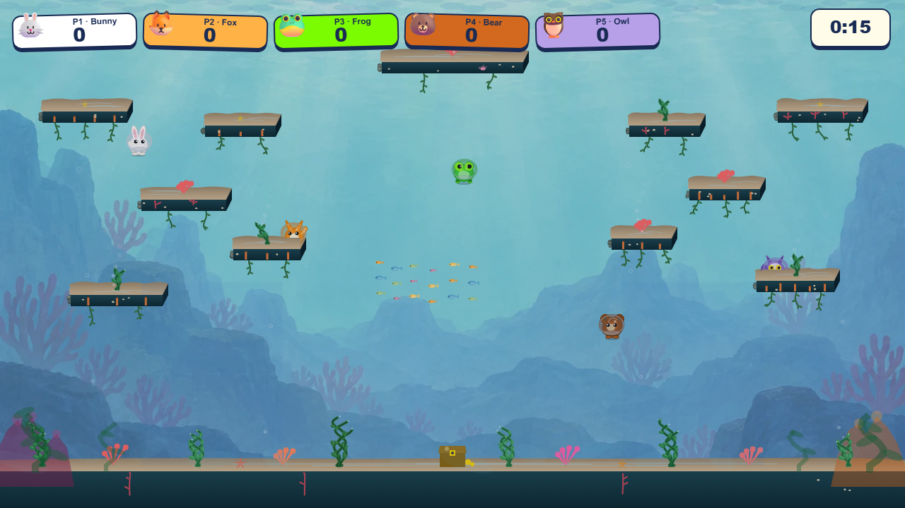
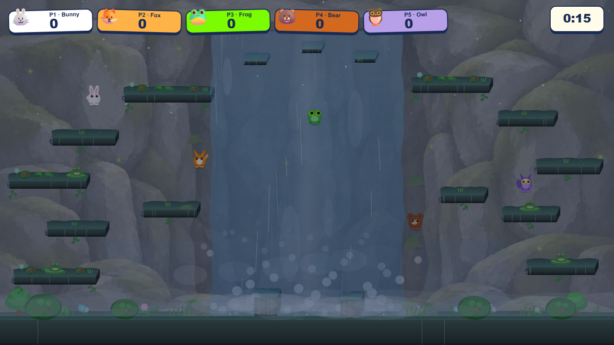

# Approved backgrounds implemented in the game

These are the latest pale, subtle backgrounds rendered beneath the actual platforms, characters, foreground objects and HUD. Meadow and Frozen Lake are excluded. Underwater is unchanged.

Each image below is a full 1280 × 720 production-renderer capture. Rooftops and Castle keep their fixed nighttime mood.

## Rooftops

## Treetops

## Waterfall

## Volcano

## Castle

## Cemetery

## Candy Land

## Space Station

## Underwater — unchanged

## Waterfall at night

[Implementation and final validation](IMPLEMENTATION.md).
