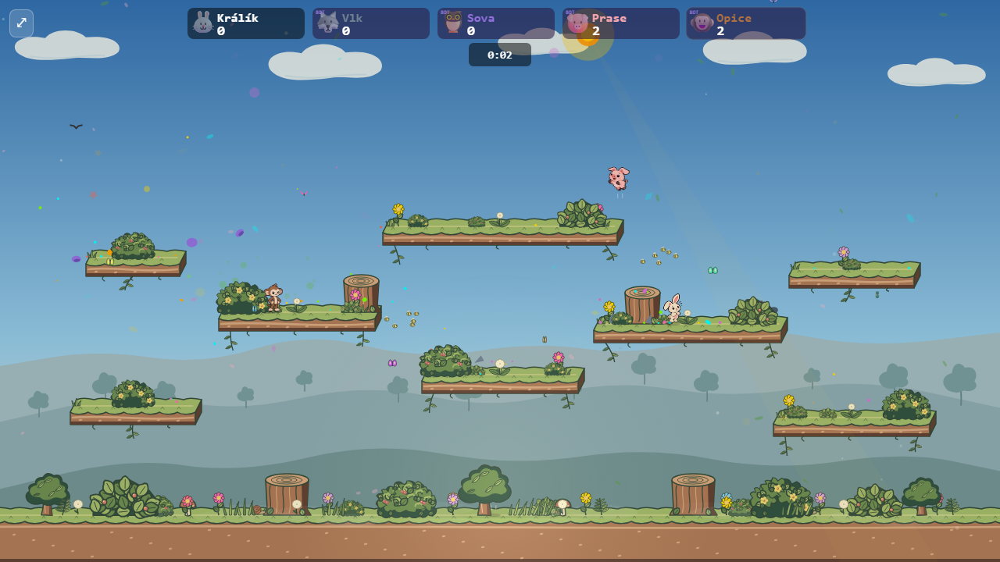
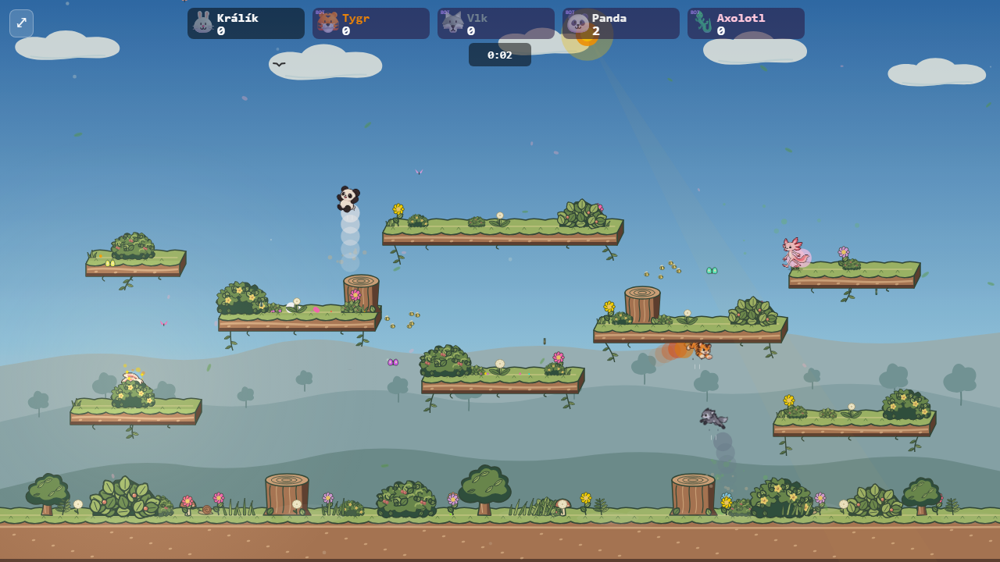

# Playable Pocket Plush roster

All 19 built-in animals use their approved [expressive eight-pose sheets](../character-roster-expressive/README.md) in lobby and matches. The default match uses Pocket Plush; append `?classicCharacters=1` (or `&classicCharacters=1` after other parameters) to compare the previous procedural rendering. The earlier `?pocketBunny=1` experiment remains available with the classic flag.

Each animal has authored idle, alternating walk, jump, seated, angry fast-stomp, landing, and attentive poses. The shared selector follows game state, while the animal-specific movement and personality are painted into each frame. The existing collision box, input, physics, sound, splat and gib behavior are unchanged. The art also appears in the renderer worker and the combined simulation worker.

The checked-in runtime WebP sheets are generated with `python scripts/generatePlayablePlush.py` from the expressive study atlases. Each frame retains at least twice its displayed resolution. Runtime assets load when entering lobby or a direct match, keeping the initial menu bundle free of the atlases. If a sheet fails to load, the game reports a loading error rather than silently showing a mixed old/new roster.

The 19 runtime sheets total about 539 KB. On a 4× CPU-throttled Chromium run with 200 KB/s download throughput and 100 ms latency, first lobby entry took about 4.0 seconds, versus 0.38 seconds with classic art. The menu remains responsive while the art is deferred. A later pass could reduce this entry cost by loading only the chosen lobby roster and prefetching the remainder.

## Meadow match checks

These are live production-preview match screenshots, including player movement, cover, lighting, and effects. The roster and action frames vary between captures because bots move independently.

The full [action boards](../character-roster-expressive/README.md) remain the best way to compare every animal and every authored pose side by side. The game captures check their actual rendering scale and layer order.
