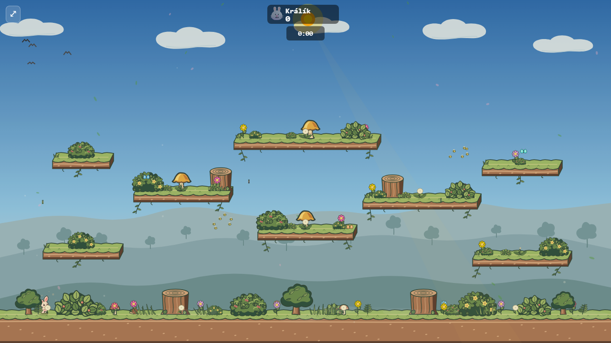
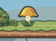
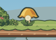
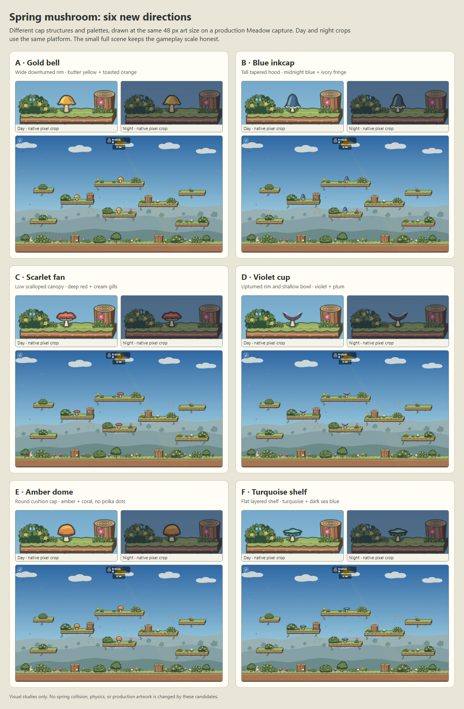

# Spring mushroom: selected gold bell

**A · Gold bell is implemented in the default spring renderer.** Its wide, downturned rim reads as the landing surface; butter yellow and toasted orange separate it from Meadow's grass. The planted foot stays put while the cream stem folds and the cap drops and broadens on a bounce. The captures below come from the production renderer, with the actual night overlay applied.

| In-game state | Capture |
| --- | --- |
| Meadow day |  |
| Meadow night |  |
| Match-scale detail |  |
| Compressed bounce |  |

The implementation changes only the default spring artwork. Spring physics, collision, grow/fade timing, and arena-specific spring skins remain unchanged.

## Exploration and comparison

The first rose-cap redesign was rejected: its spotted dome looked generic and unattractive in the Meadow scene. This second study compares six substantially different cap structures and palettes before choosing production artwork. All candidates sit at the same three positions over a spring-free capture of the production Meadow arena. They are **visual mockups**, not gameplay implementations. Candidate sprites receive an approximate night tint; the background is a live-renderer night capture.

| Study | Shape and color | Day | Night | What to watch |
| --- | --- | --- | --- | --- |
| A · Gold bell | Downturned bell; butter yellow and orange | [Full scene](gold-bell-day.png) | [Full scene](gold-bell-night.png) | Broad target and warm separation; perhaps too conventional. |
| B · Blue inkcap | Tall tapered hood; blue and ivory fringe | [Full scene](blue-inkcap-day.png) | [Full scene](blue-inkcap-night.png) | Most distinctive silhouette; dark cap loses some contrast at night. |
| C · Scarlet fan | Low scalloped canopy; deep red and cream | [Full scene](scarlet-fan-day.png) | [Full scene](scarlet-fan-night.png) | Clear landing top, organic edge, strong day/night contrast. |
| D · Violet cup | Upturned shallow bowl; violet and plum | [Full scene](violet-cup-day.png) | [Full scene](violet-cup-night.png) | Playful silhouette, though the open cup may imply a different landing behavior. |
| E · Amber dome | Round cushion; amber and coral | [Full scene](amber-dome-day.png) | [Full scene](amber-dome-night.png) | Very legible mushroom, though closer to the rejected dome family. |
| F · Turquoise shelf | Flat layered cap; turquoise and sea blue | [Full scene](turquoise-shelf-day.png) | [Full scene](turquoise-shelf-night.png) | Clear horizontal platform; visually small beside the character. |

The [original neon spring](before-day.png) and [rejected rose version](after-day.png) remain for comparison. The gold bell was chosen for its broad landing silhouette and warm separation from Meadow foliage, without the rejected dome's spots.

## Reproduce the study

1. Run `npx vite preview --host=127.0.0.1 --port=4220`, then capture spring-free Meadow backgrounds with `node docs/mockups/spring-mushroom/capture-base.mjs http://127.0.0.1:4220/bunnybrawl/`.
2. Run `npx vite --host=127.0.0.1 --port=4222`, then render the gallery with `node docs/mockups/spring-mushroom/render-variants.mjs http://127.0.0.1:4222/bunnybrawl/docs/mockups/spring-mushroom/variants.html`.

The editable study shapes and palettes live in [variants.html](variants.html). The same 48 px SVG artwork is composited at native size for every candidate. The selected production drawing is in `drawSpringMushroom`; use `node docs/mockups/spring-mushroom/capture.mjs http://127.0.0.1:4220/bunnybrawl/ docs/mockups/spring-mushroom/selected-gold-bell` to refresh its day, night, detail, and bounce captures.
