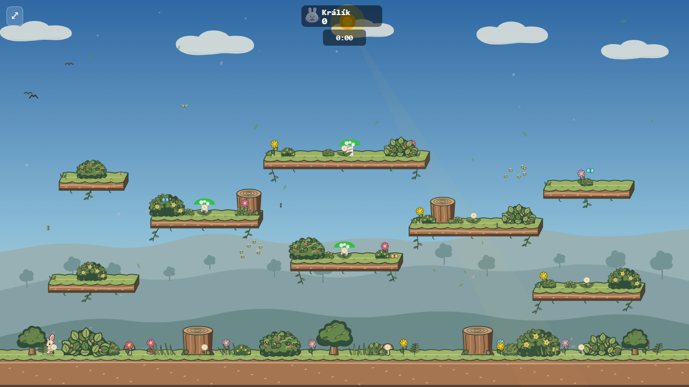
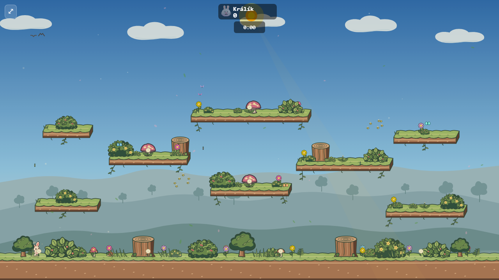
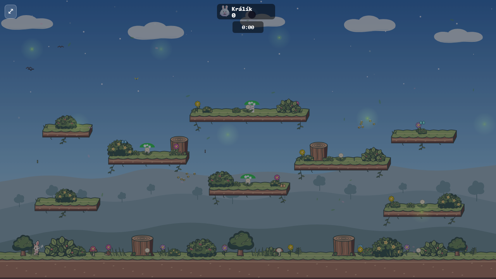
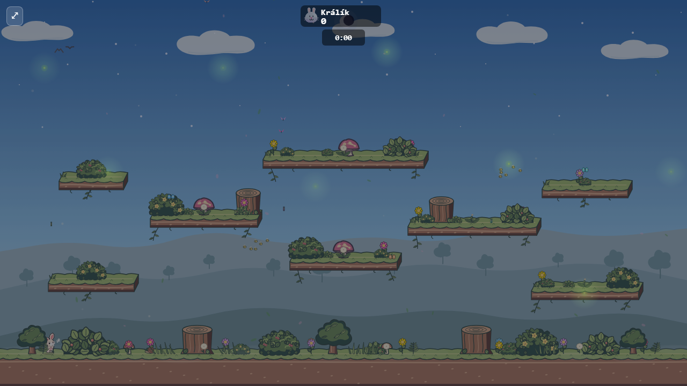
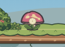
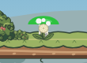
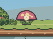

# Spring mushroom: storybook cap and elastic stem

The default spring is a gameplay object, so its cap needs to stand apart from Meadow foliage and read as a landing surface at match scale. The previous neon-green half ellipse and grey coils looked mechanical and blended into the platform grass. This pass gives it an uneven rose cap, a pale gilled underside, cream spots, and a grounded stem with organic folds. The cap moves and broadens as the stem compresses on a bounce.

These are captures from the production renderer with the same three spring locations and inactive bots. The left images use `main` before this change; the right images show the new renderer. Custom arena spring skins and all spring physics remain as they were.

| View | Before | After |
| --- | --- | --- |
| Meadow day |  |  |
| Meadow night |  |  |
| Match-scale crop |  |  |
| Compressed bounce |  |  |

To repeat the capture against a production preview, run `node docs/mockups/spring-mushroom/capture.mjs http://127.0.0.1:4220/bunnybrawl/ docs/mockups/spring-mushroom/after`. The script uses `?arena=meadow&bots=0&simWorker=off`, installs three springs into the live match state, then captures day, night, and bounce frames.
