# Winter Lake: actionable objects and snow study

This comparison for phase 5 of the [arena redesign sequence](../../../.claude/skills/visual-style/SKILL.md#arena-redesign-sequence) studied the hanging danger zones, spawned thorns, spring, carrot, and snowfall over the merged Pearl/Canvas/prop scene. **Ink Bell is now implemented in the Winter Lake game pack.** The [production renderer fixture](../winter-lake/render.ts) places identical objects at fixed positions for every candidate; these are review placements, not new spawn rules. The original Current images remain an archived pre-integration baseline.

## Full-scene comparisons

| Direction | Day | Night | Reading at 1280 × 720 |
| --- | --- | --- | --- |
| **Current** | 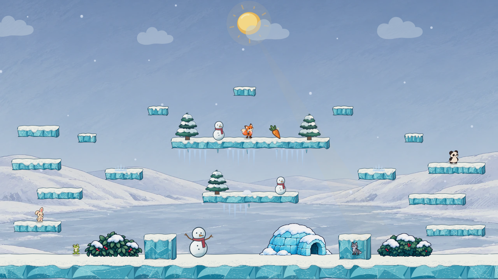 | 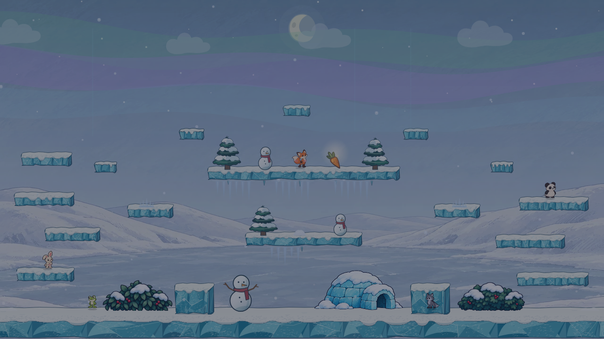 | Pale hanging icicles and the spring snow mound nearly disappear against the ice. The long-root carrot stays distinct. |
| **Ink Bell** | 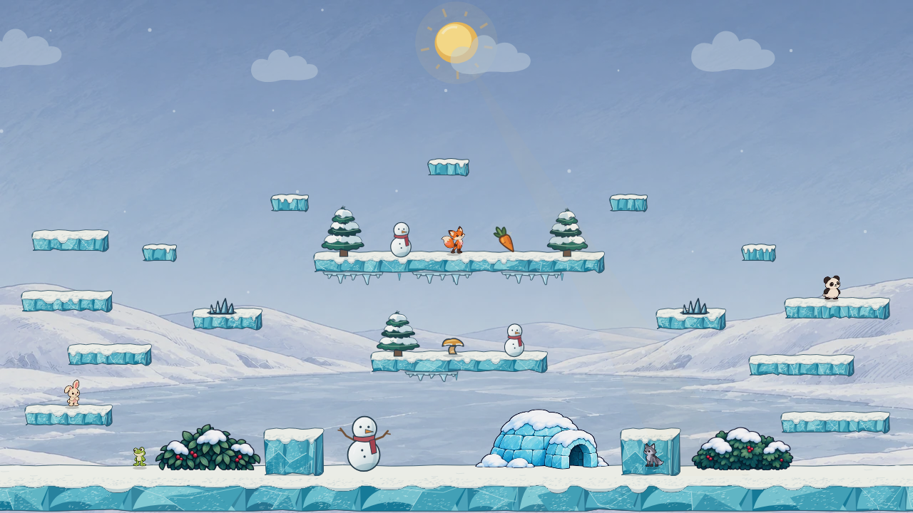 | 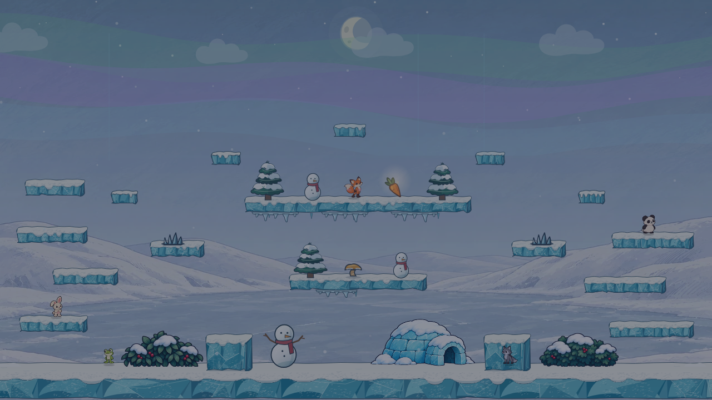 | Hanging icicles grow from an uneven frozen lip; shaded floor crystals point upward. A warm snow-rimmed bell makes the spring recognizable. Sparse round snow is quiet. |
| **Crystal Bloom** |  | 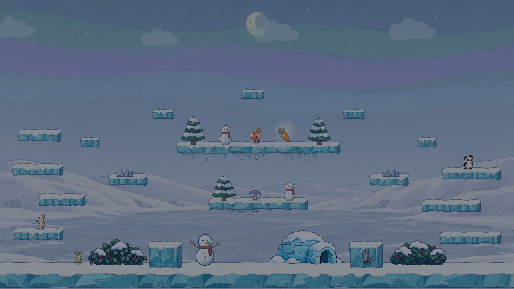 | Violet-edged icicles and floor crystals make a softer magical scene, but the spring is less obvious at night and fine diagonal snow risks becoming visual noise. |
| **Carved Puck** | 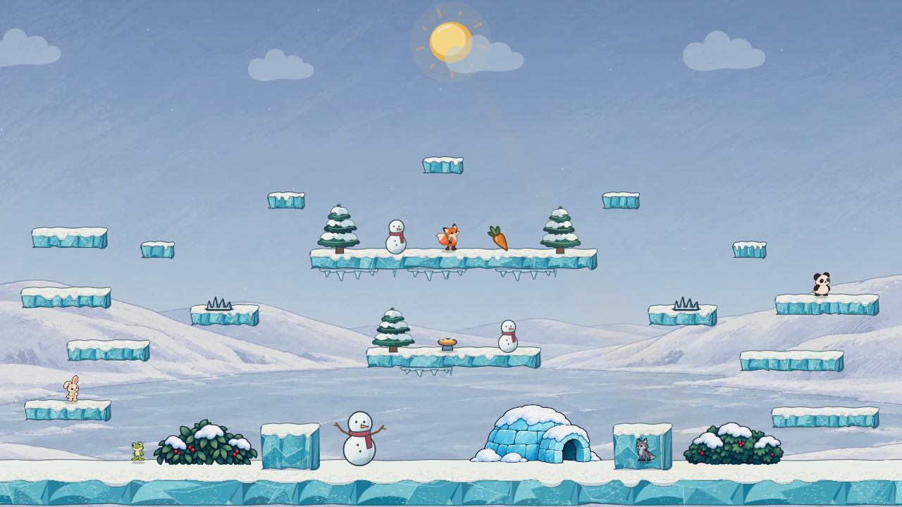 |  | Widely spaced icicle drips and shaded floor crystals frame a low amber launch pad; the pad loses the organic mushroom character and has a weak silhouette from far away. |

## Object-size inspection

These native-pixel crops show the underside hazards, side-platform thorns, and the spring on the lower bridge. They are crops of the full scenes, not enlarged concept art.

| Direction | Day detail | Night detail |
| --- | --- | --- |
| Current | 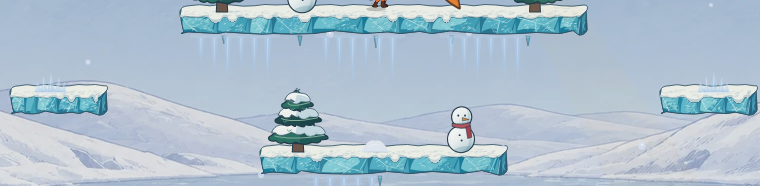 | 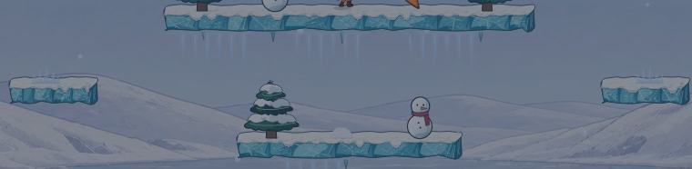 |
| Ink Bell | 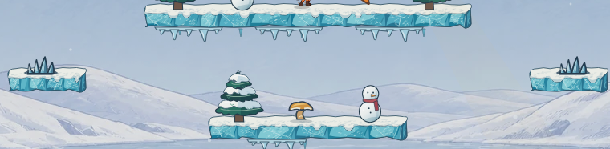 | 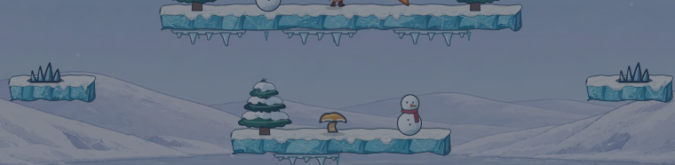 |
| Crystal Bloom | 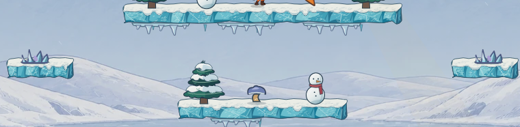 | 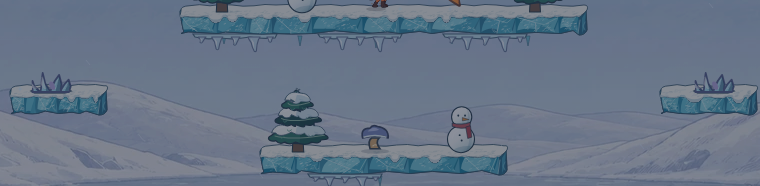 |
| Carved Puck | 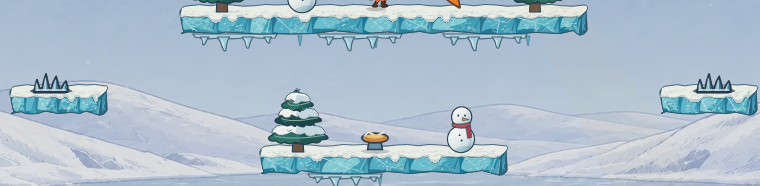 | 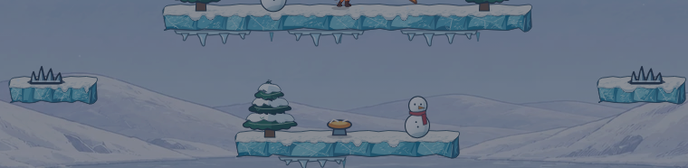 |

## What this pass establishes

- The current snow mound uses nearly the same value and edge as its platform. An actionable spring needs a distinct cap or mechanism, a visible base, and a compression pose; a still cannot prove the compression and bounce timing.
- The danger zone should read as **attached to the underside**. The candidates keep the same zone coordinates and draw their longest tips near the existing collision band's bottom instead of hanging far into safe space. Spawned top-side thorns share the material but keep a separate upward silhouette.
- The first candidate ceiling hazards reused the angular floor-crystal shape and looked like upside-down thorns. This revision gives the ceiling a connected frozen lip and varied curved, tapered drips. Floor crystals retain sharp upward silhouettes but gain broad dark and light planes plus a shaded snow foot, so their volume reads at native size.
- The selected long-root carrot already provides the warm collectible accent. The comparison fixes it in the same place, including its night glow; no carrot redraw is proposed here.
- Snow density should stay behind actionable edges. These stills vary round flakes, diagonal streaks, and sparse small flakes. Motion, spawn rate, weather cost, fog, aurora, and glints still need a separate live pass before selecting atmosphere.

**Selected direction:** Ink Bell. Its bell distinguishes the spring from snow, and the dark ice edge keeps hazards legible at night. The thorn, icicle, spring, and snowfall functions now come from [the arena art module](../../../src/engine/arenas/packs/winterActionArt.ts). Crystal Bloom and Carved Puck remain comparison alternatives.

## Playable arena check

The selected art is wired into the Winter Lake pack without changing hazard zones, thorn or spring spawn rules, platform positions, or collision bounds. These live captures use the actual match renderer with four bots, once with the default simulation worker and once with `simWorker=off`. Spawned thorns and springs appear on timers, so the opening stills chiefly verify the permanent ceiling icicles, snow, and complete scene composition. The final capture waits until both timed objects have spawned; the fixed object-size crops above show their art more clearly.

| Default worker | Simulation worker off |
| --- | --- |
| 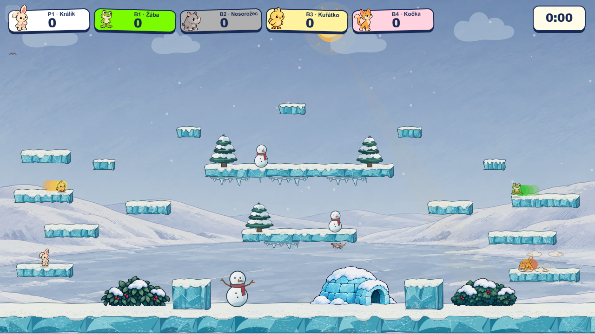 | 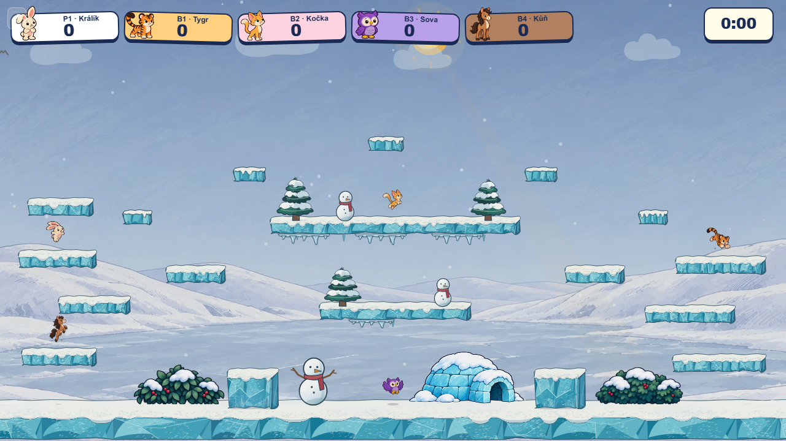 |

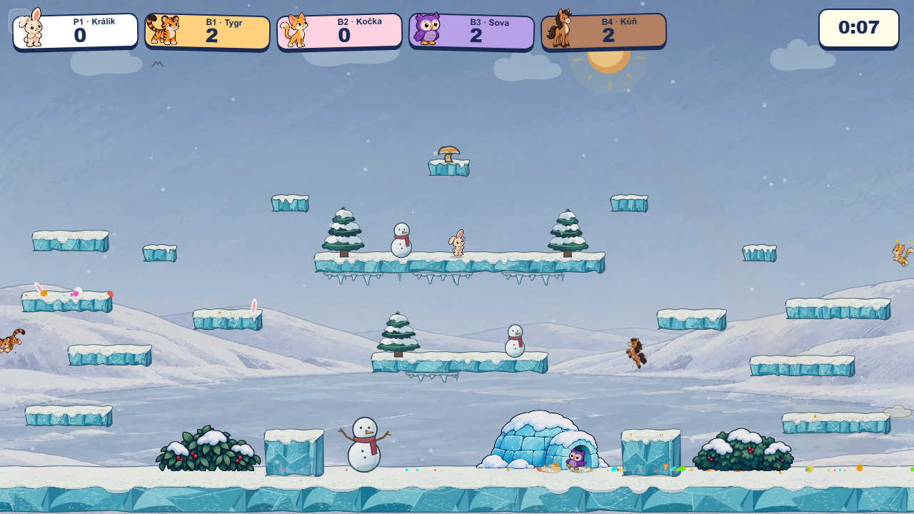

## Reproduce

Start Vite from this branch and set `WINTER_ACTION_URL` to its `/bunnybrawl/` URL. Run `node docs/mockups/winter-actionable/capture.mjs` to refresh the six candidate scenes and matching object crops. The archived `current-*.png` baseline is retained and deliberately excluded from recapture now that production uses Ink Bell. The fixture URL is `docs/mockups/winter-lake/render.html?variant=current&props=current&action=ink-bell|crystal-bloom|carved-puck&time=day|night`. Captures use a fixed random seed, five fixed character poses, fixed object positions, and 28 snow particles. They are static production-renderer composites, not a gameplay or performance test.

If Playwright's expected browser version is unavailable but a compatible local Chromium is installed, set `WINTER_ACTION_CHROMIUM` to its executable path for the capture script.
