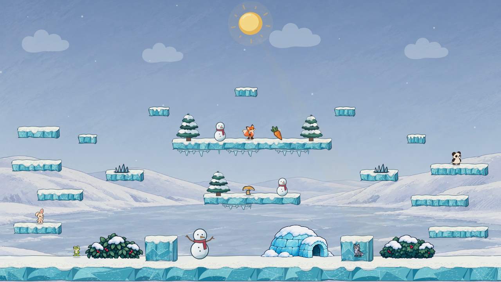
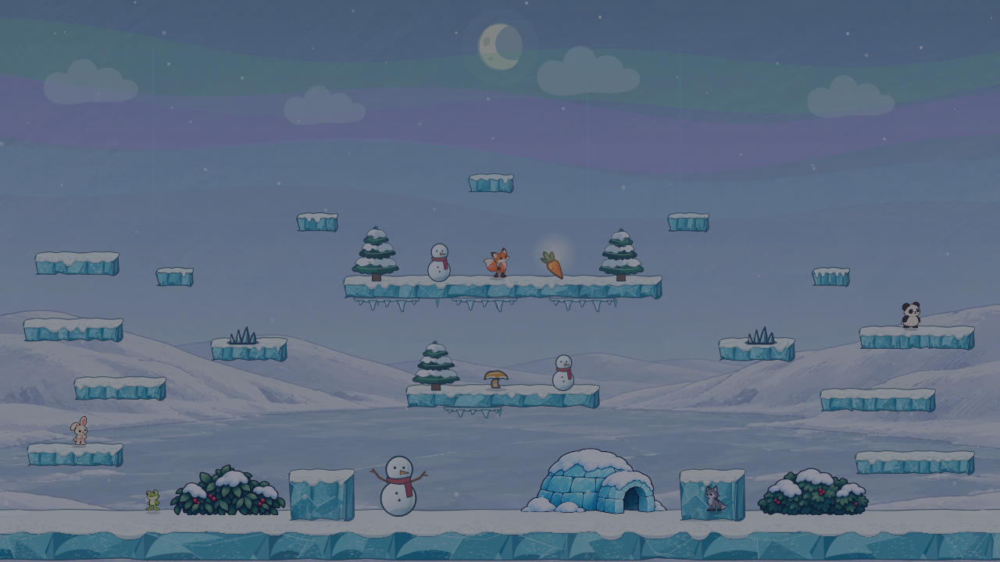
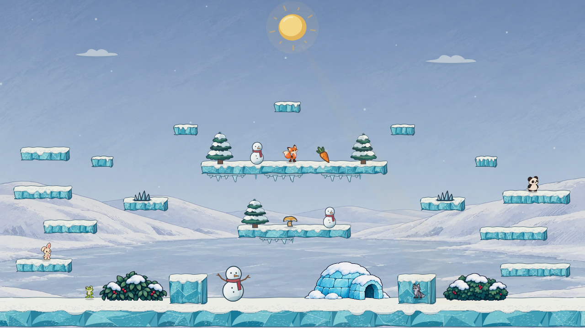
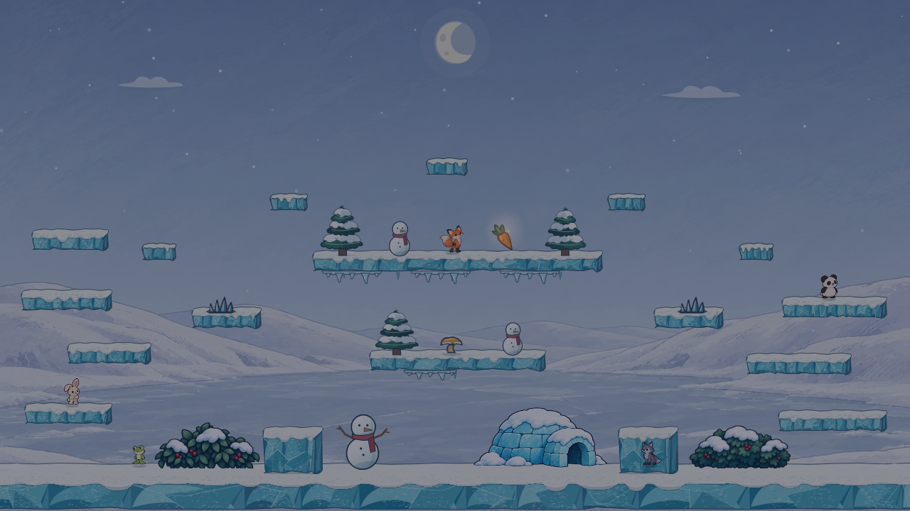
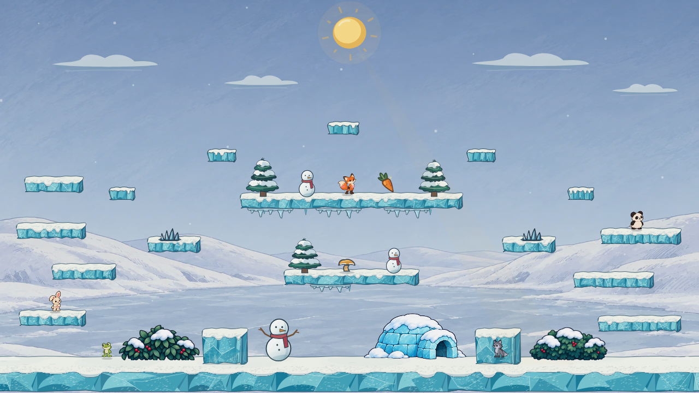
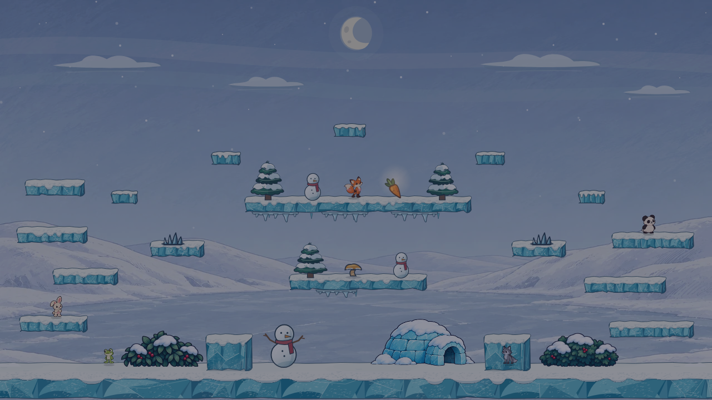
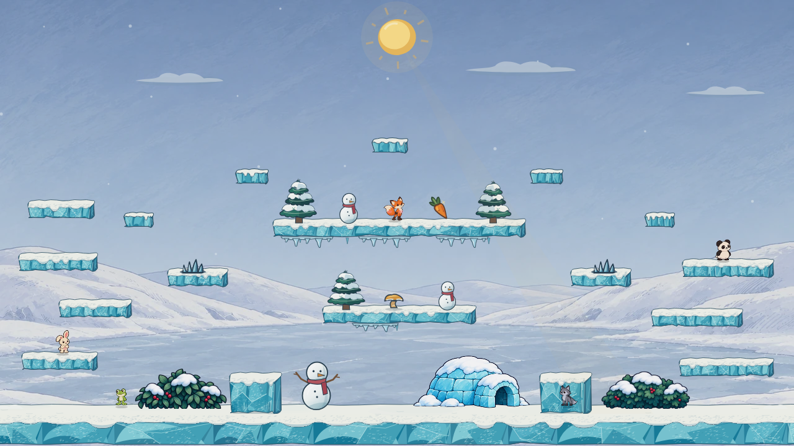
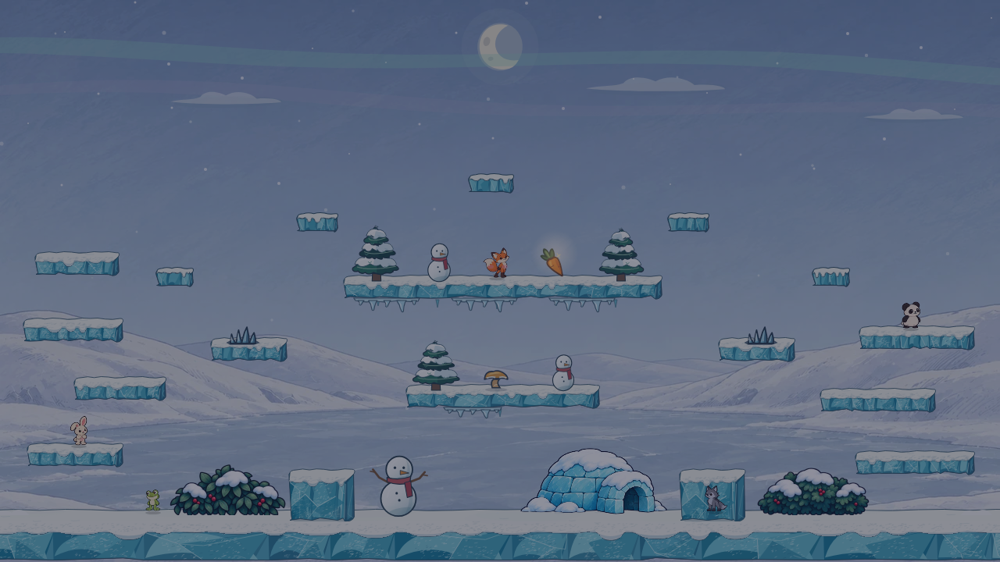

# Winter Lake atmosphere study

This is the remaining atmosphere pass in [phase 5 of the arena redesign sequence](../../../.claude/skills/visual-style/SKILL.md#arena-redesign-sequence). It compares the merged Winter Lake arena with three restrained cloud, ground-mist, and night-sky treatments. The Pearl backdrop, Canvas platforms and props, Ink Bell hazards and spring, long-root carrot, five character poses, and snowfall are identical in every frame. **No production arena art or gameplay code changes in this study.**

## Matched full-scene views

| Direction | Day | Night | What changes |
| --- | --- | --- | --- |
| **Current** |  |  | Four scalloped clouds, existing low fog, broad green/violet aurora, and the current green night wash. This is the merged baseline. |
| **Clear Ice** |  |  | Two small high clouds, very light ground mist, no aurora, and a few crisp ice glints. It leaves the most space around the moon and upper platforms. |
| **Silver Drift** |  |  | Longer wind-flattened clouds, a little more low silver mist, and two faint moonlit sky bands. It feels windier but makes the upper sky busier. |
| **Polar Veil** |  |  | Sparse swept clouds, modest ground mist, and narrower mint/lilac aurora ribbons. It keeps a northern-lights identity without the current large bands. |

## Review notes

- The current broad aurora is the strongest night feature. It pulls attention toward the sky while the approved platforms and props sit below it. Each candidate reduces that competition; Polar Veil retains the most color.
- Clear Ice gives the cleanest character and hazard separation. Silver Drift has the most cloud presence. Polar Veil is the balanced starting point if the night sky should remain distinctive.
- All candidates remove the older green foreground wash that was paired with the broad aurora. Night still uses the game's normal day/night darkening and foreground tint, so the object contrast is visible in a complete renderer composite.
- The fixed fog particles stay near the bottom ground line, behind the deliberate foreground bushes. These stills cannot establish how moving fog, cloud drift, aurora motion, or glints feel during play. Test the chosen direction live in both simulation-worker modes and compare frame cost before moving it into the arena pack.

## Reproduce

Start Vite on this branch and set `WINTER_ATMOSPHERE_URL` to its `/bunnybrawl/` URL. Run `node docs/mockups/winter-atmosphere/capture.mjs`. If Playwright cannot find its expected browser revision, set `WINTER_ATMOSPHERE_CHROMIUM` to an installed Chromium executable. The fixture URL is `docs/mockups/winter-lake/render.html?variant=current&props=current&action=ink-bell&atmosphere=current|clear-ice|silver-drift|polar-veil&time=day|night`.

The capture script uses a fixed 1280 × 720 viewport and the same random seed, character positions, clouds, snow particles, timed objects, and fog positions for every variant. Candidate drawing functions live in [variants.ts](variants.ts) and are applied only by the study fixture.
