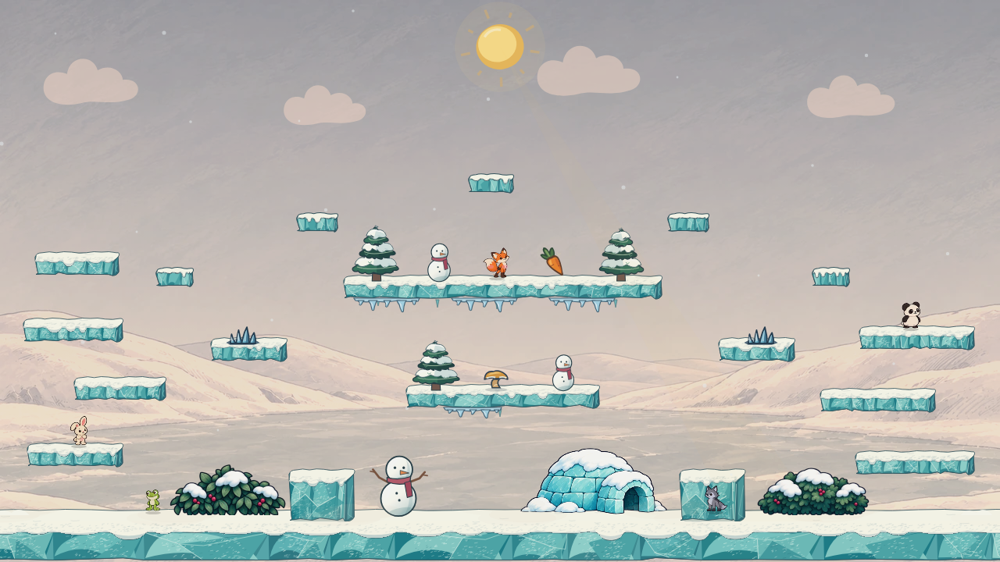
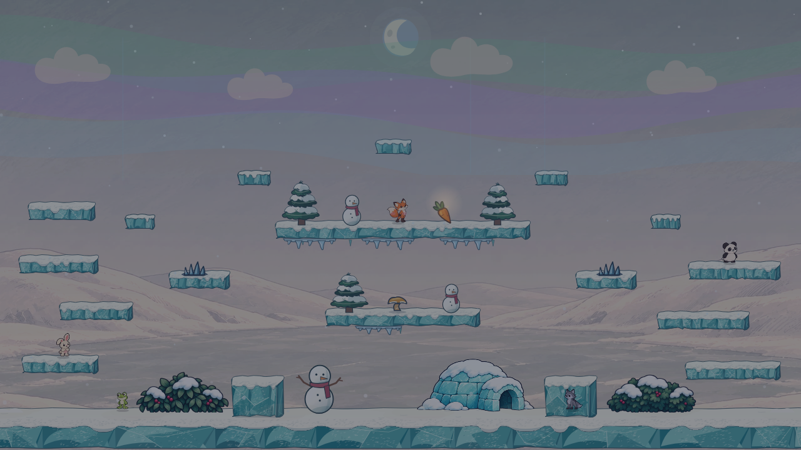
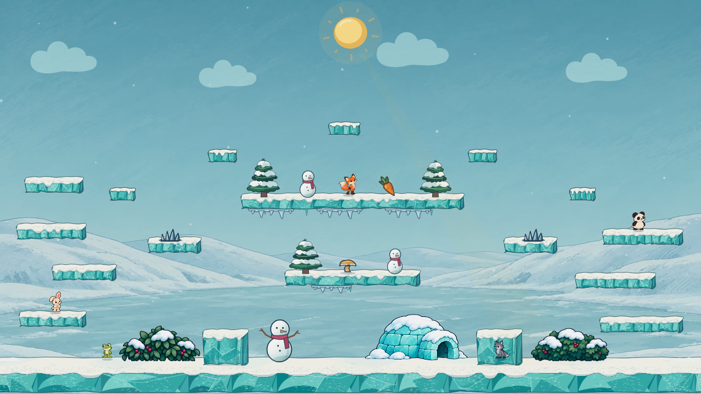
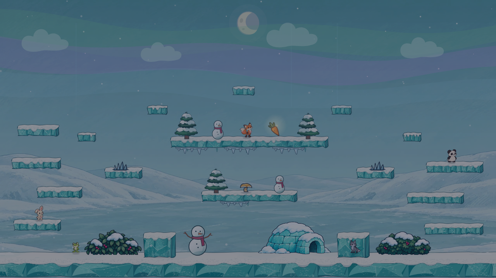
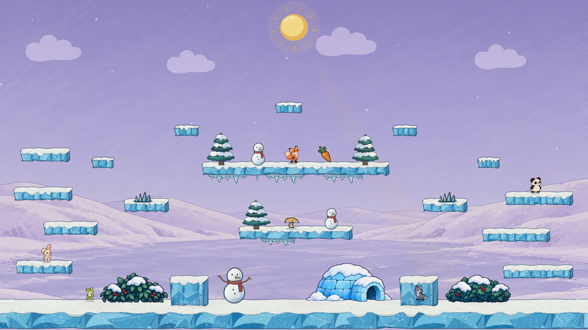
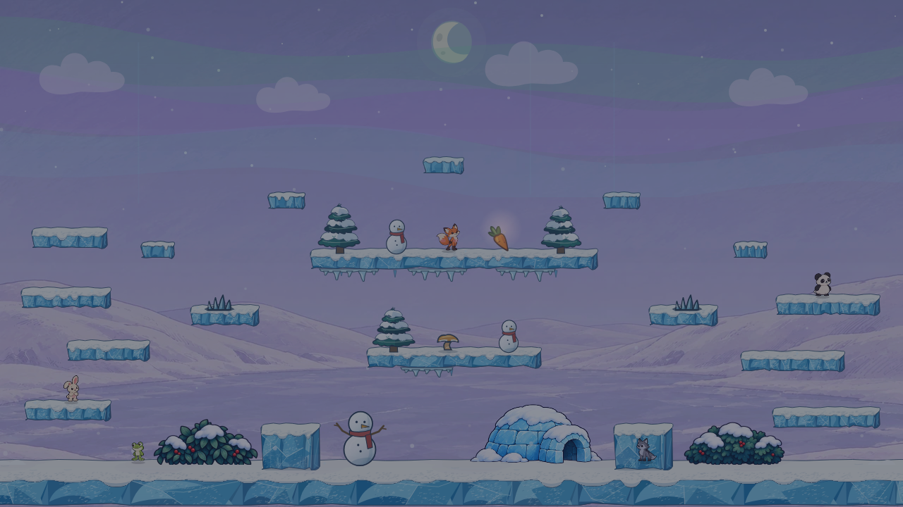

# Winter Lake atmosphere and color study

This is the remaining atmosphere pass in [phase 5 of the arena redesign sequence](../../../.claude/skills/visual-style/SKILL.md#arena-redesign-sequence). The first comparison changed mostly cloud shapes and removed the arena's signature broad aurora; its alternatives looked too similar. This second pass **keeps the original exaggerated aurora** in every night view and compares three distinct color grades. The Pearl composition, gameplay geometry, character positions, Ink Bell objects, snowfall, and collision cues stay fixed. **No production arena art or gameplay code changes in this study.**

## Matched full-scene views

| Direction | Day | Night | Color and mood |
| --- | --- | --- | --- |
| **Current** |  |  | The merged blue-gray Pearl palette and original green/violet aurora. Baseline for every comparison. |
| **Amber Frost** |  |  | Pale peach sky, warm ivory snowbanks, and amber-tinted distant ice. The still-blue platforms and cool aurora stand apart from the warmer scenery. |
| **Glacier Teal** |  |  | Saturated cyan sky and lake, mint snow shadows, and teal ice. This is the boldest winter-color treatment and the closest match between environment and ice platforms. |
| **Violet Dusk** |  |  | Lilac sky and snow shadows with a violet lake. It gives the aurora a playful purple setting while the action objects retain their own ink and color. |

## Review notes

- The aurora's shape, breadth, motion code, and green foreground wash come from the merged game pack in all four night captures. The color beneath it changes; the feature itself stays exaggerated.
- Each candidate grades the sky and existing painted background, and adjusts cached platform and prop color plus cloud and fog hues. Characters, hazards, spring, and carrot remain unfiltered so their silhouettes and gameplay colors can be judged against each setting.
- Amber Frost gives the strongest warm-versus-cool separation around the ice platforms. Glacier Teal is more saturated and may need its platform/background separation checked in moving play. Violet Dusk is distinctive but shifts the snowy setting furthest from natural daylight.
- These are fixed renderer composites, not proof of animation feel or frame cost. The selected grade needs live checks at day, dusk, and night in both simulation-worker modes. The study uses Canvas filters on cached scenery; a production version should measure or bake the selected treatment rather than assume the mockup's filter cost is free.

## Reproduce

Start Vite on this branch and set `WINTER_ATMOSPHERE_URL` to its `/bunnybrawl/` URL. Run `node docs/mockups/winter-atmosphere/capture.mjs`. If Playwright cannot find its expected browser revision, set `WINTER_ATMOSPHERE_CHROMIUM` to an installed Chromium executable. The fixture URL is `docs/mockups/winter-lake/render.html?variant=current&props=current&action=ink-bell&atmosphere=current|amber-frost|glacier-teal|violet-dusk&time=day|night`.

The capture script uses a fixed 1280 × 720 viewport and random seed. Character positions, cloud and fog positions, snow particles, and actionable objects are identical in every variant. The color-grade functions live in [variants.ts](variants.ts) and are applied only by the study fixture.
