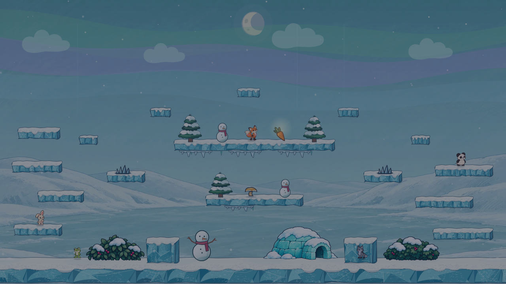

# Winter Lake atmosphere and color study

This is the atmosphere pass in [phase 5 of the arena redesign sequence](../../../.claude/skills/visual-style/SKILL.md#arena-redesign-sequence). The first comparison changed mostly cloud shapes and removed the arena's signature broad aurora; its alternatives looked too similar. The second pass kept the **original exaggerated aurora** and compared three color grades. **Glacier Teal was selected and integrated into the production Winter Lake pack.** The Pearl composition, gameplay geometry, Ink Bell objects, snowfall, and collision cues remain fixed.

## Selected production result

| Before | Glacier Teal in the production pack |
| --- | --- |
|  |  |
|  |  |

The selected grade changes the sky, painted distance, fixed props, clouds, and fog. The vector platforms keep their existing blue ink for separation from the teal shore. Characters, hazards, spring, carrot, and the animated aurora retain their original color and shape. The background and fixed-prop caches contain the filter work; it is not applied as a full-screen per-frame effect. Live gameplay was checked in both simulation-worker modes at native size.

## Original selection study

| Direction | Day | Night | Color and mood |
| --- | --- | --- | --- |
| **Current** |  |  | The merged blue-gray Pearl palette and original green/violet aurora. Baseline for every comparison. |
| **Amber Frost** |  |  | Pale peach sky, warm ivory snowbanks, and amber-tinted distant ice. The still-blue platforms and cool aurora stand apart from the warmer scenery. |
| **Glacier Teal** |  |  | Saturated cyan sky and lake, mint snow shadows, and teal ice. This is the boldest winter-color treatment and the closest match between environment and ice platforms. |
| **Violet Dusk** |  |  | Lilac sky and snow shadows with a violet lake. It gives the aurora a playful purple setting while the action objects retain their own ink and color. |

## Review notes

- The aurora's shape, breadth, motion code, and green foreground wash come from the merged game pack in all four night captures. The color beneath it changes; the feature itself stays exaggerated.
- Each original candidate graded the sky and existing painted background, and adjusted cached platform and prop color plus cloud and fog hues. The selected production pass leaves vector platforms unfiltered after that treatment delayed default-worker arena switching. Characters, hazards, spring, and carrot remain unfiltered so their silhouettes and gameplay colors can be judged against each setting.
- Amber Frost gives the strongest warm-versus-cool separation around the ice platforms. Glacier Teal is more saturated and may need its platform/background separation checked in moving play. Violet Dusk is distinctive but shifts the snowy setting furthest from natural daylight.
- The original comparison images are fixed renderer composites. They preserve the decision trail; the selected production captures above show the arena pack after integration. The live browser was also checked with both worker modes. The teal filters run when the backdrop and foreground decoration caches are built, while the existing animated aurora remains on its established cache path. A focused arena-switch gate passed with platform filtering removed; filtering every detailed vector facet had reproducibly delayed the default worker's loading handoff.

## Reproduce

Start Vite on this branch and set `WINTER_ATMOSPHERE_URL` to its `/bunnybrawl/` URL. Run `node docs/mockups/winter-atmosphere/capture-selected.mjs` for the selected production result. If Playwright cannot find its expected browser revision, set `WINTER_ATMOSPHERE_CHROMIUM` to an installed Chromium executable. The fixture URL is `docs/mockups/winter-lake/render.html?variant=current&props=current&action=ink-bell&atmosphere=current&time=day|night`.

The original four-direction study was captured at commit `3d06199`, before the production grade was applied. To regenerate those historical comparisons, check out that commit and run `capture.mjs`. Running its variant overrides on the integrated pack would apply grading twice.

The capture script uses a fixed 1280 × 720 viewport and random seed. Character positions, cloud and fog positions, snow particles, and actionable objects are identical in every variant. The color-grade functions live in [variants.ts](variants.ts) and are applied only by the study fixture.
