# Winter Lake platform pass: shape and contrast studies

Pearl Painted is the approved backdrop. This is **arena redesign step 3**: compare playable snow shelves, ground, and the two jumpable ice cubes in the full scene before choosing a production treatment. Geometry, landing heights, slippery friction, character placements, props, foreground cover, and time of day remain identical across captures. The earlier studies were fixture overrides; the scalable painted treatment is now in the playable arena.

## Scalable painted platforms in the playable arena

The painted look uses three optimized transparent WebP assets in the Winter Lake pack. A shelf has fixed-width painted ends and a continuous resizable center, while each ice block uses a two-axis nine-slice. The platform rectangles and slippery physics remain in the arena data, so moving or widening a platform changes its art placement without redrawing an asset. The ground overhang extends past the screen edges. The body-cover portion is drawn after players through the existing cached overlay. Menu and lobby prefetch the art, and each renderer realm decodes it before its first Winter Lake paint; a failed image leaves the prior procedural platform renderer available.

| Earlier whole-image stretch | Scalable production painter | Size and collision study |
| --- | --- | --- |
| 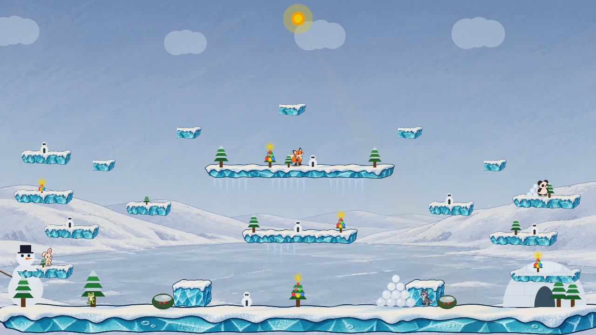 | 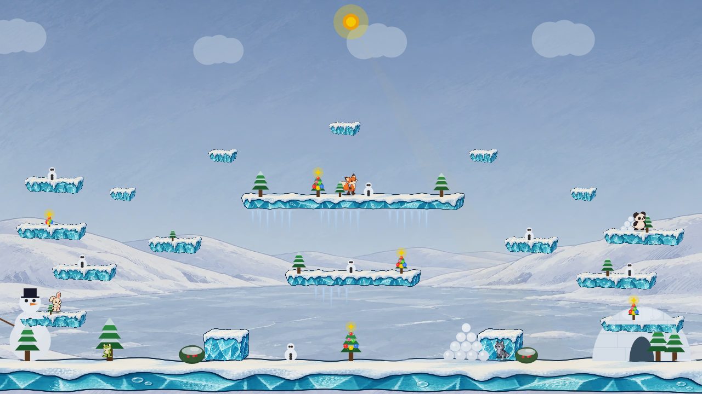 | 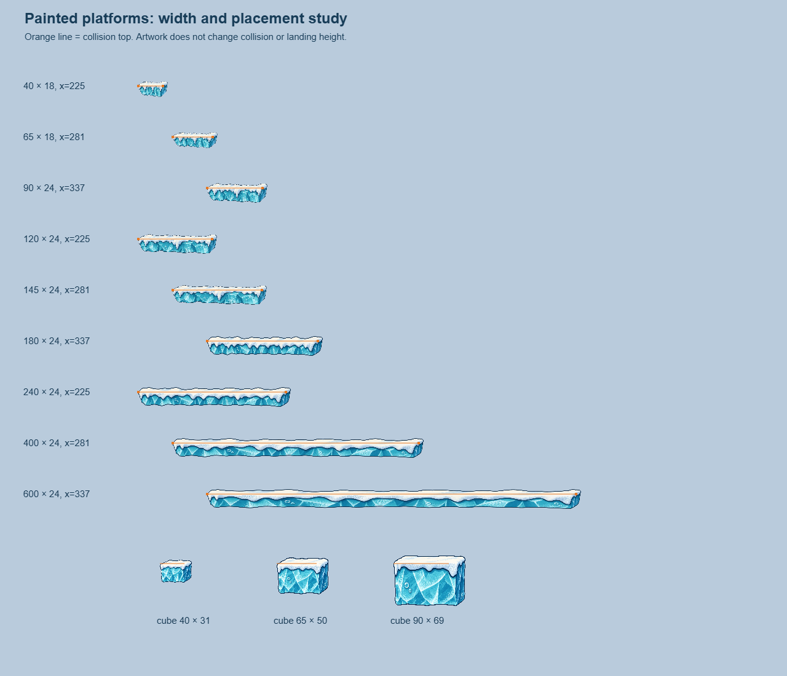 |

The [night capture](painted-scalable-night.png) checks the same composition under the arena tint. The size study covers 40–600 px shelves at varied x positions and 40/65/90 px cubes. Orange lines mark the unchanged collision tops. The first resizing attempt repeated a center tile; that created a mechanical row of snow teeth and facets along the ground, so the final painter stretches one continuous interior and keeps the ends at stable screen widths. The two broad shelves carry a `snowBridge` style tag, so changing their width will not suddenly switch artwork at an arbitrary threshold. Large future size changes still need a match-scale review. The current three WebPs total about 521 KB, compared with about 3.5 MB for their source PNGs.

## Earlier painted platform prototype

The procedural cartoon follow-ups below were judged too simple beside the generated reference. This prototype draws **actual transparent illustrated assets** in the production renderer: a narrow [long shelf](painted-shelf-long.png), the earlier [wide shelf](glacial-ceramic-art-direction.png) for medium platforms, and a matching [ice block](painted-ice-block.png). The fixture selects a source by platform width, maps its painted bounds onto each existing platform rectangle, and redraws the body in the foreground cover pass. It also overscans the visual ground past both viewport edges.

| Selected baseline | Painted prototype |
| --- | --- |
| 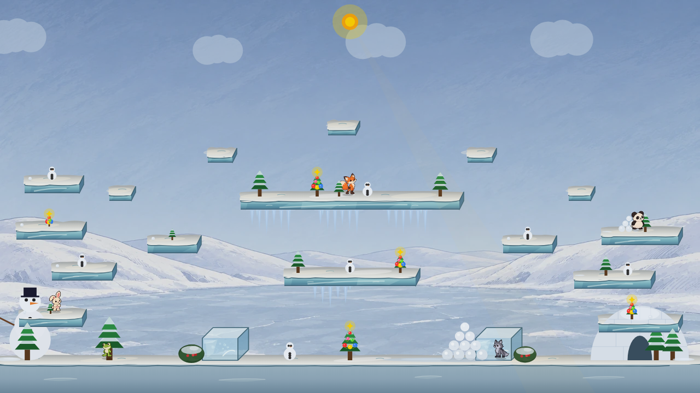 |  |
|  | 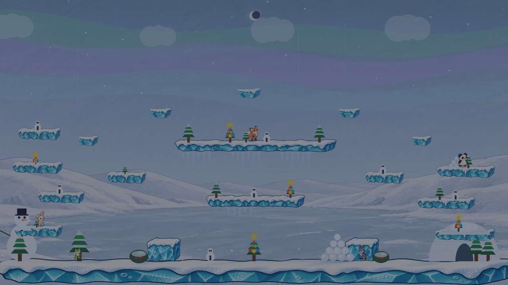 |

This brought the snowy overhang, blue facets, ink edge, and frosted texture close to the reference at match scale. The two ice blocks used matching art rather than the old translucent wireframe. The old pine trees, snowmen, igloo, snowballs, and long icicle fringe remained; they stood out as the next visual mismatch. This initial version used large unoptimized PNGs and stretched a whole motif to every shelf. The scalable production treatment above supersedes that mapping.

## Glacial Ceramic cartoon and texture iteration

**Glacial Ceramic was selected** from the previous round. Its clean ice color worked, but the gradient and repeated long highlight still felt like smooth vector plastic. Astra reviewed the captures and advised stronger connected outlines, flatter value planes, irregular snow volume, and localized texture. We tested three code-native texture directions, then a more ambitious Storybook Glaze treatment based on those lessons and an isolated illustrated [art-direction reference](glacial-ceramic-art-direction.png). That reference has much thicker ice than the real platforms and was later reused as the medium-width source for the painted prototype above; it is not a standalone gameplay screenshot.

| Treatment | Noon | Midnight | Scene-scale result |
| --- | --- | --- | --- |
| **Selected starting point: Glacial Ceramic** |  |  | Clear material, thin cap, smooth blue-green face. |
| **Inked Glaze** | 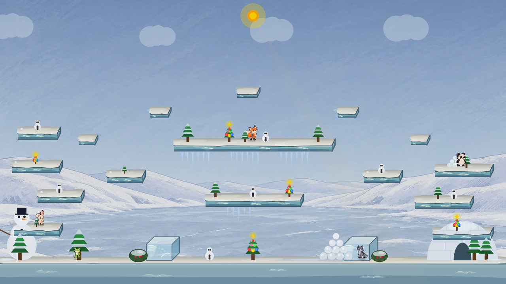 | 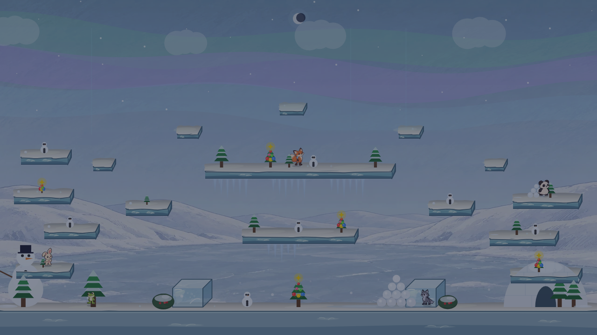 | Better ink and flatter planes; the small pale crescents still repeat. |
| **Bubble Glacier** |  | 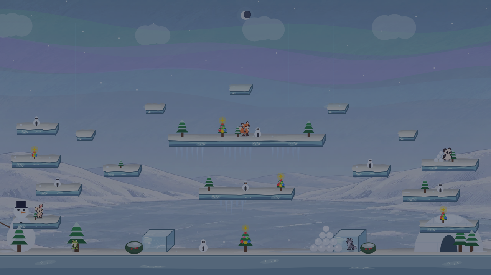 | Playful trapped bubbles, but too many shelves repeat the same cluster. |
| **Chalk Frost** | 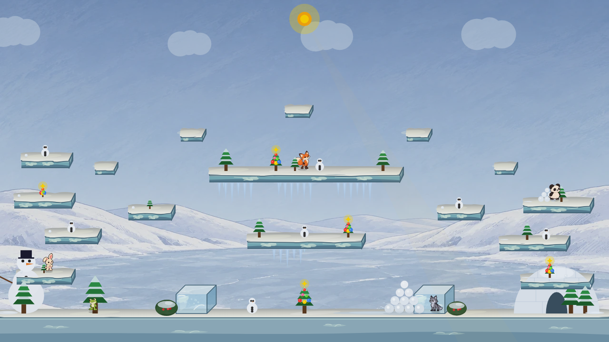 |  | Larger pale frost islands; some read more like paint patches than ice. |
| **Storybook Glaze** | 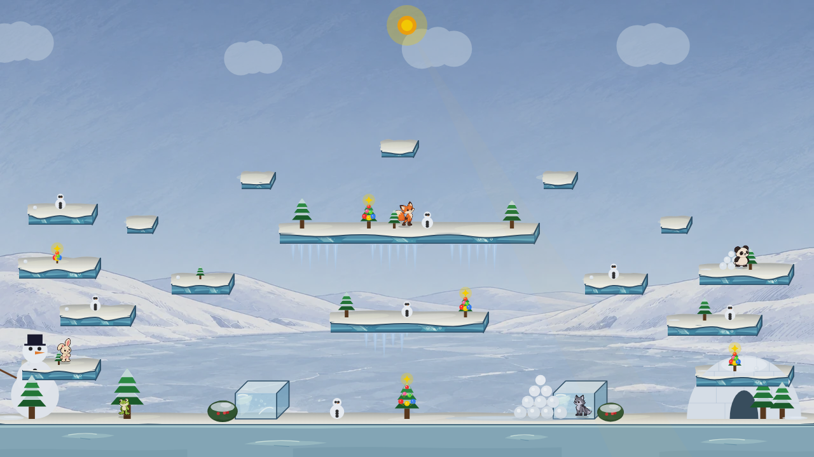 | 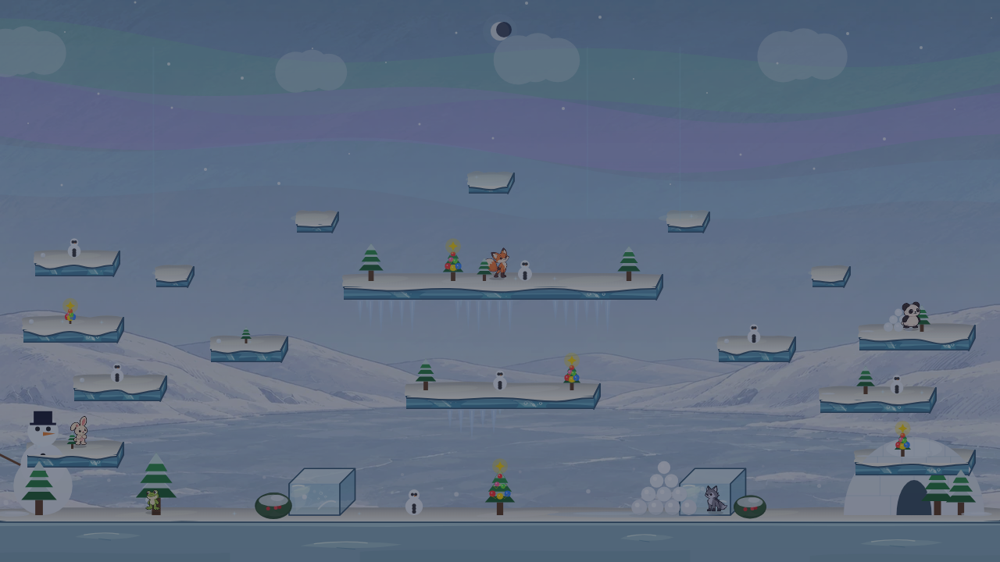 | Stronger cartoon candidate: irregular deeper snow lip, darker connected outline, broad blue ice facets with grouped frost flecks, and a ground face with quiet separated marks. |

Storybook Glaze is the strongest new treatment at full scene scale. It keeps the original collision plane, slippery behavior, right-side fake 3D depth, ice-cube bounds, and foreground body-cover pass. The texture is concentrated inside facets instead of scattered along every platform. Tiny stepping stones use a shallower lip because their ice faces are only a few pixels tall. The original thin icicles under the wide shelves are still drawn by Winter Lake's decoration layer; they and the current simplified trees/snowmen need their own later prop pass. These captures do not prove the style during moving play or at sunset.

## Ink Rim follow-up: illustrated shelf studies

Ink Rim was the preferred first treatment, but its translucent stroke and speckles left the original airbrushed rectangle intact. With Astra art-direction review, the follow-up studies replace the visible cap and front-face material with larger connected forms. The front face still renders over players, the snow cap stays centered on the original landing height, and the right face retains its fake 3D fold. The ice cubes get a clearer frosted top, tinted side, and internal highlights without changing their hitboxes.

| Treatment | Noon | Midnight | What changes from Ink Rim |
| --- | --- | --- | --- |
| **Ink Rim reference** | 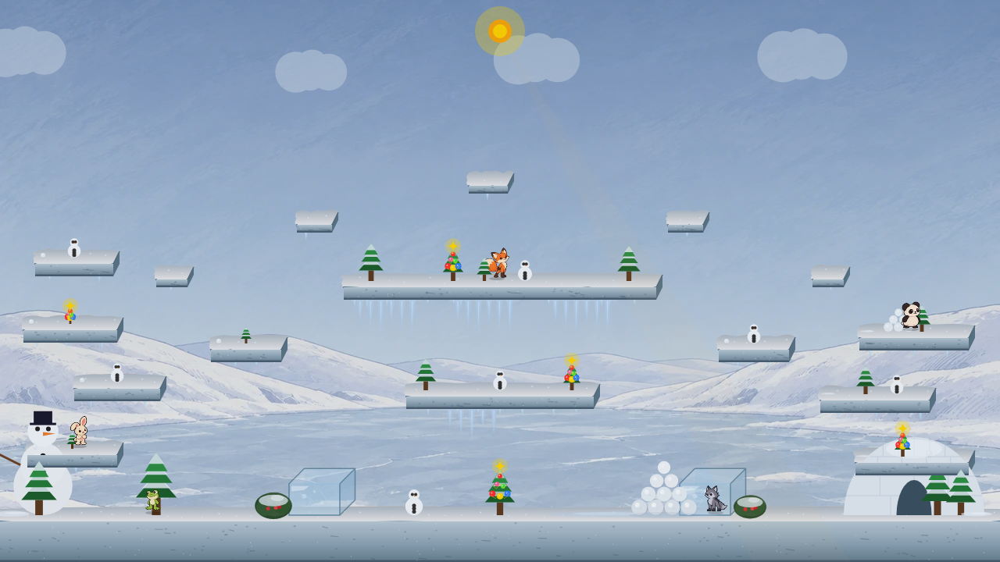 | 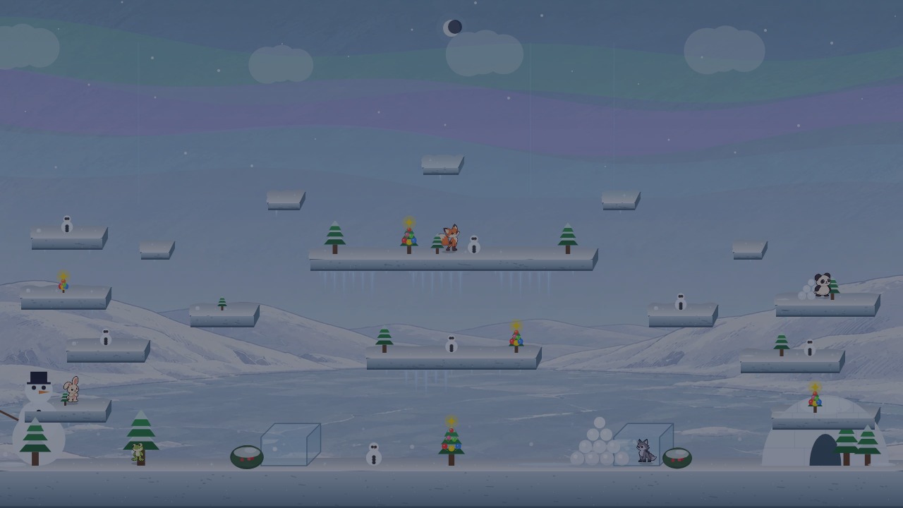 | Thin edge treatment on the existing plain shelf. |
| **Snow Pillow** |  | 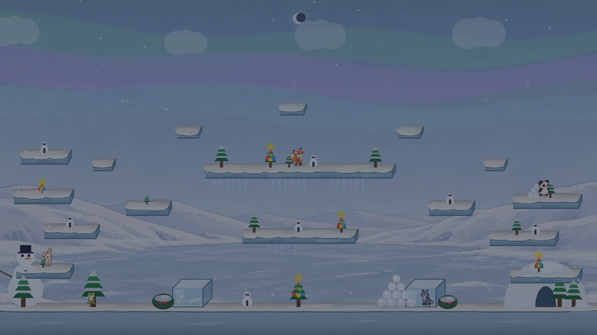 | Warm pearl snow with an uneven rolled lip, lavender under-shadow, and sparse broad frost patches. The closest continuation of Ink Rim; Glacial Ceramic was selected instead. |
| **Glacial Ceramic** |  |  | A thinner cap over a more solid blue-green ice face, curved facets, and a localized polished mark. Clearer ice identity, but brighter and more toy-like. |
| **Layered Snowbank** | 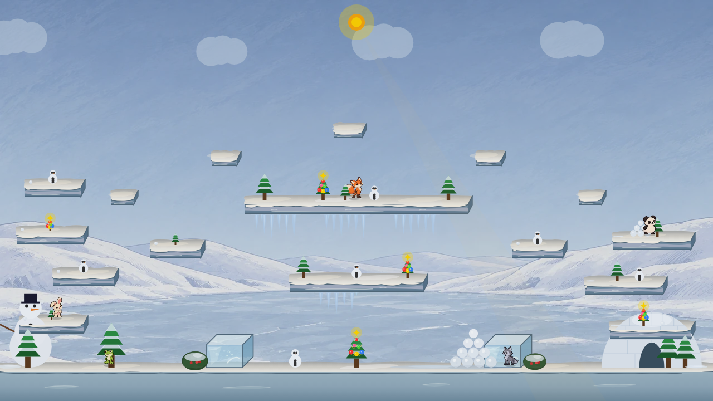 | 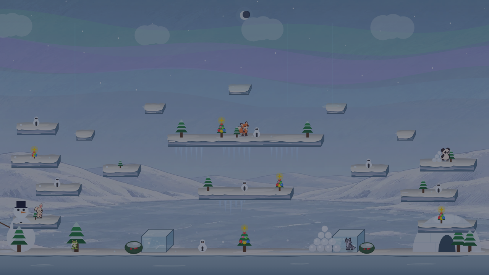 | Compressed snow and blue lower bed. This version still looks striped on the narrow shelves, so it is the weakest of the three. |

The first capture pass made the full-width ground into a repeated patterned ribbon. The revised captures give the ground only four small uneven ice pockets with long quiet spans; they are the files shown above. Original Winter Lake icicles and props still appear in all scenes because they belong to the later prop pass. Their regular spacing is now the clearest remaining mismatch with the new shelf language. The upper tiny shelves also have too little front-face height for elaborate texture; they rely on cap volume and silhouette.

## Full-scene comparison

| Treatment | Noon | Midnight | Design question |
| --- | --- | --- | --- |
| **Current** | 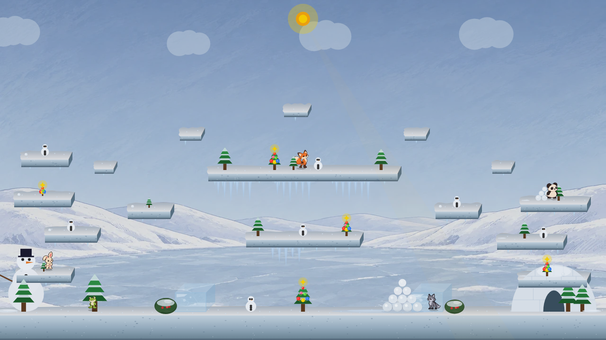 | 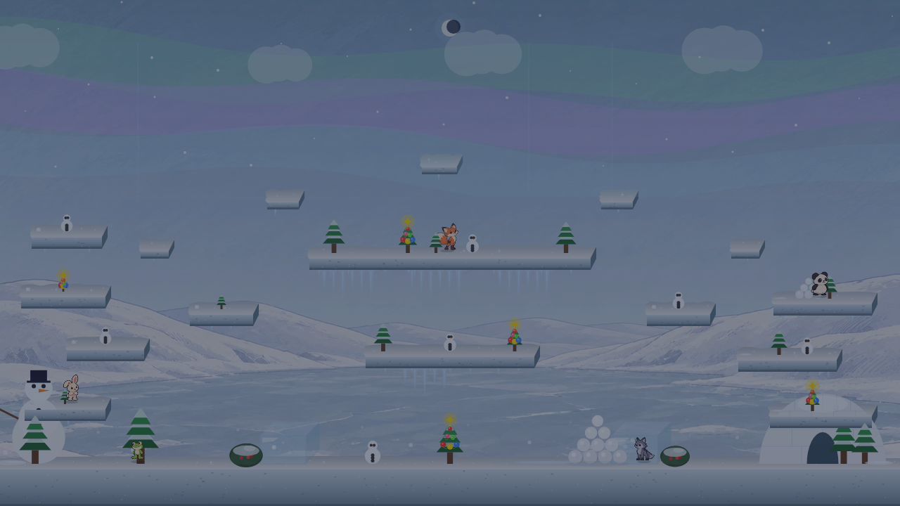 | White caps and blue front faces against the new pale banks. |
| **Ink Rim** |  |  | Can a continuous cool-slate cap edge and sparse brush marks solve the contrast problem without a major material change? |
| **Ice Strata** |  | 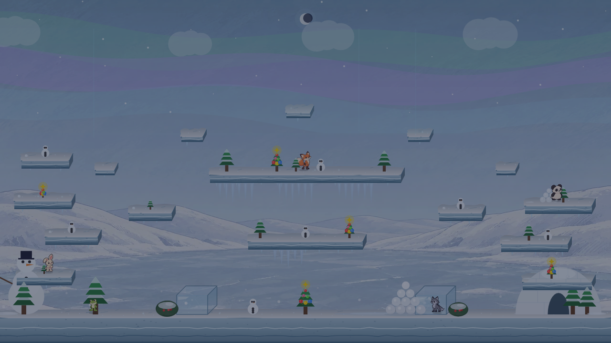 | Can banded blue ice below the snow give the shelves a distinct material and separate their lower faces from snowy banks? |
| **Snow Crust** |  | 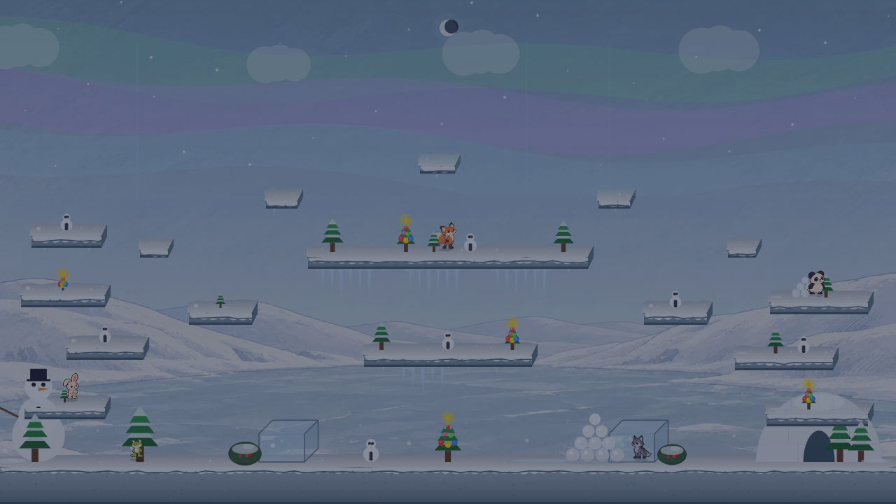 | Would a chunkier snow apron over a dark slate core read better, or would its repeating edge become too loud? |

**Initial assessment, before the Ink Rim follow-up:** Ice Strata gave the strongest separation of the lower side shelves from Pearl's snowy banks. Ink Rim was restrained, but at full match size its change was small. Snow Crust's repeating edge drew attention away from play. Ink Rim was chosen as the base for the richer studies above; the initial assessment is retained as iteration history.

## Constraints for the chosen treatment

- Keep the exact platform rectangles, collision tops, front-face player-cover overlay, fake 3D right side, and current slippery movement. A stronger outline must follow the actual wavy cap edge without shifting the landing plane.
- Check the lower left shelves around x=40–360 and lower right shelves around x=920–1230 over Pearl's pale banks. Compare white cap, blue body, and cube silhouette separately at native size and on a smaller screen.
- Keep the highest shelves readable against open sky and avoid turning every floating platform into a dark bar. The ground edge should support play without becoming the strongest line across the scene.
- Preserve the two jumpable ice cube obstacles and their top-edge cues. Any change to their apparent size needs a collision check.
- Review noon, sunset, and night with pale, green, warm, and dark characters before production adoption. Bushes and other deliberate foreground cover remain opaque.

## Reproduction

The [fixture](../winter-lake/render.ts) uses the production `Renderer` and Winter Lake pack with the selected Pearl WebP decoded before the first frame. Older variants override `drawPlatform` and `drawPlatformOverlay` with the [platform studies](variants.ts) or [whole-image mapper](painted.ts); `painted-scalable` uses the same [painter](../../../src/engine/arenas/packs/winterLakePaintedPlatforms.ts) and optimized WebPs as the playable arena. Run Vite from the repo root, set `WINTER_PLATFORM_URL` to its `/bunnybrawl/` URL, then run `node docs/mockups/winter-platforms/capture.mjs`. The separate [size study](sizing.html) renders moved and resized platforms with collision guides. Direct fixture URLs use `/bunnybrawl/docs/mockups/winter-lake/render.html?variant=current&platform=painted-scalable&time=day`, with `time=day|night`.
