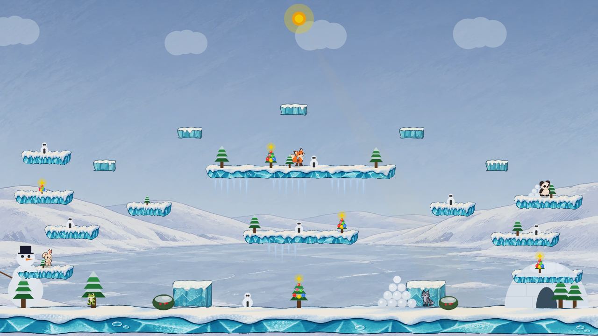

# Winter Lake platform pass: shape and contrast studies

## Selected playable direction: Astra Canvas drawing (October 2026)

The painted platform assets and their working resizer are retained here for comparison. Astra's Canvas 2D `vector-replica` treatment is the selected playable drawing. It keeps inked snow, translucent ice, fake 3D depth, and flexible platform sizing without a bitmap platform source. The Pearl painted **background** remains unchanged. Production uses the same drawing functions as the fixture; collision rectangles, landing heights, slippery physics, and the cached foreground-cover pass are unchanged. The three platform WebPs remain in the repository as an archived comparison but are no longer prefetched for play.

The [actual production-renderer capture at noon](production-day.png) and [at night](production-night.png) show the selected art without a platform override. The fixture preloads Pearl's background plate, matching normal match startup.

| Playable painted baseline | Astra Canvas replica | Detailed SVG trace hybrid |
| --- | --- | --- |
|  |  |  |
| [Width study](painted-scaling-study.png) | [Width study](vector-scaling-study.png) | [Width study](vector-trace-scaling-study.png) |

The [Canvas night scene](vector-replica-night.png) and [SVG trace night scene](vector-trace-night.png) use the same arena, actors, lighting, and collision shapes. Astra's Canvas version is coherent from 40px steps to 600px bridges and draws every cube. The snow has a continuous dark edge and varying overhang; the ice has broad overlapping facets and localized frost. The full-width ground still has a more regular rhythm than the painted source; that is a specific visual tradeoff to watch in live play.

Two user-supplied vectorizations of the long painted shelf were inspected. [Tool A](user-vector-tool-a-preview.png) uses 13 large color paths in a 645 KB SVG. It captures the broad silhouette but flattens the brush texture and has an opaque white background, so it cannot be placed over the arena as supplied. [Tool B](user-vector-tool-b-preview.png) has transparent space around the shelf, retains the ink and textured facets well, and uses 4,272 paths in a 1,063 KB SVG. The `vector-trace` sample draws Tool B through Canvas with fixed-size end caps and a stretched center on medium and long shelves; tiny steps and cubes use Astra's drawn shapes. Its long ground rim is close to the painting, but the highly detailed trace becomes crowded at 90–145px and its full-size SVG is much larger than the 112 KB production bridge WebP. Browser decoding and rasterization still happen before Canvas draws an SVG image, so this is a scalable vector source rather than a fully geometric hot-path renderer. A 4,272-path `Path2D` redraw every frame would need a separate performance study; the current trace sample is a static fixture only.

**Decision:** The Canvas drawing is the approved platform direction; the detailed SVG remains an art reference. The trace's long ground rim is attractive, but its busy middle-size shelves and roughly 9.5× bridge payload made it a worse fit for the full platform family. The earlier painted implementation remains available in this study if the Canvas treatment needs a later adjustment.

**Drawing cost:** A local Chromium microbenchmark of the same six representative platforms, drawing back and front, measured a 3.58 ms median for Canvas geometry versus 0.07 ms for decoded WebPs across 12 warmed samples. This is a drawing-call comparison, not a frame-time benchmark. The renderer builds the static background and foreground-cover canvas when the arena loads or is invalidated, then composites those cached layers during play; the measured geometry cost is therefore a load/redraw consideration rather than a recurring cost on every frame. The [benchmark script](benchmark.mjs) records the exact platform set and method. Slower devices and a full arena may take longer, so live startup responsiveness remains worth checking.

### How the good vector result was reached

This was a sequence of visual constraints and comparisons, rather than a single prompt that happened to work. The initial Ink Rim and Glacial Ceramic code passes focused on outlines, gradients, and a few marks. They were structurally correct but looked like simple vector plastic. The first generated art-direction reference showed the missing material hierarchy: a thick draped snow volume, a dark connected ink contour, varied turquoise ice masses, internal fractures, and small frost marks. The painted prototype proved those features could look good **in the real arena**, which gave the vector attempt a concrete target rather than a vague request for “more cartoon.”

The first vector replica still failed that target. Its cap was a thin, nearly straight white stripe; ice faces formed repetitive upright triangles; cubes looked like striped boxes; the ground became a uniform patterned ribbon. The full-scene screenshot exposed those faults faster than an enlarged asset view. We asked Astra to revise the actual Canvas geometry against the painted capture, naming those specific failures. The revised painter changed the construction order:

1. Draw a **single watertight ice silhouette** and a separate closed snow silhouette before adding detail. This keeps a continuous outer ink edge at 40px and avoids gaps between facets.
2. Give snow its own volume. Its lobes vary in width and depth, with a wavy top near the landing plane and a shadowed lower edge. The cap is a material layer rather than a white line.
3. Build the ice from overlapping broad light and dark masses. Seed their widths and fracture positions from platform geometry so moved or resized pieces stay stable, but do not repeat one triangle at fixed intervals. Cubes get diagonal slabs that cross their upright grain.
4. Put fine dry-brush flecks **inside** those masses and leave quiet patches between them. Fine texture alone cannot carry the material at match scale; the big color planes do that first.
5. Draw the darker right return plane and its continuous edge after the face, preserving the fake 3D read. Render the front face again through the existing foreground-cover clip so players still pass behind a shelf body.

The comparisons were fixed at identical arena state, characters, platform positions, and day/night lighting. A separate width study covered 40, 45, 50, 65, 90, 120, 145, 180, 240, 400, and 600px shelves plus three cubes, with orange collision-top guides. This caught details that an attractive long source asset could hide. The two online SVG traces were useful **after** the Canvas revision as fidelity checks: they confirmed what the painted contour and ice colors contained, but also showed why a high-detail long-shelf trace is not a universal resizable platform drawing.

For another arena, start with a matched production screenshot and a visual reference at the **smallest, typical, and largest** gameplay sizes. Write down the material layers and silhouettes that make the reference work, then draw those large forms before texture. Reject the first implementation if it merely checks technical constraints while looking too flat in the whole scene. Compare at native game scale and under night tint after each structural revision. Only then refine flecks, seams, and color. This is why the final result was achievable: the early passes identified which visual information was missing, and the painted target plus fixed-size captures made the next instruction precise.

Pearl Painted is the approved backdrop. This is **arena redesign step 3**: compare playable snow shelves, ground, and the two jumpable ice cubes in the full scene before choosing a production treatment. Geometry, landing heights, slippery friction, character placements, props, foreground cover, and time of day remain identical across the original matched captures. The scalable painted treatment was playable during exploration; the later Canvas drawing is the selected production platform art. The [cross-pass lessons](../winter-lake/LESSONS.md) explain the change.

## Earlier scalable painted platforms

The earlier playable painted look used three optimized transparent WebP assets in the Winter Lake pack. A shelf had fixed-width painted ends and a continuous resizable center, while each ice block used a two-axis nine-slice. The platform rectangles and slippery physics remained in the arena data, so moving or widening a platform changed its art placement without redrawing an asset. The ground overhang extended past the screen edges. The body-cover portion was drawn after players through the existing cached overlay. This code and its source images are retained as a comparison; the selected Canvas platforms no longer fetch the three platform images during normal startup.

| Earlier whole-image stretch | Scalable production painter | Size and collision study |
| --- | --- | --- |
|  |  |  |

The [night capture](painted-scalable-night.png) checks the same composition under the arena tint. The size study covers 40–600 px shelves at varied x positions and 40/65/90 px cubes. Orange lines mark the unchanged collision tops. The first resizing attempt repeated a center tile; that created a mechanical row of snow teeth and facets along the ground, so the final painter stretches one continuous interior and keeps the ends at stable screen widths. The two broad shelves carry a `snowBridge` style tag, so changing their width will not suddenly switch artwork at an arbitrary threshold. Large future size changes still need a match-scale review. The current three WebPs total about 521 KB, compared with about 3.5 MB for their source PNGs.

**Tiny-step correction:** Scaling the full shelf painting to 40–65 px made its ink disappear in places and left visible slice joins. Those steps now use a continuous small-scale ink silhouette with broad ice facets, plus one cropped painted texture sample inside the face. The larger shelves and cubes retain their illustrated art. The updated [size study](painted-scaling-study.png) and [day scene](painted-scalable-day.png) show this hybrid treatment at native scale; the next visual decision should use those scene images, since a clean isolated step can still look too flat beside painted platforms.

## Earlier painted platform prototype

The procedural cartoon follow-ups below were judged too simple beside the generated reference. This prototype draws **actual transparent illustrated assets** in the production renderer: a narrow [long shelf](painted-shelf-long.png), the earlier [wide shelf](glacial-ceramic-art-direction.png) for medium platforms, and a matching [ice block](painted-ice-block.png). The fixture selects a source by platform width, maps its painted bounds onto each existing platform rectangle, and redraws the body in the foreground cover pass. It also overscans the visual ground past both viewport edges.

| Selected baseline | Painted prototype |
| --- | --- |
|  |  |
|  |  |

This brought the snowy overhang, blue facets, ink edge, and frosted texture close to the reference at match scale. The two ice blocks used matching art rather than the old translucent wireframe. The old pine trees, snowmen, igloo, snowballs, and long icicle fringe remained; they stood out as the next visual mismatch. This initial version used large unoptimized PNGs and stretched a whole motif to every shelf. The scalable production treatment above supersedes that mapping.

## Glacial Ceramic cartoon and texture iteration

**Glacial Ceramic was selected** from the previous round. Its clean ice color worked, but the gradient and repeated long highlight still felt like smooth vector plastic. Astra reviewed the captures and advised stronger connected outlines, flatter value planes, irregular snow volume, and localized texture. We tested three code-native texture directions, then a more ambitious Storybook Glaze treatment based on those lessons and an isolated illustrated [art-direction reference](glacial-ceramic-art-direction.png). That reference has much thicker ice than the real platforms and was later reused as the medium-width source for the painted prototype above; it is not a standalone gameplay screenshot.

| Treatment | Noon | Midnight | Scene-scale result |
| --- | --- | --- | --- |
| **Selected starting point: Glacial Ceramic** |  |  | Clear material, thin cap, smooth blue-green face. |
| **Inked Glaze** |  |  | Better ink and flatter planes; the small pale crescents still repeat. |
| **Bubble Glacier** |  |  | Playful trapped bubbles, but too many shelves repeat the same cluster. |
| **Chalk Frost** |  |  | Larger pale frost islands; some read more like paint patches than ice. |
| **Storybook Glaze** |  |  | Stronger cartoon candidate: irregular deeper snow lip, darker connected outline, broad blue ice facets with grouped frost flecks, and a ground face with quiet separated marks. |

Storybook Glaze is the strongest new treatment at full scene scale. It keeps the original collision plane, slippery behavior, right-side fake 3D depth, ice-cube bounds, and foreground body-cover pass. The texture is concentrated inside facets instead of scattered along every platform. Tiny stepping stones use a shallower lip because their ice faces are only a few pixels tall. The original thin icicles under the wide shelves are still drawn by Winter Lake's decoration layer; they and the current simplified trees/snowmen need their own later prop pass. These captures do not prove the style during moving play or at sunset.

## Ink Rim follow-up: illustrated shelf studies

Ink Rim was the preferred first treatment, but its translucent stroke and speckles left the original airbrushed rectangle intact. With Astra art-direction review, the follow-up studies replace the visible cap and front-face material with larger connected forms. The front face still renders over players, the snow cap stays centered on the original landing height, and the right face retains its fake 3D fold. The ice cubes get a clearer frosted top, tinted side, and internal highlights without changing their hitboxes.

| Treatment | Noon | Midnight | What changes from Ink Rim |
| --- | --- | --- | --- |
| **Ink Rim reference** |  |  | Thin edge treatment on the existing plain shelf. |
| **Snow Pillow** |  |  | Warm pearl snow with an uneven rolled lip, lavender under-shadow, and sparse broad frost patches. The closest continuation of Ink Rim; Glacial Ceramic was selected instead. |
| **Glacial Ceramic** |  |  | A thinner cap over a more solid blue-green ice face, curved facets, and a localized polished mark. Clearer ice identity, but brighter and more toy-like. |
| **Layered Snowbank** |  |  | Compressed snow and blue lower bed. This version still looks striped on the narrow shelves, so it is the weakest of the three. |

The first capture pass made the full-width ground into a repeated patterned ribbon. The revised captures give the ground only four small uneven ice pockets with long quiet spans; they are the files shown above. Original Winter Lake icicles and props still appear in all scenes because they belong to the later prop pass. Their regular spacing is now the clearest remaining mismatch with the new shelf language. The upper tiny shelves also have too little front-face height for elaborate texture; they rely on cap volume and silhouette.

## Full-scene comparison

| Treatment | Noon | Midnight | Design question |
| --- | --- | --- | --- |
| **Current** |  |  | White caps and blue front faces against the new pale banks. |
| **Ink Rim** |  |  | Can a continuous cool-slate cap edge and sparse brush marks solve the contrast problem without a major material change? |
| **Ice Strata** |  |  | Can banded blue ice below the snow give the shelves a distinct material and separate their lower faces from snowy banks? |
| **Snow Crust** |  |  | Would a chunkier snow apron over a dark slate core read better, or would its repeating edge become too loud? |

**Initial assessment, before the Ink Rim follow-up:** Ice Strata gave the strongest separation of the lower side shelves from Pearl's snowy banks. Ink Rim was restrained, but at full match size its change was small. Snow Crust's repeating edge drew attention away from play. Ink Rim was chosen as the base for the richer studies above; the initial assessment is retained as iteration history.

## Constraints for the chosen treatment

- Keep the exact platform rectangles, collision tops, front-face player-cover overlay, fake 3D right side, and current slippery movement. A stronger outline must follow the actual wavy cap edge without shifting the landing plane.
- Check the lower left shelves around x=40–360 and lower right shelves around x=920–1230 over Pearl's pale banks. Compare white cap, blue body, and cube silhouette separately at native size and on a smaller screen.
- Keep the highest shelves readable against open sky and avoid turning every floating platform into a dark bar. The ground edge should support play without becoming the strongest line across the scene.
- Preserve the two jumpable ice cube obstacles and their top-edge cues. Any change to their apparent size needs a collision check.
- Review noon, sunset, and night with pale, green, warm, and dark characters before production adoption. Bushes and other deliberate foreground cover remain opaque.

## Reproduction

The [fixture](../winter-lake/render.ts) uses the production `Renderer` and Winter Lake pack with the selected Pearl WebP decoded before the first frame. Older variants override `drawPlatform` and `drawPlatformOverlay` with the [platform studies](variants.ts) or [whole-image mapper](painted.ts); `painted-scalable` explicitly loads the retained [painted painter](../../../src/engine/arenas/packs/winterLakePaintedPlatforms.ts) and WebPs. `vector-replica` uses the selected [production Canvas drawing](../../../src/engine/arenas/packs/winterLakeVectorPlatforms.ts). Run Vite from the repo root, set `WINTER_PLATFORM_URL` to its `/bunnybrawl/` URL, then run `node docs/mockups/winter-platforms/capture.mjs`. The separate [size study](sizing.html) renders moved and resized platforms with collision guides. Direct fixture URLs use `/bunnybrawl/docs/mockups/winter-lake/render.html?variant=current&platform=vector-replica&time=day`, with `time=day|night`.
