# Winter Lake props and cover: redesign step 4

The selected Pearl background and Astra Canvas platforms are held fixed in every capture. This pass explores decorative props only: the large snowman and igloo, ground and shelf evergreens, smaller snowmen, the foreground snowball pile, and the two ground bushes. The first study kept the old bush positions at x=350 and x=960; the later cleanup moved them to x=300 and x=990 so they no longer crowd the ice cubes. The fixture uses the production `Renderer`, the same fixed characters and arena geometry, and matched day and night states. Hazards, pickups, physics, landing heights, and animated weather belong to later work.

## Full-scene choices

| Direction | Day | Night | Main design difference |
| --- | --- | --- | --- |
| **Current baseline** | 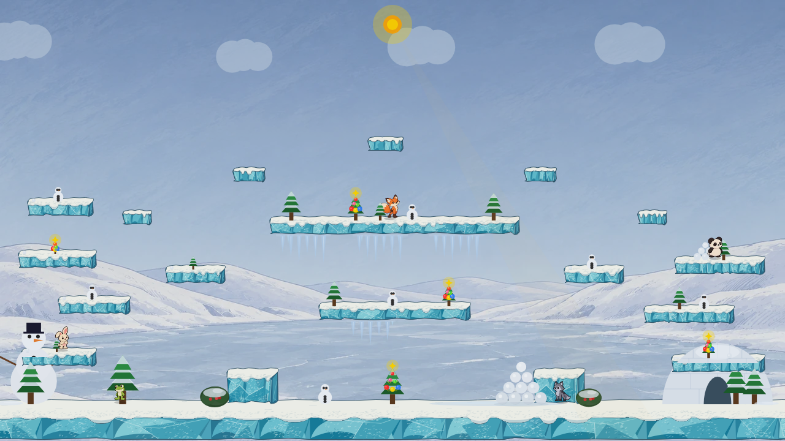 | 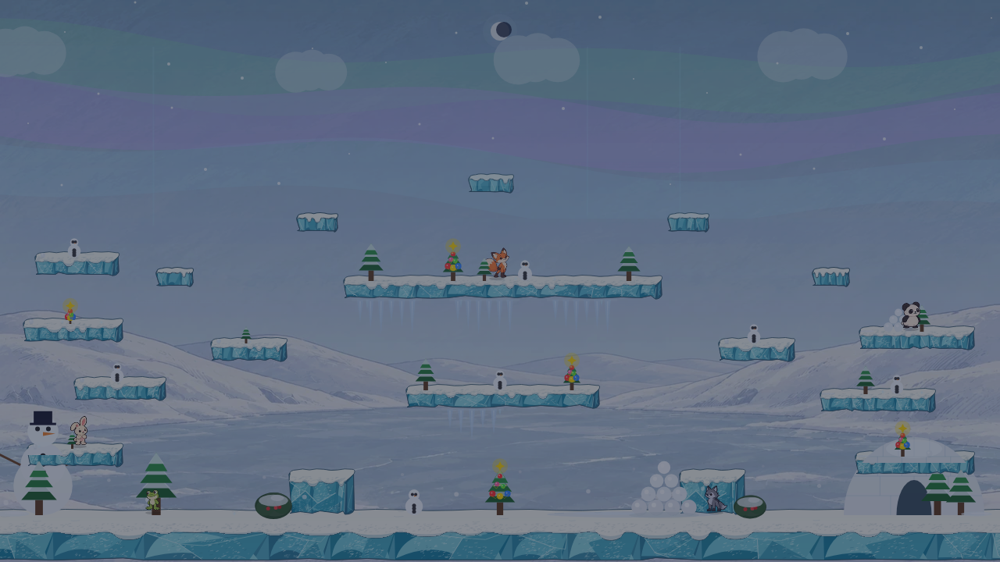 | Repeated flat triangular evergreens, tiny white snowmen, plain igloo and snowball pile. |
| **Round Grove** | 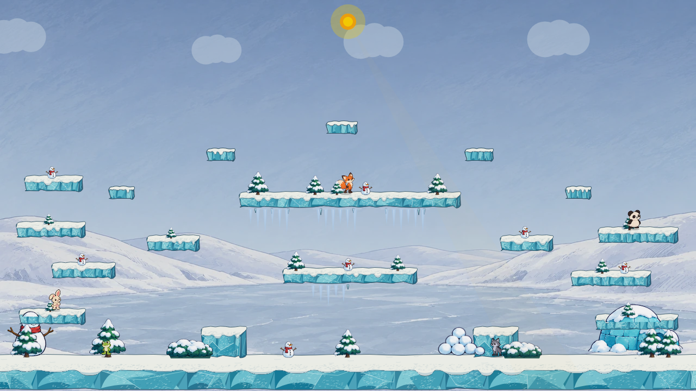 | 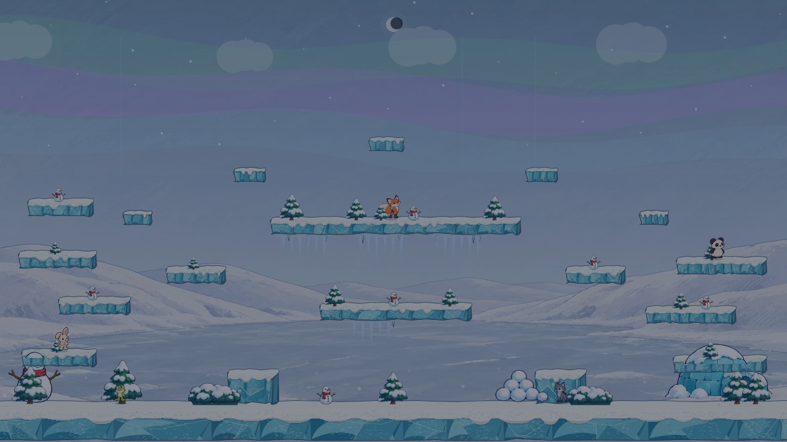 | Plush wide boughs, generous snow cushions, compact dark-leaf bushes, friendly scarfed snowmen. Closest to the soft storybook mood. |
| **Wind Carved** | 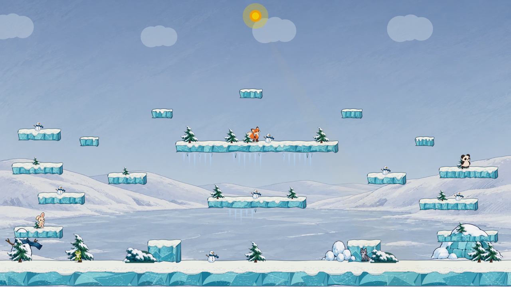 | 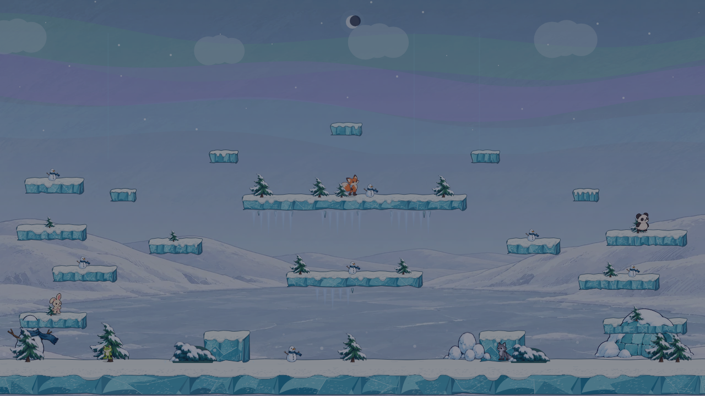 | Asymmetric swept branches and low drifting bush, calmer blue scarf and rugged snow masses. Gives the level motion without changing gameplay. |
| **Lake Cedar** |  | 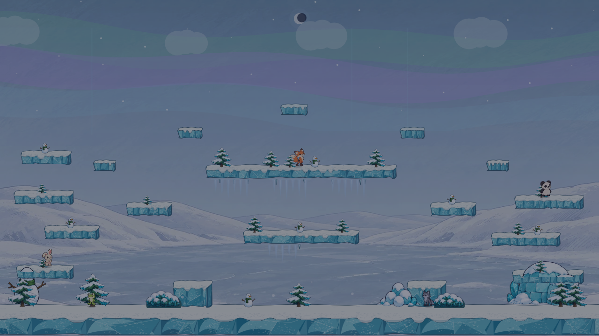 | Wide cedar layers with turquoise icy tips and a bright glacial igloo. Has the clearest lake-specific material accent, but the bush is close to reading as a snow-covered ice pile. |

The [source concept sheet](prop-direction-sheet.png) shows each prop at a readable size. A [transparent atlas](prop-atlas-transparent.png) is cropped into the fixed prop positions by the [fixture painter](illustrated.ts). These are **painted mockups**, not the production assets or a commitment to use one atlas for every tiny prop. At 18–30px, fine painting is compressed; a chosen direction will need a separate small-scale treatment for those pieces. The generated snowmen's stick arms are exploratory; their silhouettes must not be mistaken for hazards. All gameplay geometry is unchanged.

### Cover check

In the original painted study, the foreground bushes were drawn in the same layer and at the old ground positions. Each had a continuous opaque dark leaf body under the illustrated cutout, so its painted texture could not expose a hidden player through transparent holes. The historical captures placed Bunny and Wolf behind both bushes. The later Canvas cleanup uses Meadow's selected bush silhouettes and moves the two bushes slightly away from the ice cubes, still drawing them over players.

| Current cover | Round Grove | Wind Carved | Lake Cedar |
| --- | --- | --- | --- |
| 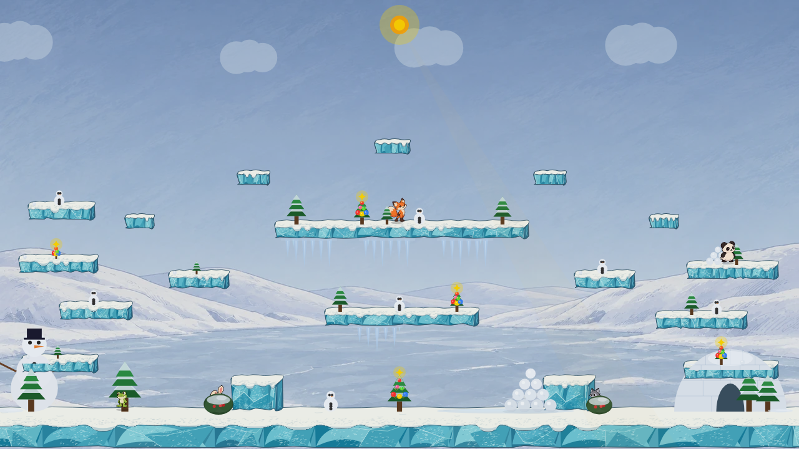 | 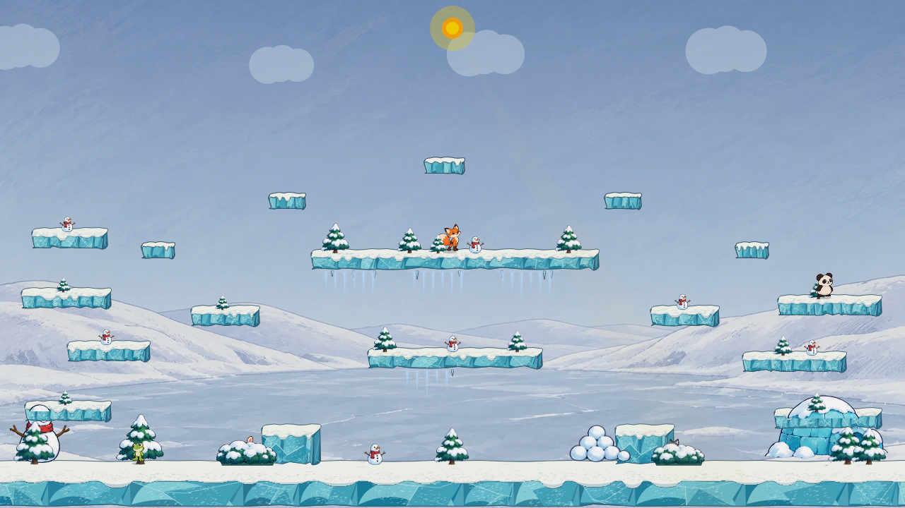 | 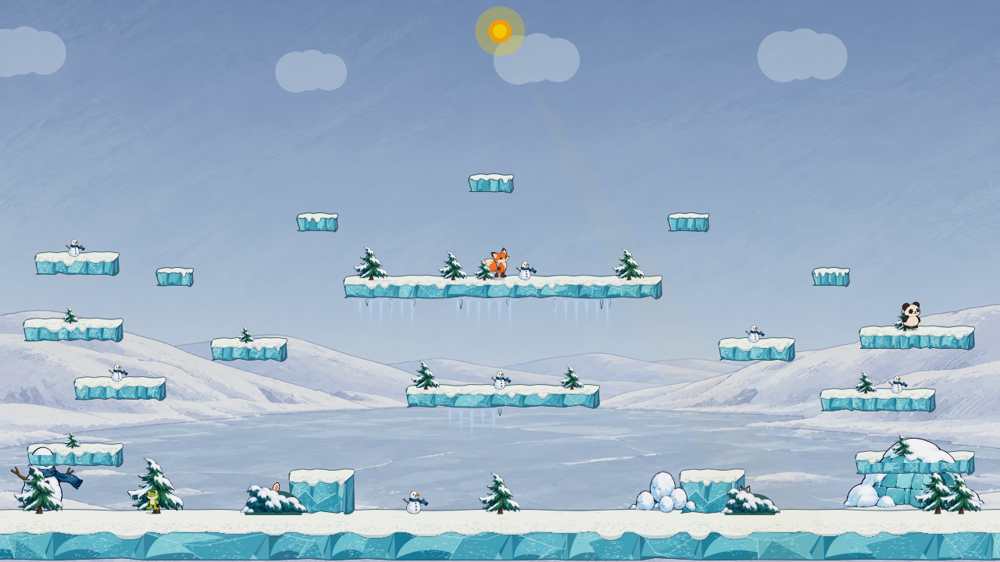 | 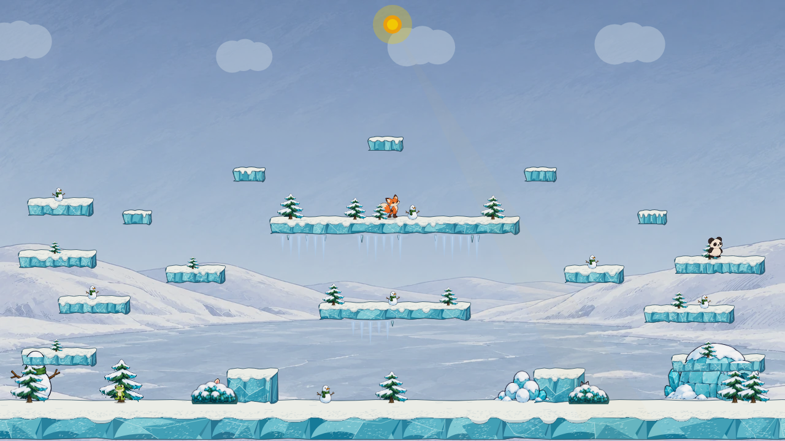 |

## Original study occupancy and review constraints

| Layer | Positions retained | Review concern |
| --- | --- | --- |
| Background landmarks | Snowman at left x=55; igloo at right x=1080–1260 | Leave spawn areas and the right portal readable. The left snowman shares space with a foreground fir and remains partly obscured, as before. |
| Background trees and figures | Ground x=200, 640, 1200; proportional placements on shelves | Avoid a uniform row of identical trees; keep the central bridge clear around moving characters. |
| Foreground cover and accents | Bushes x=350 and x=960, edge firs x=50 and x=1230, snowball pile x=850 | Keep bushes opaque over players and avoid a foreground glow or gaps. |

These positions describe the original painted study. The current Canvas implementation uses the cleaned positions described below.

The illustrated variants are stronger than the first directly coded [Canvas sketches](round-grove-day.png), [wind sketch](wind-carved-day.png), and [cedar sketch](lake-cedar-day.png). Those sketches preserved the layout and layering, but their identical small snow ribbons made the trees look mechanical. The painted reference made the missing shape language obvious: thicker irregular snow, distinct bough profiles, texture inside connected masses, and variation between tree types. The sketches remain in the gallery as a record of that failed first pass. The next step is to choose or mix the strongest prop shapes, then translate them into a production treatment and check live occlusion and load cost. The first preference from the full scene is Round Grove for cover and broad tree mass, with occasional Wind Carved trees for variety; Lake Cedar's icy accents should be used sparingly so they do not compete with playable ice.

## Round Grove Canvas implementation

The first production translation drew the selected direction with Canvas paths in [`winterLakeRoundGroveProps.ts`](../../../src/engine/arenas/packs/winterLakeRoundGroveProps.ts). Background props are drawn when the static layer is built; foreground bushes and snowballs are drawn into a cropped transparent `OffscreenCanvas` at 2× resolution and blitted over players each frame. Arena collision rectangles and landing heights are unchanged. The original painted sheet and the earlier Canvas sketch remain visible above for comparison.

| New Canvas day | New Canvas night | New Canvas cover |
| --- | --- | --- |
| 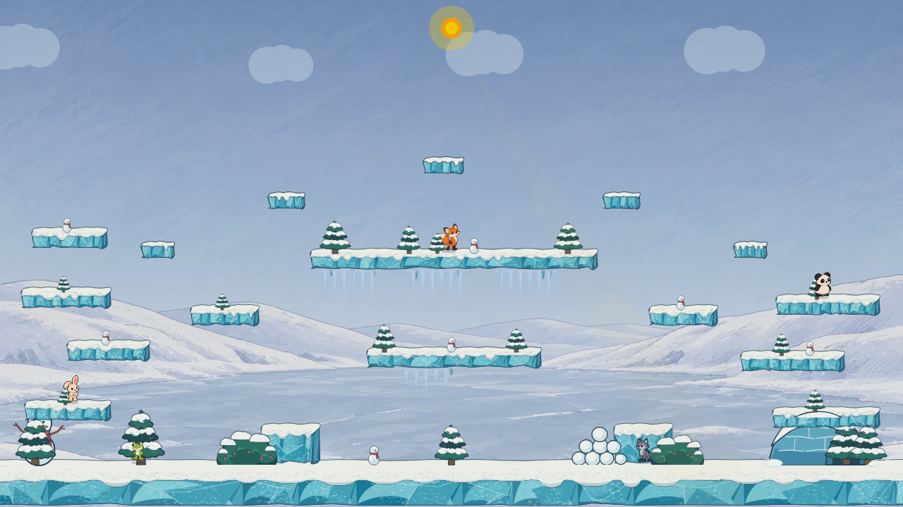 |  |  |

The first translation still looked mechanical because every fir had four thin, regularly spaced snow ribbons. The second pass removed one tier and kept a deeper dark bough visible beneath each thicker snow mass. A live play review exposed the next problem: the old snowman was behind a foreground tree and shelf; the igloo was hidden by a right shelf; the bushes overlapped ice cubes; many tiny decorations crowded the jump surfaces. The cleanup moved the large shaded snowman to x=485, the igloo into open central ground, and the cover bushes to x=300 and x=990. It removed most decorations from small steps and the foreground bridge tree. The firs gained dark side planes and blue-gray snow shading. The bushes now call the actual Meadow Leafy and Hedge drawings, with light snow caps added afterward. Their silhouettes remain opaque over players.

### Igloo iterations in the cleaned arena

| Blue Brick (provisional game choice) | Snow Stone | Arched Door |
| --- | --- | --- |
| 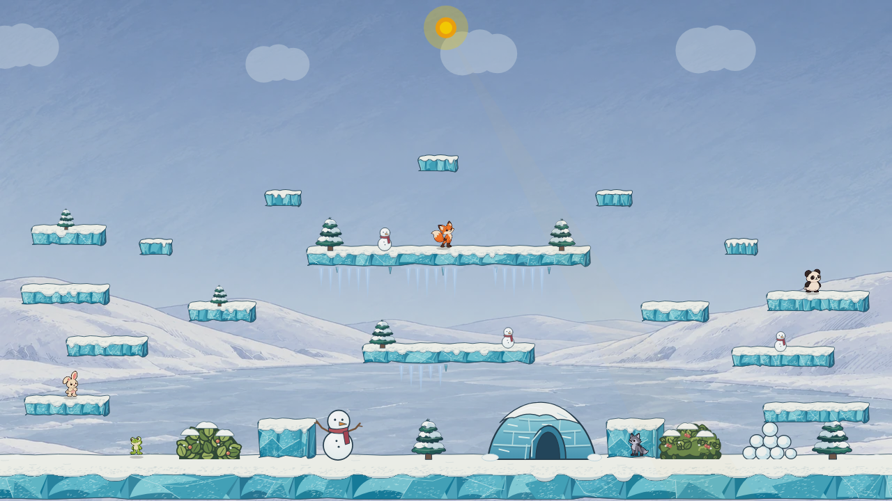 | 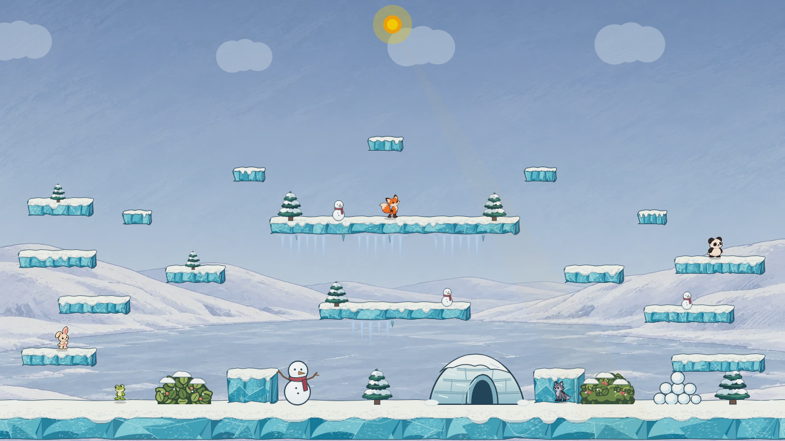 | 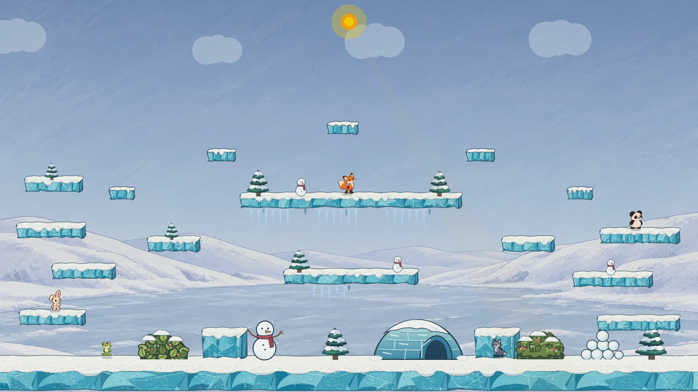 |
| 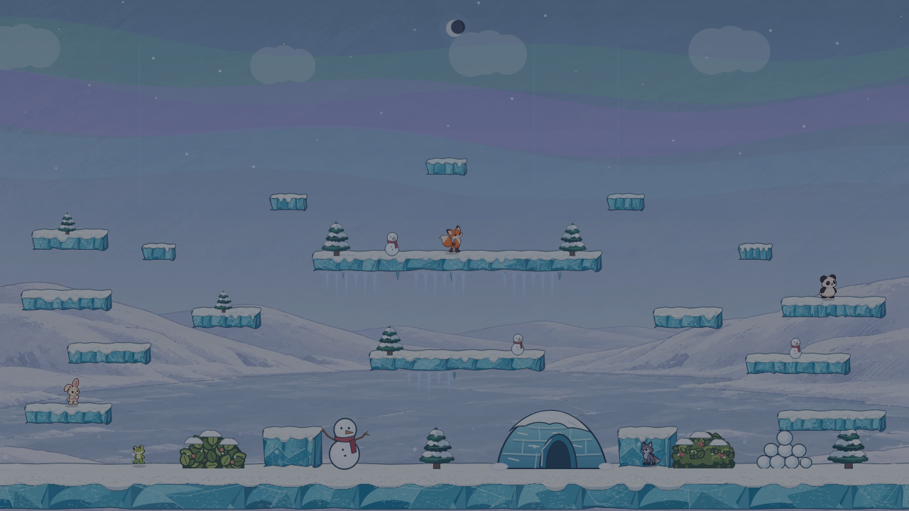 | 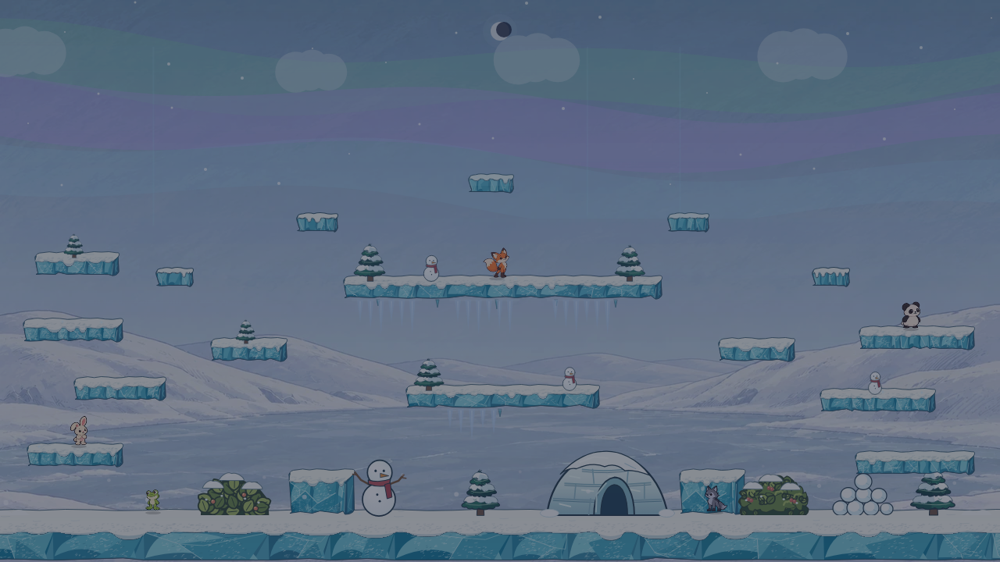 | 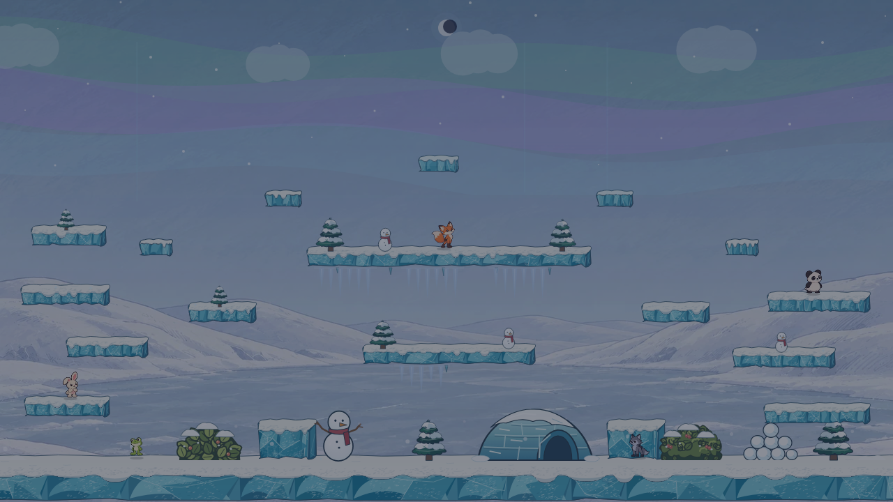 |

The earlier right-side igloo looked like a flat ice tent once a shelf covered its top. These three were rebuilt as curved block domes with offset seams, a shaded roof, and a dark doorway. Blue Brick had the clearest form against the pale lake. Snow Stone was softer but got lost against the snowy banks; Arched Door had a wider, lower body and a side entry. All three use the same new ground interval and keep gameplay geometry unchanged. Blue Brick became the fallback after the painted replacement below.

### Painted bush and igloo replacement

In the live game, the Canvas bushes still looked like Meadow foliage with snow stickers, and the Blue Brick igloo still read as a simplified blue dome. We generated fresh transparent paintings for a broadleaf berry bush, a compact hedge, and a hand-built block igloo. The bushes have a connected dark foliage mass under individually readable leaves, three irregular snow loads, and sparse berries. The igloo has staggered icy blocks, a snow roof, and an offset dark doorway. The bushes move a further 10 px away from the adjacent ice cubes. Trees, snowmen, snowballs, platforms, and background remain as in the cleanup pass.

| Day | Night | Cover |
| --- | --- | --- |
| 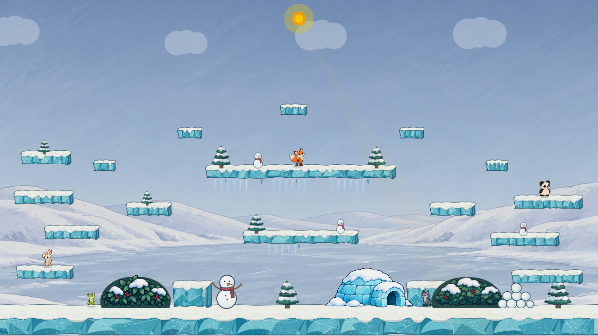 | 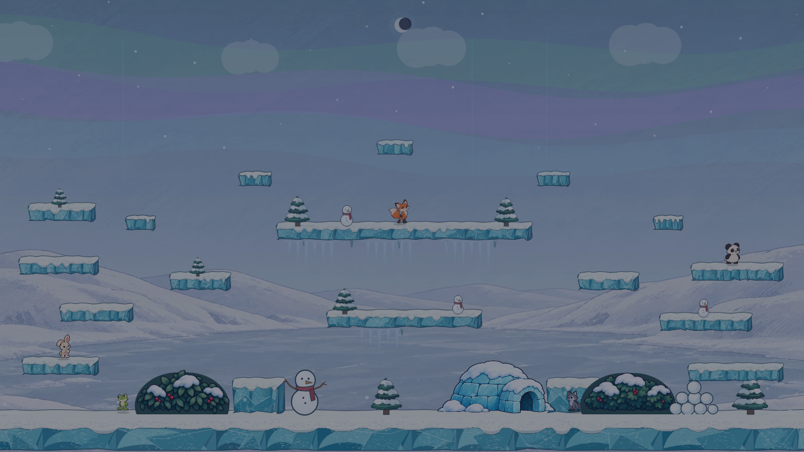 | 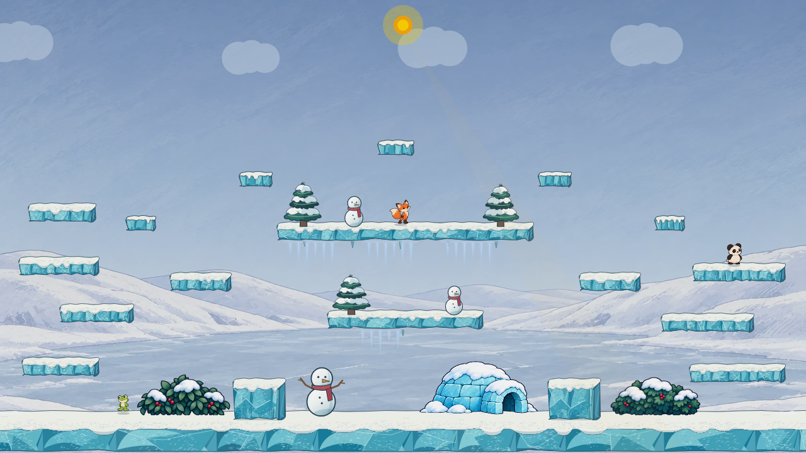 |

The images above are captures of the **production renderer** with the replacement assets loaded, at 1280 × 720. The original transparent [bush study](snow-bush-paint-study.png) and [igloo study](igloo-paint-study.png) are retained. [`prepare-runtime-art.mjs`](prepare-runtime-art.mjs) crops, downsizes, and WebP-encodes those sources to two 420 × 195 bush files and one 480 × 226 igloo file (about 86 KB combined). This is technical asset preparation; the painting itself is unaltered. [`capture-paint.mjs`](capture-paint.mjs) reproduces the scene captures.

The foreground bushes still render **over** players, with a connected opaque backing under each transparent painting so small gaps cannot reveal a hidden character. The selected igloo stays in the cleaned open ground interval. The menu and lobby prefetch the three files with Pearl; each render worker decodes its own copy before drawing Winter Lake. If an image fails, the previous Canvas bush or igloo draws instead. Production build, focused preload tests, Chromium smoke, and Winter Lake browser tests in both worker modes pass. A local screenshot confirms composition and occlusion in the fixture; moving gameplay should still be reviewed by eye before merging.

Reproduce the implementation and igloo comparison captures with `node docs/mockups/winter-props/capture-round.mjs` while the worktree Vite server is running.

`node docs/mockups/winter-props/benchmark-round.mjs` measures one construction and 500 cached foreground calls in headless Chromium. After the Meadow bush reuse and layout cleanup, one local run measured about 2.8 ms for the static background props, 6.1 ms for the foreground cache build, and 0.003 ms per cached foreground call. These are JavaScript enqueue timings in an isolated fixture, not GPU frame timings or a before/after gameplay benchmark.

## Reproduction

Run Vite from this worktree and set `WINTER_PROPS_URL` to its `/bunnybrawl/` URL, then run `node docs/mockups/winter-props/capture.mjs` for the painted and early Canvas study variants. The fixture is [`render.ts`](../winter-lake/render.ts) with `?variant=current&props=painted-round|painted-wind|painted-cedar&time=day|night`. Add `&cover=1` to see players behind the two bushes. The historical `current-*.png` files were captured before production changed and are intentionally not overwritten by that script. Use `capture-round.mjs` for the new production art. The [generation prompts](PROMPTS.md) and original sheet are retained so the art direction can be revisited without relying on a temporary server.
